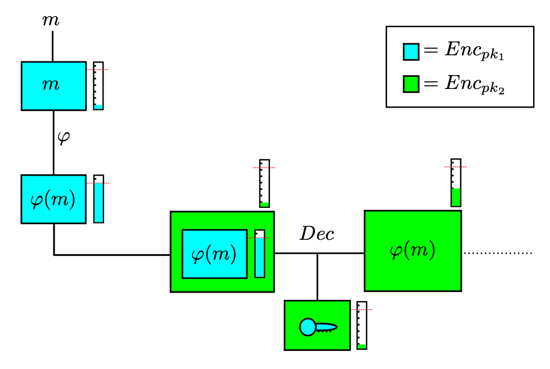
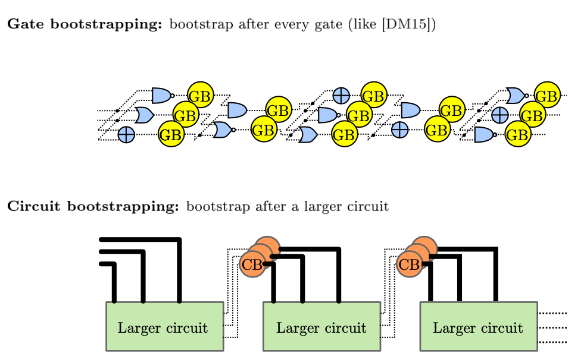
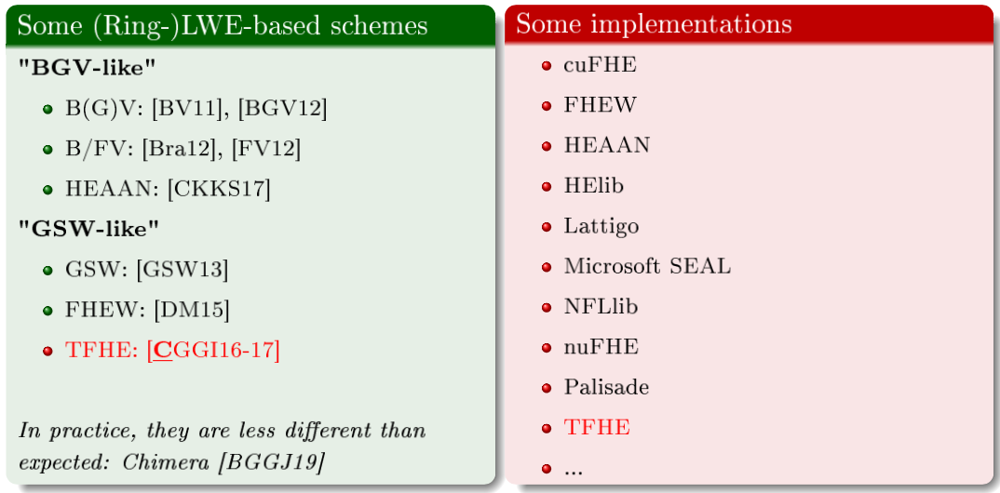

# 初探全同态加密之四：Bootstrapping的原理与实现

在上一期的文章中，我们学习并且深入了解了**GSW全同态加密系统**的具体构造。通过这一构造，我们可以对加密的密文进行**相加**和**相乘**的操作，并且通过二进制分解的方法，把密文中噪声的增加速度控制在一个可控的区间之内。

### GSW的有限级数限制

然而，根据我们对于模组$q$和噪声取值$B$的选择，我们只能对一组GSW加密的密文进行**有限次数的Eval运算**。由于乘法会导致噪音增加的更快，所以同样的parameters可以进行更多次加法计算。

当噪声的取值范围逐渐逼近$\pm q/4$之后，我们的密文就变成了一个“饱和”的密文，不能够进行任何同态计算了。因为一旦进行计算的话，代表0的一头与代表1的一头的噪音区间就会重叠在一起，这样我们在解密的时候，就不能通过一个简单的thresholding（即比较最后的结果是否接近0的一头还是$q/2$的一头）来完美还原出一开始的原文了。

这也就是说，GSW加密系统是有限级数同态的（Leveled FHE），这在上一期我们也讲到了。那如果我们需要计算一个深度为$\mathcal{L}$的电路$C$，需要怎么使用GSW来实现呢？

第一种最简单的方法，莫非于我们根据需要计算的深度$\mathcal{L}$来选择对应的$q$与$B$。这样一来，我们就可以确保整个系统可以同态计算$C$并且噪音区间不会爆掉。**这其实对于大多数的应用来说已经非常足够了**。唯一美中不足的是，当我们要计算的电路复杂度（深度）变得非常大的时候，我们选择的模组也会相对着变得非常大，这对于计算与存储的效率来说是大打折扣的。

一直无法计算未知或者无限深度的电路$C_\infty$这一件事情一直很烦扰着我们。有没有什么办法可以不用改变模组与噪音的大小，但是可以扩大有限级数系统的计算范围呢？如果更严谨的来问的话：有没有什么方法可以让模组$q$与噪音$B$的选择独立（independent）于我们计算的电路大小$\lvert C \rvert$呢？

这个时候，就轮到Bootstrapping登场了。

### Bootstrapping的概念

Bootstrapping是FHE界的开山鼻祖Craig Gentry在2009年提出的一个idea。Gentry本人其实写过一篇非常方便理解这个idea的介绍性paper：Computing Arbitrary Functions of Encrypted Data。我们这里就基于Gentry在原文中的表述方法来尝试深入了解一下。

#### Alice的珠宝店

Alice开了一家珠宝店，每天她需要把不同的珠宝（钻石、黄金）加工拼接起来，然后把完成的首饰卖给顾客。

过了一阵子后，Alice觉得自己忙不过来，于是决定雇佣Bob作为她的员工。然而，Alice担心Bob会趁着她不注意，偷偷的把加工完剩余的边角料藏起来，或者是加工的时候偷工减料为自己牟利，所以一直放不下心来。

直到有一天，**Alice突然想到了一个idea**。

Alice买来了一个**手套箱**（**Glove Box**），就是那种做实验用的密封的箱子，中间有两个带有手套的洞，手可以伸进去碰到箱子里面。她的想法很简单：只需要把所有的原材料全部锁在箱子里，然后Alice保管着可以开锁的钥匙，Bob就偷不走了。Bob想要加工这些原材料也很简单，只需要把手伸进去隔着手套加工珠宝，就可以完成工作了。

这个手套箱还有一个巧妙的小设计，有一个单向的进口，外面的人可以投任何东西进来。Bob可以通过这个进口把部分的原材料从外面投入手套箱内，但是无法打开手套箱把它们取出来。

整个idea一切都很完美，正当Alice买回来了一个手套箱，准备进行实践的时候，她突然发现了这个箱子的几个问题：

1. 首先，套上手套的Bob的加工手艺并没有以前那么精湛了。也许原本只需要半天的活，现在可能要磨蹭两三天才能干完。
2. 其次，虽然手套箱上了锁之后，Alice就可以放心Bob不会偷走珠宝了。但是这样的代价就是，当Bob加工完了之后，他并没有办法直接把加工完的珠宝拿出来给顾客，而是得等Alice过来了才能打开来。这样一来如果Alice很忙的话，可能顾客得Alice忙完了才能拿到自己买的商品。
3. 以上的两点问题，Alice勉强都可以接受，但是接下来的第三点是最致命的。Alice发现，这个手套箱具有**一定的使用寿命**，也就是说Bob只能在这个箱子里加工珠宝$L$次，然后这个箱子就会坏掉，变得无法再继续加工。如果已经达到了损耗的临界值，然后Bob继续尝试使用的话，那么里面的珠宝就有可能会彻底的被搞坏，变得无法修复。

当Alice发现手套箱的这三个特点之后，她开始思考如何有效的让Bob使用这一新发明。

#### Alice的平行世界：FHE

看到这里，想必熟悉FHE构造的读者们一定会对Gentry举的这个Alice的珠宝店例子非常亲切。Alice发明的**手套箱**其实就是暗指FHE系统！我们来比较一下这两者之间的共同性：

1. Alice拥有手套箱的钥匙，所以可以打开盒中的东西。这代表了FHE加密系统的解密正确性。
2. Bob可以通过单向的入口把东西投入手套箱中，但是无法取出任何东西。这代表了我们讨论的FHE加密系统是一个安全的public key（公钥）的加密系统，即任意第三方都可以创造密文但不能解开密文。
3. Bob可以通过两个手套口，任意的加工放在手套箱中的物品，但是效率比起直接加工要慢上许多。这一步对应了FHE中的同态计算（Eval）。
4. 最后，手套箱的使用寿命，以及使用了若干次之后就会坏掉这一设定，完美的吻合了Lattice结构的FHE系统中的噪声以及上限。想要增加使用寿命，一种方法是把盒子做的更大、更昂贵，这对应着在FHE中把对应的parameters增大。

那么现在问题来了，Alice可以如何不改进手套箱，但是增加它的使用寿命呢？我们继续回到Alice的世界中来看看Gentry是怎么描述的。

#### 手套箱中的奥秘

一筹莫展的Alice看着一个只能用有限次的手套箱，非常的失望。这一有限的加工次数决定了Bob可以加工的珠宝的复杂程度。按照现在这个样子，Bob只能加工一些半成品出来，然后需要Alice去开锁，再把半成品放到一个新的手套箱中，继续让Bob加工。

这样一来，Alice基本上得全程在旁边看着。原本雇Bob来是为了减少负担的，没想到现在反而还更加加重了工作压力。

直到有一天，Alice在看Bob加工珠宝的过程中，突然灵机一动：假如我事先知道了Bob加工一个珠宝需要两个手套箱，我能不能想办法可以让Bob**在没有钥匙的情况下**把未加工完的半成品从第一个手套箱中转移到第二个手套箱中呢？

Alice回去之后想了半天，终于想出了一个绝妙的想法：

第二天，Alice准备了两个手套箱，分别标号为A与B。Alice把A、B两个手套箱都交给Bob，并且自己留下手套箱B的钥匙。她唯独做了一件不一样的事情：**把A的钥匙丢入了B当中**。

这样一来，当Bob在手套箱A中加工珠宝达到损耗的临界值的时候，他接下来需要做的事情就是：**把手套箱A一整个塞入手套箱B中**！然后，Bob就可以直接在手套箱B中拿着实现放进去的钥匙解开里面的A箱的锁，然后把半成品的珠宝拿出来继续加工了。

整个想法瞬间震惊了所有珠宝店的人，通过这样的构造，Bob就可以不用Alice帮忙加工任意复杂度的珠宝了，两个不够就串三个，三个不够就四个。唯一需要做的就是Alice需要在开始之前**把对应的钥匙丢入对应的箱子中**。

为什么这样的方案可行呢？因为一开始说到了，手套箱上安装的单向入口**可以放入任何东西**，包括另一个手套箱，所以就可以层层嵌套啦。唯一需要注意的一点是，在手套箱B中解开箱A的锁这个步骤，也会给箱B带来一定的损耗。所以在选取锁的时候，Alice特意选择了不需要太大力气**可以几步解开的锁**。

#### Bootstrapping初见端倪

Alice所想到的这个技巧，正是我们这一期想要讨论的Bootstrapping的概念！如果拿到FHE的世界中简单的概括的话，那就是：**把一个满噪音的FHE的密文加密进另一个FHE密文中，并且同态计算FHE的解密算法，把里层的密文解密还原为原文，就能获得一个全新的低噪音FHE密文**。

如果乍一看有点一头雾水，不要急，我们一步一步的来看在FHE中Bootstrapping是如何实现的。

上面的图很好的体现了Bootstrapping的过程。结合图上所示，首先我们需要生成两组（或多组）FHE的密钥$(pk_1, sk_1), (pk_2, sk_2)$。

一开始，我们把原文$m$，通过$pk_1$加密得到一个低噪声（fresh）的密文$ct_m$。随后我们基于$ct_m$同态的计算函数$\phi$，得到$ct_{\phi(m)}$。因为$\phi$的复杂度较高，图上标注出来的噪音已经达到了临界值，我们无法进行更深层次的同态运算了。

随后，我们可以做的是把整个密文$ct_{\phi(m)}$通过$pk_2$加密进一个全新的fresh的FHE密文当中（绿色标注），得到$ct_{ct_{\phi(m)}}$。这个时候我们发现，虽然原本的密文$ct_{\phi(m)}$已经到达了噪音上线，但是双重加密的密文$ct_{ct_{\phi(m)}}$的噪音值是非常低的。

这样以来，我们接下来需要做的事情，就是同态的计算FHE的解密（Dec）函数，就可以把嵌套在$ct_{ct_{\phi(m)}}$内部的$ct_{\phi(m)}$还原为$\phi(m)$，然后就可以得到一个全新的$ct_{\phi(m)}$了。由于Dec需要用到原本的密钥$sk_1$，所以我们需要额外的提供一份加密在$pk_2$下的$sk_1$来用于同态计算。

#### 同态计算无限级数电路

前面我们只是表述了一次Bootstrapping的过程，即通过加密在$pk_2$下的$sk_1$同态的解开$pk_1$下的密文。同理可得，我们可以继续嵌套这个过程，继续同态计算新的函数，等噪音封顶之后再进行第二次、第三次Bootstrapping，从而同态计算更复杂的函数。

为什么这个操作可以延伸FHE计算的级数呢？这是因为通过Bootstrapping的操作，我们可以变相的把一个满噪声的密文“刷新”为一个全新的FHE密文同态计算完Dec之后的噪声值。这样一来，只要我们选取的FHE系统的参数可以让我们在计算Dec函数之后，还拥有一部分空间可以计算下一次有意义的加法/乘法计算，那么我们就可以无限的把这个Bootstrapping的链条继续下去，直到同态计算完毕为止。

然而，我们现在的Bootstrapping系统还有一个小缺点，那就是我们在生成参数的时候需要事先准备好Bootstrapping的链条，即生成公钥私钥对$\{pk_i, sk_i\}$，并且公开对应的私钥$sk_i$加密在$pk_{i+1}$下的密文。所以作为第三方，我们仍然不能计算任意深度的电路，因为计算的深度在进行公共参数生成的阶段已经被决定好了。

#### 密钥循环与Circular Security

解决上述问题的方法也非常简单，我们只需要循环利用生成的公钥就可以了。拿上述的双FHE系统$(pk_1, sk_1), (pk_2, sk_2)$举例子来说，我们不仅可以公开在$pk_2$下加密的$sk_1$，同时还可以公开在$pk_1$下加密的$sk_2$！

这样一来，我们就可以无限的使用这两个系统，往复进行Bootstrapping了。当第二层FHE的噪声到达临界的时候，我们可以再把它在$pk_1$下加密，然后同态的解开$pk_2$的密文。这也就是真正的FHE（**Fully** Homomorphic Encryption）的全貌了。这里的Fully代表了，只要拥有$pk_1, pk_2, ct_{sk_1}, ct_{sk_2}$，我们就可以同态计算所有复杂度的电路了。

唯一美中不足的一点在于，我们分别在各自的公钥下面加密了对方的私钥，并且公开了密文。这样仿佛是构造成了一个**密钥循环**（**Key Cycle**）。这一操作究竟会不会暴露出额外的有价值的信息，从而可以让人破解$pk_1, pk_2$呢？这一点对于很多公钥加密系统来说都是**不确定的**。

不过密码学的好处在于，遇到了难题不直接解决也没有问题——我们可以**提出新的假设**：**Circular Security**（密钥循环安全）。其中，**2-Circular Security**的假设特指了当我们拥有两个公钥加密系统，并且构造成了一个密钥循环的时候，整个系统仍然是安全的。

另外一个值得提到的假设是**1-Circular Security**，即单密钥循环安全。除了生成两对FHE的参数构造一个cycle之外，我们甚至还可以只构造一组密钥对$(pk_1, sk_1)$，并且直接在$pk_1$下加密$sk_1$并且公开密文$ct_{sk_1}$！如果我们假设1-Circular Security的话，那么我们就可以不借助任何额外的公钥参数进行Bootstrapping了：当噪声到达上限之后，我们只需要在同样的$pk_1$下面加密自己本身，然后再同态的解开里层的$pk_1$密文，就可以进行自我Bootstrapping了。

目前来说，我们还没能找到一个非常好的模型来研究Circular Security假设真正的安全性。这是因为在设计公钥加密算法的时候，我们并不会考虑到公开了密钥的密文之后会带来什么后果。有一派的看法是，因为公钥加密系统是Semantic Secure（语义安全的）的，所以密钥的密文应该看起来和其他的密文没有任何区别，所以循环安全这一假设应该很容易成立。

但是，我们近几年已经找到了很多反例，即找到了一些一定不满足Circular Security的加密系统。比如说我们手动的在某个加密系统中塞入一个后门，使得一旦拥有了循环密钥，即加密了密钥的密文之后，就可以通过这个后门来获得密钥的原文。但是这些加密系统都是人为的构造的，由于我们目前还没有在现有的公钥加密体系找到一个很自然的反例，所以**我们相信Circular Security仍然是个安全的假设**。

### Bootstrapping的策略

看到这里，想必大家已经对Bootstrapping的概念有了一个大概的了解。

和之前介绍FHE系统不同的是，Bootstrapping其实是一个很广义、宽泛的概念。我们并没有用一系列公式来展示Bootstrapping的过程，而只是介绍了这一种思路，即**同态验证解密函数**。这种思路可以用于任何FHE的系统，包括BGV与GSW系统。

在深入理解Bootstrapping在GSW中到底是什么原理之前，我们先来看看，**到底什么时候才需要Bootstrapping**。

Bootstrapping的策略分为两种：**Gate Bootstrapping**与**Circuit Bootstrapping**。

#### Gate Bootstrapping

第一种Bootstrapping的策略，就是每当我们进行一次最简单的同态计算，我们就进行一轮的Bootstrapping把噪声值还原到进行计算前的量。因为我们可以把计算的函数用电路表示，而电路的最基本构成元素是逻辑门（Gate），所以这种方案又被称作Gate Bootstrapping。

熟悉逻辑电路的读者可能会知道，所有的逻辑门都可以用一个逻辑门**NAND**来表示。这也就是说，只要我们可以构造出一个同态计算NAND并且再进行一轮Bootstrapping的构造，我们就可以把这个构造作为一个逻辑计算模块，然后用这个模块构造出任何电路。因为Bootstrapping确保了噪声不会超过临界值，所以我们可以用这种方法来进行任何深度的电路的同态计算。

基于Gate来构造的Bootstrapping较为简单，我们在同态计算一个程序的时候，只需要写一个编译器，把这个程序转换成电路，再把电路分解为单个的逻辑门，然后把每个逻辑门再拆分成NAND，就搞定了。这样的结构等于是**在应用层隐藏了Bootstrapping**这件事情，因为每次进行NAND计算的时候，噪音值就已经被重新刷新了。

#### Circuit Bootstrapping

第二种Bootstrapping的思路和我们之前讨论的思路比较相似。我们首先使用原本的FHE系统同态计算我们想要计算的电路，直到达到了噪音临界值。然后我们再进行一轮Bootstrapping来“刷新”噪声值，以便进行后续的同态计算。

这种结构和Gate的思路相反，把Bootstrapping的概念直接暴露在了应用层。我们在进行计算的时候可以根据目前的噪声值来选择是否要进行Bootstrapping。这样的好处在于，如果我们需要同态验证的电路的复杂度不是很高的话，我们就可以很快速的进行Leveled同态计算，而不需要花额外的时间来通过Bootstrapping来刷新噪声。

### Bootstrapping的实现

了解完Bootstrapping的原理与策略之后，接下来我们终于可以来结合之前所学的看一看，如何在我们之前看到的GSW同态体系中运用Bootstrapping的概念了。

我们先重新回顾一下GSW的加密与解密结构。

当我们需要加密一个bit $\mu$的时候，GSW的加密算法$Enc$会首先随机生成一个LWE问题$(A, A \cdot \tilde{s} + \vec{e})$，然后把我们需要加密的值乘以工具矩阵$\mathbf{G}$之后叠加上去。
$$
C = (A, A \cdot \tilde{s} + \vec{e}) + \mu \cdot G \in \mathbb{Z}_q^{m \times n}
$$
我们可以直接输出$C$作为GSW的密文，但是在进行同态计算的时候，需要先把$C$二进制分解为$\hat{C}$之后，才能正确进行计算。

#### 同态解密GSW密文

GSW的解密过程也非常简单，如果我们拥有一个二进制分解态的密文$\hat{C}$，我们需要做的只是先把它重组回普通的密文$C$（乘上$\mathbf{G}$），然后再乘以密钥$\vec{s} = \begin{pmatrix}\tilde{s}\\-1\end{pmatrix}$。
$$
\begin{align*}
\hat{C} \cdot \mathbf{G} \cdot \vec{s} &= C \cdot \vec{s}\\
&= \mu \cdot \mathbf{G} \cdot \vec{s} \pm \vec{e}
\end{align*}
$$
然后我们需要做的，只是看这个结果的第一项，即一个$\mathbb{Z}_q$的数字，判断这个数字距离0点的距离是否在$q/4$之内，就可以知道$\mu$的值了。

如果我们想要进行Bootstrapping，这也就是说我们需要同态的计算上面描述的解密过程。和之前描述的步骤一样，我们先要获得一个加密过后的密钥$ct_{\vec{s}} \in \mathbb{Z}_q^n$。因为$\vec{s}$是一个向量，所以我们需要对这个向量的每一个维度分开进行加密，获得$n$个GSW密文。

接下来，我们可以把GSW的$Dec$解密函数拆分成两部分，逐步计算：

1. 线性乘积$C \cdot \vec{s}$。这一部分非常简单，因为我们已经知道了$C$的值（$C$是公开的），并且我们拥有了$ct_\vec{s}$，所以我们需要做的就是基于$C$的第一行$C_1$的值（我们只需要看解密之后的第一项），构造一个$\vec{s}$的线性函数$Dec_{Lin}$。这个函数把$\vec{s}$中的每一项都乘以$C_1$系数，然后再相加起来。最后，我们在密文$ct_\vec{s}$上面同态计算$Dec_{Lin}$。

$$
ct_{DecLin} = Eval(pk, Dec_{Lin}, ct_\vec{s})
$$

2. 当我们获得了这个线性乘积的结果之后，下一步就是判断这个结果是否接近数字0。这其实是整个解密过程中最困难的一步，因为我们不能用简单的加法或者乘法来把一个$\mathbb{Z}_q$中的数字变成$\mathbb{Z}_2$的一个bit。这个时候，我们就需要用到一些比较复杂的逻辑，比如说我们需要判断$ct_{DecLin}$中的值是否大于某个临界值。然后我们需要通过加法和乘法来构造出一个**比较电路**（**Comparator Circuit**）。最后，我们同态的在$ct_{DecLin}$上计算这个Comparator Circuit就能获得最后的结果——一个加密了0或者1的密文。

解密的第一步非常简单，我们要做的就只是做一次线性相乘，并且在已知了$C$的值的情况下，我们只需要做纯同态加法，不需要做任何乘法。所以这一步对于密文的噪音增长的影响是非常小的。

真正有问题的是第二步，因为就像在计算zkSNARK的LPCP的时候，我们为了构造R1CS程序，要把电路转化为数学运算电路（Arithmetic Circuit）一样（具体可以参照零知识证明一系列文章），整个系统的效率是非常低下的。

低效率还带来了一个更大的问题：整个解密电路的复杂度会变得非常高，甚至高于我们真正想要进行同态计算的电路。为了使得Bootstrapping之后的密文的噪音值会“降低”到一个比原来更低的值，我们就需要被迫扩大GSW的模组和其他参数，使得我们能够成功的在噪音区间内同态计算$Dec$。

这样一来，原本使用Bootstrapping的意义就没了，因为我们本来是希望不扩大太多的参数，让我们可以同态计算更复杂的电路。但是如果$Dec$过于复杂，虽然我们最后还是可以得到一个FHE系统，即可以计算无限深度的电路，但是效率非常低下，**很有可能99%的计算都在用来计算Bootstrapping上**。

#### 使用Barrington's Theorem进行Bootstrapping

在GSW构造被提出之后，Brakerski与Vaikuntanathan试图寻找一个比较合理的Bootstrapping方案，即找到一个可以有效解决$Dec$中第二步的方法。他们选择的方法是首先用逻辑电路来表达解密函数$Dec$，然后再使用**Barrington's Theorem**把这个逻辑电路转化为一系列的**Matrix Branching Program**（**矩阵分叉程序**，**MBP**）。

矩阵分叉程序（MBP）其实就是一个用矩阵相乘来表达的程序。假设一个程序一共有$n$的bits的输入，即$x_0, x_1, x_2, \dots, x_{n-1}$，这个程序的MBP形态就是$2n$个矩阵$\{\mathbf{M}_{i,b}\}$。我们可以根据$x_i$的值来选择对应的$\mathbf{M}_{i, x_i}$，然后把他们陆续相乘：
$$
\prod_i^{n-1} \mathbf{M}_{i,x_i}
$$
最后得到的矩阵就是这个程序的运算结果了。如果最后我们得到了Identity Matrix $\mathbf{I}$的话，那么表示程序输出的是0，反之是1。单个的MBP只能表示一个bit的输出结果，所以如果我们要把一个$k$ bits输出的程序转换为MBP的话，我们需要输出$k$个MBP，每个程序单独计算一位输出结果。

为了方便理解，我们假设某个程序一共有3个二进制输入，然后这个程序对应的MBP形态拥有3对矩阵：
$$
\mathbf{M}_{0,0}, \mathbf{M}_{0,1}, \mathbf{M}_{1,0}, \mathbf{M}_{1,1}, \mathbf{M}_{2,0}, \mathbf{M}_{2,1}
$$
那么我们计算输入$\mathbf{x} = (1, 0, 1)$的结果就是：
$$
\mathbf{M}_{0,1} \cdot \mathbf{M}_{1,0} \cdot \mathbf{M}_{2,1} \stackrel{?}{=} \mathbf{I}
$$
最后只需要检查输出的结果是否是$\mathbf{I}$就知道结果了。

至于Barrington‘s Theorem，是计算机科学家David Barrington在1986年证明的一个非常重要的定理。他指出，所有在$\mathbf{NC_1}$复杂度中的程序（即复杂度为$\log{n}$的电路），都可以直接转换成一个$poly(n)$，即多项式大小的MBP程序。由于篇幅原因，我们就不多阐述证明了，而是直接拿这个定理来用。

Brakerski与Vaikuntanathan正是使用了Barrington‘s Theorem来把$Dec$转换成MBP，然后基于加密的密钥$ct_\vec{s}$同态的计算这个MBP。由于计算MBP的过程就是很简单的矩阵相乘，所以只需要选择GSW的参数可以hold住这么多次相乘就可以了。具体计算的方法也很简单，假如我们拥有加密的$s_0, s_1$两个bits的输入，然后需要计算$\mathbf{M}_{0, s_0} \cdot \mathbf{M}_{1, s_1}$，那么我们就可以同态计算一个新的函数$C$：
$$
C(s_0, s_1) = (\mathbf{M}_{0, 0} \cdot (1 - s_0) + \mathbf{M}_{0, 1} \cdot s_0) \cdot (\mathbf{M}_{1, 0} \cdot (1 - s_1) + \mathbf{M}_{1, 1} \cdot s_1)
$$
通过同态计算$C$这样构造的函数，我们就可以变相的使用加密的$s_i$来“选择”到底是哪个$\mathbf{M}$被相乘了。最后我们只需要通过验证结果是否等于$\mathbf{I}$，再把这个验证结果转换成一个bit，就大功告成了！

这个问题解决了之后，剩下来的就是把$Dec$转换成MBP然后进行同态计算了，这一部分我们就不多说了。

当BV二人根据这个结构提出Bootstrapping的方案之后，大家逐渐找到了一条可以真正实现Bootstrapping的路，并且开始用代码来实现。到2014年，**Halevi**与**Shoup**在HElib（IBM的FHE库）中使用类似的概念进行Bootstrapping计算，并且可以在**半个小时左右的时间内**进行一次Bootstrapping，使用的参数的存储空间达到了几十个GB左右。

#### 实际的Bootstrapping方案（Practical Bootstrapping）

看到这里的朋友们可能会不禁吐槽到，Bootstrapping这么简单的概念，居然需要在电脑上花上半个小时的时间，并且占用这么大的空间才能完成。没错，早期的FHE之所以不能投入应用，就是因为Bootstrapping的开销实在是太大了。并且抛开Bootstrapping不说，我们光是用GSW这样庞大的LWE矩阵来加密一个bit，就基本上代表已经没有什么效率可言了。

然而，这一切在2014年后开始发生了改变。

2015年的时候，Ducas与Micciancio提出了全新的【**DM15**】构造，属于Gate Bootstrapping的方案（即提供了一个NAND+Bootstrapping的实现），并且基于GSW系统。这一构造被称作为**FHEW**，标准参数下只需要**0.69秒**就可以完成一轮Bootstrapping！

在DM15中，作者发现GSW的解密过程中最令人头疼的第二步，其实并不需要实现完整的Comparator Circuit，可以通过一个更加简单的Accumulator（累加器）来实现。这一发现直接就大大简化了第二步所需要的计算量。主要的思路在于，如果我们合理的选择模组$q$的值，那么第二步比较判断的过程，就完全可以通过观察密文二进制分解之后的最高位是1还是0来完成，而不需要与$q/4$来进行比较了。

紧接着，在2016年的【**CGGI16**】中，**TFHE**诞生了，继承了FHEW的特点，不过进行了一系列更加优化的操作，把Bootstrapping的时间压缩到了**0.05秒**之内。在2017年的follow up 【**CGGI17**】中，又把这一下限压到了**0.013秒**！

TFHE所用到的技巧也非常巧妙，它的核心也是观察到FHEW所用的Accumulator的构造，发现如果把密文映射到Torus $\mathbb{T}$（环面空间）中，那么构成这个Accumulator的构造更加简单。因为整个计算空间是一个环形的，只需要通过一个**盲旋转**（**blind rotation**）的操作，就可以提取出密文的最高位的值。

至于FHEW与TFHE的具体实现与证明，我们在这里就不多说了，以后有时间的话可以再开一篇，详细讨论一下这两种方案。

#### FHE库的比较

到这里，我们大概已经知道了FHE的大致发展了。从09年Gentry提出了这一概念之后，学术界和业界都在争相在计算机上实现FHE。除了我们这期提到的FHEW与TFHE之外，还有HElib，SEAL，cuFHE等等非常有名的开源库。

为了在计算机系统上更加高效率的进行FHE计算，我们往往会使用**多项式环**（**Polynomial Ring**）下的FHE系统。具体在Ring下的LWE问题是怎么一回事，可以参考笔者在【Lattice学习笔记】这一专题中提到的内容。我们在这里只需要知道，在Ring下的格运算操作，可以通过FFT来加速，只需要$O(n \log{n})$的时间就可以完成普通$O(n^2)$的计算。

这些库之间并没有特别多的好坏比较，更多的只是他们适应于不同的使用需求。比如说有的库会使用很多浮点操作，有的库会使用CUDA加速，有的库会使用GPL License下的其他插件（比如FFTW），所以不能用来闭源开发等等。由于时间关系，笔者就没有一一去测试了，把这个机会留给大家去尝试一下。

### 写在最后

到这里，我们【初探全同态加密】这一专题就到此结束啦。我们来快速回顾一下这4期覆盖的内容：

1. 什么是加密系统，与什么是加密系统的同态性质。
2. 同态加密的分类与特性。
3. 全同态加密的定义的历史。
4. 格密码学入门以及LWE问题的介绍。
5. 基于LWE问题的Regev加密系统。
6. GSW全同态加密体系的三次尝试：矩阵特征值，加入噪音，二进制分解。
7. Bootstrapping是什么，以及具体实现策略。
8. 如何基于GSW进行Bootstrapping，以及现有的实现方案。
9. FHE库的大致一览。

这么一看，这四期已经涵盖了非常多的内容了！如果看到这里大家觉得对之前的概念有点生疏的话，不妨回去再看一遍，巩固一下知识。

距离上一篇FHE文章已经过去了很久，这段时间笔者都在努力的补更多关于格密码学的知识，在过程中重新学习一遍这些讲过的概念。每次重新学这些概念的时候，都会发现每次的理解都会变得不一样，也会发现很多见过的构造其实都有非常巧妙的相似之处。

如果看完了FHE之后，还想了解一下基于格密码学的更多高级的构造，比如ABE，NIZK，iO等等，希望大家也可以关注一波笔者在更新的【格密码学进阶】专题～

