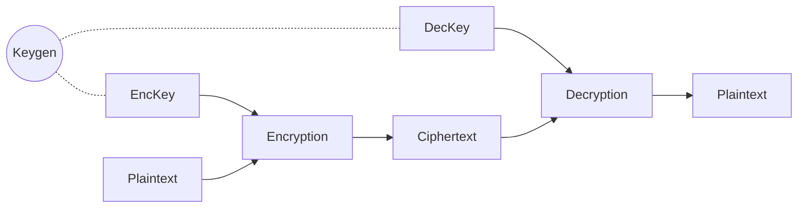

# 初探全同态加密：FHE的定义与历史回顾

前一阵子在斯坦福学习了CS355（高阶密码学）的课程。给我们上课的是Dan的三个PhD学生Dima Kogan，Florian Tramer和Saba Eskandarian。三个PhD讲师各有特色，研究的方向也非常不同。Dima主攻隐私保护技术PIR（Private Information Retrieval），Florian主攻ML和区块链方面的研究，而Saba主攻零知识证明。

CS355这一门课几乎涵盖了从古至今密码学领域的所有内容。从最早的单向函数（One-way Function），到椭圆方程（ECC）和Pairing，最后到一些近几年比较热的MPC、零知识、私有信息检索（PIR）、全同态算法等等。由于前两天刚刚结课，趁着知识内容还在浅层记忆中没有忘掉，整理了一波笔记。课程内容非常有趣，其余的内容以后有时间跟大家慢慢分享～

这一期，我们来讲一讲最近很火的全同态加密（FHE）与伴随而来的格加密（Lattice-based Encryption）技术。

## 全同态加密是什么

相信很多朋友已经多少听说过**全同态加密**（Fully Homomorphic Encryption/FHE）的大名了。近几年对于个人隐私保护的话题越来越多，包括同态加密在内的一系列密码学应用技术也得到了很广泛的普及。

为了更好的了解这个话题，我想要再对全同态加密这个定义稍作介绍一下。

### 加密体系回顾

在开始之前，我们先温习一下最最传统的加密体系。

我们都知道，如果要构建一个加密系统，往往都需要一个密钥（Key）。通过这个密钥，我们可以一头把明文的信息加密成密文，然后在另一头通过密钥再把密文变回原来的样子。如果没有这个Key的话，其他的人很难知道我们到底传递了什么信息。

上文的图例基本展示了所有常见加密体系的全貌。所有的加密体系，如果用比较正式的描述方法，无疑是做了三件事：

1. 首先，通过一个生成算法$KeyGen(1^{\lambda})$来随机生成一对用于加密和解密的密钥$(EncKey, DecKey)$。

2. 加密方通过加密密钥$EncKey$和加密算法$Encryption$来加密原文$Plaintext$，最后得到密文$Ciphertext$。
3. 随后，在解密的时候，解密方可以通过解密密钥$DecKey$和解密算法$Decryption$来解密密文，最后还原回来原来的原文。

对加密算法有所了解的朋友，肯定会知道常见的一些加密算法，比如说AES，RSA等等。大家肯定也会知道一般来说加密体系分为两种：**对称加密体系**和**非对称加密体系**。我们这里描述的这三个步骤，其实通用于任何加密体系。如果是对称的，那么加密和解密用的密钥就是一样的。如果是非对称的体系的话，那么加密用的就是公钥（Public Key），然后解密用的是不一样的私钥（Private Key）。

在密码学研究中，每当我们看到一个新的系统的定义之后，接下来往往都要陈述这个系统所应具有的**属性（Properties）**。

首先，我们第一个要实现的属性是**正确性（Correctness）**。正确性代表说，如果我拥有一个正确的密钥，那么我就可以通过解密算法$Decryption$来把密文还原成原文。我们往往都使用概率的方法来表示解密的成功率：
$$
\forall pt \in PT, (k_{enc}, k_{dec}) \leftarrow KenGen(1^\lambda):\\
Pr[Decryption(k_{dec}, Encryption(k_{enc}, pt)) = pt] = 1
$$
上面的等式代表了，如果我们拥有**正确的密钥**，那么解密算法可以还原加密算法生成的密文的几率是**100%**。

我们要实现的第二个属性是语义安全（Semantic Security）。

具体对于语义安全的定义，我们在这里不多做解释了。但是我们可以理解为，如果我们拥有任意两个不同的原文所对应的密文，那么我们是无法区分到底哪个密文是对应了哪个原文的：
$$
\forall m_0, m_1: \{Enc(k_{enc}, m_0\} \approx_c \{Enc(k_{dec}, m_1\}
$$
语义安全的主要意义在于旁观者无法区分两条加密的消息。那么如果有入侵者窃听网络，看到了我发出的加密信息，只要我使用的加密体系是语义安全的，那么我就可以确信入侵者无法从密文中得到关于加密内容的任何信息。

满足了上述两条属性之后，一个加密体系就变得健全啦。

### 同态加密：偶然的特殊性质

了解完加密体系是怎么一回事之后，我们可以来关注一下这个看似像随机生成的乱码一样的密文。我们都知道，光看密文本身，我们什么信息都不会得到。但是这是不是就代表，如果没有密钥只有密文，我们什么都不能做了呢？

答案我们都知道：**其实并不是**。

但是在众多的加密算法当中，有一类算法生成的密文有一种特殊的**同态**属性：假如我们使用加密算法$Enc$得到了数字1的密文$ct_1$，然后我们又得到了数字2的密文$ct_2$。这个时候，如果我们把密文相加起来，$ct_1 + ct_2$恰恰是$1 + 2 = 3$的密文！

对于这种属性，我们称之为**加法同态**。意思就是说，加密过后的密文与以前的原文保持着一种微妙的代数关系。如果我们把密文累加起来，我们就可以获得把原文相加起来加密过后的新密文。同理可得，加法同态至于，还存在着**乘法同态**的加密算法。一个乘法同态的算法生成的密文，我们可以相乘起来，然后获得原文之间相乘之后的结果所对应的密文。**整个过程中，我们不需要知道任何和密钥有关的信息，纯粹只是把看似像随机乱码的密文组合起来。**

#### 举个例子：匿名投票系统

下面，我们来举一个例子，生动的描述一下同态加密的实用性。

我们都知道在线投票是怎样的——假如一个公司的老板想要**发起一波投票，选择公司是否要采取996的制度**。那么老板可以让IT设置一个服务器，让员工提交自己的选择：**投0代表不想，投1代表想**。最后投票阶段结束之后，老板就可以把所有的投票加在一起。如果最后所有票的总和超过了员工人数的一半，那么公司就会开始996。

这个投票机制看起来很简单，但是有一个很大的隐私问题：假如老板心中**就想让全员996**，然而只是故意发起了这个投票来**钓鱼执法**，看看哪个员工不愿意加班，那么老板可以悄悄委托自己的小弟在网络上偷听，把每一个员工提交的选择都记录下来，最后看到底是谁投了0。**这样一来，员工都十分害怕，不敢吐露自己的心声**。

如果我们可以使用**加法同态**的加密算法的话，那么这个问题就很好解决了。

首先，IT可以先使用$KeyGen$算法生成一对加密解密的钥匙$pk, sk$，然后把公钥$pk$分发给每个员工。

随后，每个员工把自己的选择$pt_i$（1或0）通过加密算法$Enc$加密成密文，然后把密文发送到IT的服务器上：
$$
ct_i = Encryption(pk, pt_i):pt_i \in \{0,1\}
$$
最后，IT部门可以把每个人的选择全部加起来，得到一个组合的密文$\hat{ct}$，并且把这个密文发给老板。最后老板用解密的密钥$sk$打开这个密文，得到了最后的投票结果：
$$
Decryption(sk, \sum_i ct_i) = \sum_i pt_i
$$
这样一来，我们就成功的用加法同态的特性实现了投票计数系统，并且老板就算派人监听网络，也只能看到加密过后的密文$ct_i$，并没有办法知道每个人到底投了什么票。

当然，这个系统还非常的不完整，比如IT部门可以直接帮助老板把每个人的投票解密开来，然后记录成一个文档。对于这个问题还有别的密码学工具可以帮我们来解决。由于篇幅原因就在这里不多说明啦。

不过到这里，我们应该可以感受到同态加密算法的强大了。我们可以这样理解：通过同态加密算法，用户可以与一个不可信的远程服务器（云端）进行某种**安全代理计算（Secure Delegated Computation）**。用户可以通过同态加密的技术来把自己敏感的隐私输入加密后托付给云端，然后云端可以在加密过后的数据上进行一定程度的计算，最后得到加密过后的用户想要的结果，并且返还给用户。最后用户就可以用解密密钥来打开得到的结果了。整个协议中，被代理方（云端）始终都无法看到任何和私密输入有关的有用信息。

### 同态加密体系的分类

大致了解了两种最基础的同态性质之后，其他的概念就变得非常容易理解了。如果系统性的来看，同态加密体系大致上被分为四类：**部分同态、近似同态、有限级数全同态与完全同态**。

下面，我们就来依次看一下每一个类别的具体定义。

#### 部分同态加密（Partially Homomorphic Encryption)

同态加密最初级的阶段被称为**部分同态加密**，定义就是密文**只有一种同态特性**。这一阶段就包括了我们上文所描述的**加法同态**与**乘法同态**两种模式。

如果放到之前说的**安全代理计算**的场景下看，假如我们有私密输入$x_1, x_2, ..., x_n$，然后我们希望云端可以帮我们计算$f(x_1, x_2, ..., x_n)$，那么我们可以把云端对于这些输入做的计算**使用函数$F$来表示**。

假如说我们可以通过一个加法同态加密的算法来计算$F$的话，那么代表了这个函数$F$肯定就只能包含私密输入$x_i$的任意线性组合（加法运算）。一个可行的例子就是把各项私密输入乘以一个常数，然后相加起来：
$$
f(x_1, x_2, ..., x_n) \rightarrow c_1 x_1 + c_2 x_2 + ... + c_n x_n
$$
但是如果我们想让两个输入$x_i, x_j$相乘起来的话，那么上述的加法同态算法就无能为力了。$F$只能是所有私密输入的**线性组合**。

常见的加法同态加密算法就是基于循环群$\mathbb{G}$的**ElGamal加密算法**。

ElGamal是基于Diffie-Hellman密钥交换协议为基础而产生的一个非常方便的公钥加密算法，采用的是**循环群**的特性。由于篇幅的原因，我们就在这里不详细解释循环群的定义了，我们只需要知道每一个群都可以找到一个生成元（generator）$g \in \mathbb{G}$，然后这个生成元可以进行幂的计算。

ElGamal加密实现方法大致如下：

1. 首先我们找到一个生成元$g \in \mathbb{G}$，然后随机选择一个整数$x$。我们把$g^x$作为公钥$pk$，然后把$x$作为私钥$sk$。
2. 如果要加密一个消息$m$的话，那么我们就再随机选择一个整数$y$，然后我们就可以输出密文$ct \leftarrow (v \leftarrow g^y, e \leftarrow pk^y \cdot g^m)$。注意这个密文分为$v, e$两段。
3. 当我们需要解密一个密文$ct$的时候，我们只需要首先计算$w \leftarrow v^x = g^{yx} = pk^y$，然后就可以轻松的还原出原文$m$了：$m \leftarrow log_g(e/w)$。

具体ElGamal的正确性和安全性我们就不论证了。但是看到这个加密体系的加密方式之后，由于都是幂运算，我们可以发现ElGamal潜在的**加法同态**的特性。

假如我们拥有两条消息$m_0, m_1$的加密，分别为$ct_0, ct_1$，展开来就是：
$$
ct_0 = (v_0 = g^{y_0}, e_0 = pk^{y_0} \cdot g^{m_0})\\
ct_1 = (v_1 = g^{y_1}, e_1 = pk^{y_1} \cdot g^{m_1})
$$
我们可以注意到，如果我们**把两条密文的两个部分各自相乘**的话，我们就可以得到一个新的密文$\hat{ct}$：
$$
\hat{ct} = ct_0 \cdot ct_1 = (\hat{v} = g^{y_0 + y_1}, \hat{e} = pk^{y_0 + y_1} \cdot g^{m_0 + m_1})
$$
我们得到的结果恰恰就是原文$m_0 + m_1$加在一起之后所对应的加密密文！这样的话，如果我们得到了两条ElGamal加密算法的密文，我们就可以通过这样的方法得到密文的**任意线性组合**了。

---

同理我们也可以应用于**乘法同态**加密的算法上——$F$就只能把所有的私密输入相乘起来，但是没有办法做任何线性组合（加法）。乘法同态的例子其实也非常常见，我们大家都熟悉的RSA加密就是一个乘法同态的系统。

RSA加密的实现方法大致如下：

1. 首先找到一个很大的数字$N = p \cdot q$，并且$p, q$为质数。然后找到一组数字$e, d$使得可以满足$e \cdot d = 1 \text{ mod } (p-1)(q-1)$。我们把$(N, e)$作为公钥，$(N, d)$作为私钥。
2. 如果要加密一个消息$m$，我们只需要输出密文$ct \leftarrow m^e \text{ mod } N$。
3. 如果需要解密一个消息$ct$，我们只需要还原出原文$m \leftarrow ct^d \text{ mod } N$。

这个加密算法的正确性就在于$(m^e)^d = m \text{ mod } N$。因为RSA加密和解密的过程也就只涉及到了幂的计算，我们又可以观察到同态的性质了。假如说我们有两条加密的消息$ct_0, ct_1$对应$m_0, m_1$。那么我们可以把他们相乘起来得到$\hat{c}$，并且可以观察到：
$$
\hat{c} = ct_0 \cdot ct_1 = m_0^e \cdot m_1^e = (m_0 \cdot m_1)^e
$$
我们就得到了这两条**消息相乘之后所对应的密文**！这就是乘法同态性质了，我们可以接着这条密文继续往上叠加新的密文，这样一来我们就可以得到密文之间**任意的相乘**。

#### 近似同态加密（Somewhat Homomorphic Encryption）

就如同我们在上一段所说，如果我们又想让私密输入相乘，又想得到它们之间的线性组合的话，单纯的部分同态加密算法（RSA，ElGamal）是无法完成的。所以我们就需要来到**下一阶段**。

部分同态加密的下一阶段是**近似同态加密**，这一阶段距离我们想要实现的全同态更近了一步。如果我们有近似同态加密算法的话，那么我们就可以在密文上**同时计算加法与乘法了**。但是需要注意的是，正因为这一阶段是**近似同态（Somewhat Homomorphic）**的，所以可以做的加法和乘法次数非常有限，可以计算的函数$F$也**在一个有限的范围内**。

近似同态加密这一阶段常见的例子并不多，如果说最好理解的例子的话，那就应该是**基于配对（Pairing）的循环群加密算法**了。

上文我们简单的讨论过**基于普通循环群的ElGamal加密算法**。我们都知道这一算法是**加法同态**的，也就是说可以得到**任意密文之间的线性组合**。事实上，在某些特殊的循环群中，我们还可以找到一些薄弱的乘法同态性质。

配对（Pairing）是基于某些特有的椭圆曲线循环群可以进行的一种特殊运算，我们用$e(\cdot, \cdot)$来表示。具体Pairing做的事情，就是把两个循环群中的值映射到第三个循环群中：
$$
e(g^x \in \mathbb{G}, g^y \in \mathbb{G}) \rightarrow g_T^{xy} \in \mathbb{G}_T
$$
这样一来，我们就变相的得到了前两个值的幂之间的乘积组合！再搭配ElGamal加密中可以把两个值的幂做线性组合的属性的话，那么我们就得到了一个全同态的系统了。

事实上，现实并没有那么美好，因为**Pairing这一特殊属性并不会出现在所有的循环群当中**。所以如果我们把两个可以做Pairing的群中的值通过Pairing相乘起来，映射到了一个新的群$\mathbb{G}_T$当中之后，那么新的群并不一定能找到对应的Pairing属性！

这也就是说，通过拥有Pairing属性的循环群，我们只能做**非常有限的乘法计算**。假如说我们当前的群$\mathbb{G}$支持Pairing，但是新的映射群$\mathbb{G}_T$并不支持任何Pairing，那就代表了如果我们要基于当前的体系进行同态加密运算，可以运算的函数$F$虽然可以包涵任意的线性组合，但是**只能包涵最多一层乘法在里面**。

这一局限性证明了这个系统是近似同态的，因为我们**不能计算任意逻辑和深度的函数$F$。**

#### 有限级数全同态加密（Fully Leveled Homomorphic Encryption）

来到下一个阶段之后，我们距离全同态的目标更进一步了。

这一阶段被称之为有限级数全同态加密。在这一阶段的话，我们已经可以对密文进行**任意的加法乘法组合**了，没有任何对于次数的局限性。

但是之所以被称之为**有限级数**全同态的原因是，这个阶段的算法会引入一个新的复杂度上限$L$的概念，**这一复杂度上限约束了函数$F$的复杂度**。如果我们可以把$F$用二进制电路$C$来表示的话，那么**$C$的深度和大小一定要在$L$的范围之内**，即：
$$
\mid C \mid \le L
$$
也就是说，如果$L$相对来说比较大的话，那么我们就可以进行各种各样较为简单（低复杂度）的同态运算了。**有限级数同态加密的算法也是下一阶段全同态加密的奠基石**，当我们实现了$L$复杂度以内的全同态之后，实现完全同态也不远了。

我们可以了解一下这个复杂度的上限$L$是怎么来的。首先，我们可以想象一下，假如有一个全同态加密的算法，可以对密文进行任何的加法与乘法的运算。但是这个算法在加密的时候会在密文里面加入一定的**随机噪音**。

当噪音早可控范围内的时候，那么解密算法就可以很**容易从密文还原回原文**。但是当我们**叠加密文**在一起进行同态计算的时候，每一个密文里面自带的**噪音会被叠加扩大**。如果我们只是对密文进行比较简单的逻辑，那么叠加起来的噪音还在一个可以接受的范围。但是如果我们过于复杂地堆叠密文在一起，那么一旦噪音的范围超过了临界值，那么就会彻底的覆盖掉原来的原文，从而导致**解密会失败**。

在这个场景中，这个同态加密系统可以接受的噪音上限转换为叠加的逻辑的复杂度的话就是$L$了。这就是为什么我们只可以进行复杂度小于$L$的计算，因为一旦复杂度超过$L$，我们就再也无法还原回原来的原文了。

#### 全同态加密（Fully Homomorphic Encryption，FHE）

千呼万唤使出来，最后就到我们拭目以待的全同态加密（FHE）了。

就像名字所说的一样，一个全同态加密的系统没有任何计算方法的限制，我们可以在没有密钥的情况下，把密文任意的组合起来，形成新的密文，并且新的密文，无论计算的复杂度，都可以完美的被还原成原文。

当我们达到这一阶段的时候，之前提到的**安全代理计算**就变得可行了。如果可以找到一个效率比较高的全同态加密体系的话，我们可以安全的把所有本地的计算全部代理到云端，并且不会泄露任何一丁点数据！

##### 全同态加密体系的定义

在开始下文对于全同态历史的讨论之前，我们可以系统性的定义一下全同态系统的正式定义。一个全同态加密系统，一共拥有四个算法：

1. **密钥生成算法**$KeyGen(1^{\lambda}) \rightarrow sk$: 生成加密与解密需要用到的密钥$sk$。为了简单表示，我们这里假设这个加密系统是对称的（即加密密钥等于解密密钥）。
2. **加密算法**$Enc(sk, m \in {0, 1}^{\mid M \mid}) \rightarrow ct$：把原文$m$加密成密文$ct$。
3. **解密算法**$Dec(sk, ct) \rightarrow m$：把密文$ct$还原为原文$m$。
4. **运算算法**$Eval(F, ct_1, ..., ct_l) \rightarrow \hat{ct}$：把$l$个密文组合起来，通过一个二进制逻辑电路$F$，最后得到组合的密文$\hat{ct}$，使得$Dec(sk, \hat{ct}) = F(m_1, ..., m_l)$。

我们可以看到，最后一步的运算算法$Eval$，就是全同态加密的精髓了。回到上文的例子，如果我们想让云端的服务器替我们进行一些机器学习的模型分析，那么在这里，我们只需要把模型分析预测的过程转换为二进制逻辑电路$F$，然后我们提供加密过后的数据样本$ct_1, ..., ct_l$，然后云端就可以通过$Eval(F, ct_1, ..., ct_l)$得到加密的最后预测的结果。

##### 全同态加密体系的性质

现在我们来看看这个系统的**属性（Properties）**。首先，这个体系必须得是**正确的（Correctness）**。

也就是说，如果我们任意选择一个电路$F$，并且任意选择一组原文消息$m_1, ..., m_l$。如果我们拥有一开始$KeyGen$算法生成的密钥的话，那么：
$$
Dec(sk, Eval(F, Enc(sk, m_1), ..., Enc(sk, m_l))) = F(m_1, ..., m_l)
$$
其次，这个系统需要达到**语义安全**。这一定义我们上文已经阐述过了。

最后，为了让全同态加密体系变得有实际的使用意义，我们必须还得加一条额外的规定：**简短性（Compactness）**。

简短性是什么意思呢？其实很简单，就是说$Eval$这个算法输出的结果必须要在一个限定范围之内。如果要加一个硬性条件的话，就是$Eval$这个算法的输出结果大小必须要独立于二进制电路$F$的大小。也就是说，就算$F$再大，$Eval$的结果大小也不会有所改变：
$$
\forall F, sk, ct_i \leftarrow Enc(sk, m_i)\\
\mid Eval(F, ct_1, ..., ct_l) \mid = poly(\lambda)
$$
为什么需要加上这个简短性的特性呢？因为如果没有这个要求，我们可以非常轻易的做出一个毫无意义的（作弊的）全同态系统：

1. 密钥生成、加密算法可以任意选择一个语义安全的对称加密算法。
2. $Eval(F, \{ct_i\}) \rightarrow (F, \{ct_i\})$：运算算法$Eval$要做的事情很简单，直接把对于$F$的描述和原来的密文$ct_i$全部输出到新的密文$\hat{ct}$当中。
3. $Dec(sk, (F, \{ct_i\})) \rightarrow F(Dec(sk, ct_1), ..., Dec(sk, ct_l))$：最后在解密的时候，先把密文里所有的$ct_i$全部依次解密回原文，然后再根据对$F$的描述手动跑一下$F$得到原来的结果。

如果没有对与$Eval$输出大小的限制的话，那么我们反复叠加多次$Eval$之后，得到的密文大小将会越来越大。最后解密的时候，只需要把所有的原始密文解开，然后算一下$F$就行了。这就好比是一个用户把自己的健康信息加密了，让医院去判断他有没有生病，医院直接原封不动的把密文送回来，然后把自己的整套数据模型加上医疗课本也发回来，跟用户说，你自己去算吧，是一个意思。

这一类全同态系统还有一个更大的弊端，也就是最后得到的密文并无法完全掩盖住运算电路$F$的具体细节。在这个医院的使用场景中，有可能医院自己最值钱的就是这套数据分析系统。如果白白的把自己的$F$发回给了用户，那自己的辛苦劳动成果就被别人轻易窃取了。

综上所述，只要满足**正确、语义安全、简短**这三个要素，我们就拥有一个**有意义（Non-trivial）的全同态加密体系**了。

## 全同态加密的历史回顾

在开始学习全同态加密算法到底是怎么实现的之前，我们不妨来看看全同态加密这个概念到底是怎么来的。

FHE（全同态）的概念其实在上世纪70年代末就已经被提出了。1978年，密码学界的几个大牛**Rivest，Adleman和Dertouzos**在他们的论文**On Data Banks and Privacy Homomorphisms**中第一次提到了对于密文进行一定的计算，可以间接地对原文进行操作的系统构想。到后来这一想法就被重新总结命名为**全同态加密**了。

由此可见，全同态加密这一概念已经被提出了很久了。令人惊讶的是，1976年，也就是论文发表的两年前，Diffle-Hellman密钥交换协议才刚刚被提出！由此可见密码届大牛的想象力还是非常丰富的。

当FHE的概念被提出来之后，整个学术界都为之所动，开始了长达几十年的搜索，试图找到一个拥有全同态性质的完美算法。但是这几十年下来，人们试遍了所有可以想到的选择，但是找不到一个**又能满足全同态所有条件，并且安全性可以被轻易证实的选项**。

直到2009年，在斯坦福读书的PhD **Craig Gentry**突然灵光一现，攻破了FHE算法的难关。在他的博士毕业论文中，他第一次给出了一个合理并且安全的全同态加密系统！这一系统基于**理想格（ideal lattice）的假设**。Gentry09提出来的全同态系统，我们往往称之为**第一代全同态加密系统**。

在Gentry的论文中，他还提到了一个至关重要的概念叫做Bootstrapping。Bootstrapping是一种对于密文的特殊处理技巧，处理过后竟然可以把一个噪音接近临界值的密文“**重新刷新**”成一个噪音很低的新密文。通过Bootstrapping，**一个有限级数的系统的噪音可以永远不超过临界值，从而变成了全同态的系统**。这样一来，我们就可以同态计算任意大小的$F$了。

在Gentry的重大突破之后，整个密码圈又一次陷入了疯狂，大家都开始争相基于Gentry提出的想法寻找更加高效率和全能的全同态体系。

在2011年的时候，两位大佬**Brakerski和Vaikuntanathan**提出了一个新的全同态加密体系，这一体系基于**格（lattice）加密**的另一种假设**Learning With Errors（LWE）**。在同一年，Brakerski，Gentry与Vaikuntanathan这三人一起把这个体系做完了，并且正式发表出来。他们发明的全同态系统简称为**BGV系统**。BGV系统是一个**有限级数**的同态加密系统，但是可以通过Bootstrapping的方式来变成全同态系统。BGV系统相比起Gentry09提出的系统，使用了更加实际一点的LWE假设。一般来说我们都把BGV系统称之为**第二代全同态加密系统**。

2013年，**Gentry又卷土重来了**。Gentry，Sahai和Waters三个大佬推出了新的**GSW全同态加密系统**。GSW系统和BGV相似，本身具有有限级数全同态性质，基于更加简单的LWE假设，并且通过Bootstrapping可以达到全同态。我们一般把GSW系统称为**第三代全同态加密系统**。

2013年之后，密码圈基本上就百花齐放了。基于原来的三代全同态系统之上，出现了各种各样新的设计，致力于优化和加速BGV与GSW系统的运行效率。**IBM**基于BGV系统开发了一个**开源的全同态运算库HElib**，并且成功的移植到各大移动平台上。与此同时，还有另外一个开源项目**TFHE**也非常值得注意。TFHE是基于GSW系统，又加以了各种优化与加速，现在也非常的有名。

在开发传统的全同态库之外，也有很多团队在研究如何通过**GPU，FPGA，ASIC**等异构硬件来更好的加速全同态加密算法的计算。比如**cuFHE**就是一个比较有名的基于CUDA的GPU加速全同态加密系统。

站在今天的角度上，一路看来，全同态体系的大门被Gentry大神敲开已经过去了11年了。现在业界对于FHE的研究百花齐放，不少人都在不同的角度和应用需求上在研究全同态系统。直到今天，我们已经拥有了多种可行的FHE实现方法，但是现在大家还在不断追求的是**FHE系统运转的效率**。拿现在最前沿的FHE库来说，在移动平台上同态计算一些比较简单的逻辑可能要少则花上几十毫秒，多则花费几十秒的时间。这些时间单位对于计算机系统来说是**极其缓慢**的。

**如何可以让FHE系统更加高效率的在异构平台上运行，仍然是一个未解之谜**。如果这道难题一旦被解决了，那么把所有的电脑运算都转为全同态，代理在第三方的云端上进行计算，都是伸手可得的未来。

## FHE与MPC的关系

在结束文章之前，我还想补充说明一下FHE与MPC之间的关系。MPC即**Secure Multi-Party Computation**，就是可信多方计算。通常代表的是有多方拥有自己的私密输入，不想泄露给别人，但是他们想使用自己的输入一起计算一个函数$F$并分享计算的结果。

MPC其实已经是一个非常广为人知，并且被研究了很久的一个领域了。自从上个世纪密码学家**姚期智**推出了他的**Garbled Circuits**之后，MPC领域获得了非常广的认可，并且也有很多突破。现在我们已经拥有很多可以使用的MPC库，并且也具有一定的运行效率了。

如果了解MPC的朋友，看到全同态加密系统的艰辛历史之后，也许会有很多疑问：**为什么不可以直接通过一个MPC协议来代替全同态加密呢？**

的确，一个MPC协议可以完全代替一个FHE协议。我们只需要把用户和私密输入作为一个协议中的一个Party，再把远程的代理计算服务器作为另一个Party，就满足了MPC协议执行的条件，只需要通过一定的交互，就可以实现代理计算，并且服务器也看不到私密输入。

但是有很重要的一点我们忽略了：**由于MPC是有交互性的，所以需要用户和服务器共同进行计算与交流才可以完成协议。**这也就和FHE代理计算最根本的需求冲突了。如果用户需要一直保持在线完成协议，并且也要付出一部分算力的话，那其实计算根本就没有被“代理”出去，**双方只是为了信息的安全性而在做更多的计算**。这也说明了为什么MPC领域已经得到重大突破了，但是FHE的领域仍然是一片未知，因为他们两个系统**解决的是完全不同的问题**。

## 下一站：GSW全同态加密系统

看到这里，想必大家已经对于全同态加密系统有了非常透彻的理解。

下一站，我们可以一起来学习一下前文提到的**GSW全同态加密系统**。虽然说这是全同态系统的第三代，但是我认为Gentry09，BGV，GSW这三套系统中用到假设最少，构造最简单，并且最容易理解的就是GSW了。并且现在也有很多开源库（如TFHE）就是基于GSW系统构建的。

由于篇幅原因，我们就在这里结束这一篇文章吧。下一篇文章，我们可以首先学习一下GSW系统的基础：**基于格（lattice）的加密体系**与**LWE问题**。一旦了解了LWE问题之后，GSW解决的问题就变得非常清晰了。

