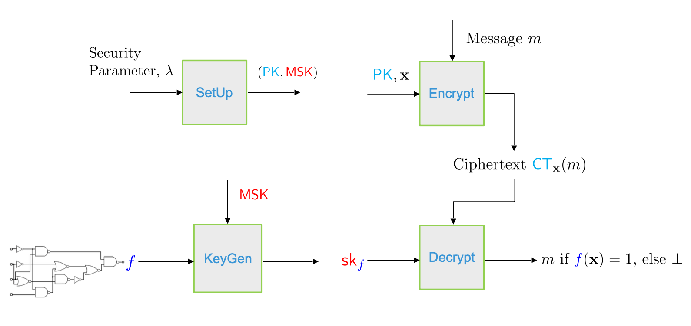

# 格密码学进阶05：从IBE出发到内积ABE（AFV11）

### 写在前面

越往后面写，笔者发现随着难度的进阶，很多内容并不是可以全部塞在一篇文章中一起发出来的了。每一篇文章的内容都有太多细节的地方需要满满的思考。

从这一期开始，为了方便阅读，我们缩短每一期的篇幅，每一期就详细的介绍一篇或者几篇有关的paper。这样可以方便我们充分的理解体系的构造以及安全性的证明。

在之前的文章中，我们已经充分的了解了IBE加密在格中的实现方法。IBE其实并不是一个什么大难题，因为我们已经有基于双线性配对（Bilinear Maps）的非常好的IBE系统了。

真正让Lattice突出它的强大的地方在于，我们可以从类似ABB10的IBE架构出发，逐步添加新的功能，最后就可以实现传说中的**ABE**（**Attribute-based Encryption**），即**属性加密**了。

这一期，我们来看一看从IBE开始向ABE跨越的第一步：**支持内积运算**。

### ABE简介

乍一看**支持内积运算**这个词，大家都会感觉一头雾水。想要了解它是什么意思的话，我们需要了解一下ABE问题的具体定义。

想必现在网上已经有许多关于属性加密（ABE）的介绍了。我们在这里就不多说整个问题的背景知识了，而是直接给出大概的定义。

首先，整个系统和IBE是一样的，需要一组由管理员生成的MPK与MSK。拥有了MSK的管理员，就可以基于任何**属性函数**$f(\cdot)$签发对应的私钥$sk_f$。什么是属性函数呢？属性函数其实就是一个读取一个**属性输入**$x$的函数，如果$x$通过了函数的验证，那么这个函数就会输出1，反之就会输出0。（反过来也可以，如果通过了输出0，没有就输出1也是一样的。）

这样的话，如果Alice要发送一封消息，她可以根据MPK与自己选择的一个属性输入$x$创建一个特殊的公钥，进而加密她的消息$m$。这个时候，和IBE不同的是，这个消息并不是指向某个$ID$的，而是任何人，只要拥有管理员签发的密钥$sk_f$，并且$f(x) = 1$的话，那就可以解密这条消息。

不仅如此，管理员也可以签发多个$f'$的私钥$sk_f'$，并且分发给不同的人。这样就可以确保一条消息对应的属性$x$只会有一部分人对应的函数$f'$可以验证通过。这样的构造对于人数众多的**ACL**（**Access Control List**）使用场景下非常有用。即如果我想要一条消息只让某个分组的人可以解密，就可以通过ABE系统来高效地实现。

对于这一类把属性函数存放在密钥sk中，然而把属性本身放在密文中的构造，我们一般都称之为**KP-ABE**（**Key Policy ABE**）。反之，如果我们把验证的函数放在密文中，然而把属性放在密钥中的话， 这种构造被叫做**CP-ABE**（**Ciphertext Policy ABE**）。

一般来说，CP-ABE更加贴合我们实际的使用逻辑一点——我们在创造密文的时候，可以决定验证的属性函数$f$，就可以很轻松的选择到底谁能看到谁不能看到。每个人所拥有的属性密钥，就可以是他们的名字或者是身份证号。然而，现在**最常见的构造仍然是KP-ABE的结构**，因为CP-ABE的构造会更复杂一点（需要能够把函数嵌入在密文中并且可以快速验证属性输入）。

如果我们不需要高效这一点，我们可以**把任意的KP-ABE结构转换成CP-ABE结构**，即对调加密方和解密方的角色。假如我们拥有一个可以支持任意复杂度电路的属性函数的KP-ABE结构，这个时候，我们只需要生成一个对应于**Universal Circuit**（**全能电路**）$U(\cdot, x)$的密钥$sk_U$，就足够了。

Universal Circuit $U(C, x)$是一个万能的电路，其功能如下：我们输入一个电路$C$的描述，与$C$的输入$x$，然后全能电路就可以计算这个输入的电路在$x$上的值$U(C, x) = C(x)$随后输出。在KP-ABE的场景中，我们想要通过Key中的函数$f$来验证密钥中的输入$x$。当Key中的函数是$U(\cdot, x)$，即内嵌了输入$x$的Universal Circuit的时候，这个时候密钥中的输入就变成了CP-ABE中的属性函数$f$的电路描述$C$。换句话说，我们可以把对于属性函数电路的描述存放在密钥中，然后通过Key中嵌入的全能电路和输入$x$来进行计算，最后得到$C(x)$的值。

关于Universal Circuit的适用方法，还有很多很多，这里就不多描述了。但是$U$的最大弊端在于这么一个全能的电路的体积是非常庞大的。如果我们把$U$作为$f$嵌入在$sk_f$中，首先能否实现巨大的复杂度先不说，就算可以实现，整体的效率也会非常低。

### IBE是ABE的一种简化版本

了解完ABE是什么之后，我们回头看IBE的时候就会发现，其实IBE就是一种非常简化版本的ABE了。

IBE的问题在于，在一个系统中，每一个人都拥有属于自己的一个任意选择的“身份”，即$ID$。然后如果我想给某人发消息，我就需要基于那个人的$ID$来作为公钥进行加密。那个人会从系统管理员那里拿到属于自己的$ID$的密钥$\mathbf{e}_{ID}$，从而就可以解开所有对着他的$ID$加密的密文了。

如果套用ABE的构造的话，那么“身份”即$ID$，就是ABE系统中的属性输入$x$，然后验证身份所用的属性函数也很简单：
$$
f(x) = \begin{cases}0 & x = ID^*,\\
1 & \text{otherwise}.\end{cases}
$$
之前我们描述的ABE的属性函数对于通过的属性会输出1，这里我们为了方便后续的构造，我们颠倒一下1与0的定义，如果属性通过验证，$f$会输出0。（这一点并不影响ABE的实现，非常的trivial。）

在ABE中，IBE只是一种非常简单的属性函数。我们观察$f(x)$的定义可以发现，这其实就是一个**Point Function**。也就是说，在整个函数的输入空间中，只有一个点（即$ID^*$）上对应的输出是0，其余都是1。

Point Function在所有可能的属性函数的集合中，属于最简单的一类。之前我们说到的CHKP10与ABB10这两种IBE构造都是变相的实现了Point Function ABE。

写到这里，我们不禁开始思考：我们知道ABE最后的终点就是可以实现任意复杂度的函数，但是我们目前只知道怎么实现Point Function而已。我们能不能循序渐进继续摸索下一个复杂度的函数类别呢？

### 内积函数

如果要超出Point Function的范畴，进入下一阶段的话，一个比较有意义的方向就是线性函数（Linear Function）了，即对于属性$\mathbf{x}$（可以是一个向量）的任意线性组合。我们在表达$\mathbf{x}$中的元素的线性组合的时候，就可以使用$\langle \mathbf{x}, \mathbf{y} \rangle$的内积形式来表述。举个例子：
$$
\mathbf{x} = [x_0,x_1,x_2]\\
\mathbf{y} = [1, -1, 2]\\
\langle \mathbf{x}, \mathbf{y} \rangle = x_0 - x_1 + 2x_2
$$
在2011年的时候，Agrawal，Freeman与Vaikuntanathan在【**AFV11**】这篇paper中介绍了一种新的ABE构造，可以实现属性向量$\mathbf{x}$与密钥中的一个向量$\mathbf{y}$的内积。这里的属性函数为：
$$
f(\mathbf{x}) = \begin{cases}
0 & \text{if } \langle \mathbf{x}, \mathbf{y} \rangle = 0,\\
1 & \text{otherwise.}
\end{cases}
$$
AFV11同样也是一个KP-ABE架构。这也就是说，在这个构造中，我们在密钥$sk_f$中嵌入一个计算与$\mathbf{y}$向量内积的函数$f(\cdot)$。然后我们在加密的过程中在密文中嵌入属性向量$\mathbf{x}$。这样，如果解密方的密钥中的$\mathbf{y}$与密文中的$\mathbf{x}$的内积为0的时候，解密方就可以成功解密这个密文啦。

即然Point Function ABE就等于IBE，那么基于内积函数的ABE可以实现什么不同的功能呢？如果仔细观察的话，我们可以把一组有限长度的**布尔逻辑表达式**（CNF/DNF）嵌入在这个里面。这样的话，$\mathbf{x}$向量的每一位就代表一个boolean bit，然后$\mathbf{y}$中就是对应的约束。只要内积等于0，那就代表布尔逻辑验证通过了。

光是基于内积，就已经可以实现很多有限约束的逻辑了。是不是感觉很强大？

### AFV11的具体构造

接下来，我们来详细的看一下AFV11 ABE是如何构造的。

内积ABE这个概念在【**KSW08**】中被第一次提出。其大致形式和我们之前描述的相同：在密钥中嵌入一个$\mathbf{y}$向量，在密文中嵌入一个$\mathbf{x}$向量。最后如果两者的内积为0，则拥有$\mathbf{y}$的密钥就可以解开携带$\mathbf{x}$属性的密文。

为了方便我们表述AFV11的具体结构，我们假设进行内积运算的向量$\mathbf{x, y}$的长度为4，即$\lvert \mathbf{x} \rvert = \lvert \mathbf{y} \rvert = 4$。

#### 公共参数

AFV11 ABE系统的公共参数和之前介绍的CHKP10系统大致相似。首先，我们需要一个通过MP12 Trapdoor算法生成的随机平均分布的矩阵$\mathbf{A}$，与一个任意选择的SIS问题向量$\mathbf{u}$。

其次，因为我们这里的内积向量长度为4，所以我们需要额外的生成4个随机平均分布的（没有Trapdoor的）矩阵$\mathbf{A}_1, \mathbf{A}_2, \mathbf{A}_3, \mathbf{A}_4$。

这个系统的MSK就是矩阵$\mathbf{A}$的Trapdoor $\mathbf{R}$。

#### 加密矩阵与密钥生成

熟悉基于Lattice的ABE之后，想必我们都知道下一步是什么了：根据一个约束向量$\mathbf{y}$，如何构造ABE矩阵$\mathbf{F_y}$。AFV11中的$\mathbf{F}$矩阵很简单：
$$
\mathbf{y} = (y_1, y_2, y_3, y_4)\\
\mathbf{F_y} = [\mathbf{A} \vert \sum_i y_i \mathbf{A}_i]
$$
AFV11真正不一样的地方在于右侧，把$\mathbf{y}$的每一项乘以对应的$\mathbf{A}_i$矩阵，然后把结果加起来得到一个新的组合矩阵。因为基于格的方案基本上都是针对于一个bit来进行操作的，所以我们这里也额外的约束这个ABE中的$\mathbf{x, y}$向量都为二进制向量。当$y_i \in \{0, 1\}$的时候，$\sum_i y_i \mathbf{A}_i$就等于$\mathbf{A}_i$的一个subset sum。

$\mathbf{F_y}$矩阵的左侧和往常一样，就是带有Trapdoor的$\mathbf{A}$矩阵，这确保了拥有MSK的管理员可以生成任何$\mathbf{F_y}$对应的密钥。对应$\mathbf{F_y}$的密钥$\mathbf{e_y}$就是其SIS问题的解：
$$
\mathbf{F_y e_y} = \mathbf{u} \text{ mod }q
$$

#### 加密算法Enc

我们知道如何根据$\mathbf{y}$约束向量生成$\mathbf{F_y}$和对应的密钥$\mathbf{e_y}$之后，下一步就是根据属性$\mathbf{x}$开始加密一段密文了。

首先，我们要做的事情是和普通的Dual Regev一样，把需要加密的原文$\mu \in \{0, 1\}$嵌入在密文中：
$$
C = \mathbf{u}^t \mathbf{s} + noise + \lfloor q/2 \rfloor \mu
$$
其中$\mathbf{s}$为随机选择的一个向量，$noise$为噪音。

我们知道，光有$C$还是不够的，我们还需要一个辅助的密文$C'$：
$$
C' = \mathbf{A}^t \mathbf{s} + \mathbf{noise}
$$
其中$\mathbf{x}$为噪音向量，$\mathbf{noise}$为噪音向量。

在普通的Dual Regev中，我们只需要知道一个对应了$\mathbf{A e = u} \text{ mod }q$ SIS问题中的解$\mathbf{e}$，就可以把$C'$转换成一个近似$\mathbf{u}^t \mathbf{x}$的值，随后就可以把这一部分从$C$中移除，从而还原出$\mu$的值来。

但是在这里，我们不能轻易的给出这个$\mathbf{e}$来，而是要巧妙的设计一个结构，使得如果$\langle \mathbf{x, y} \rangle = 0$的时候，我们就可以得到一个近似$\mathbf{u}^t \mathbf{s}$的值，帮助我们解密。

AFV11中，这个体系的具体实现方式是这样的，我们根据$\mathbf{x} = (x_1, x_2, x_3, x_4)$这个属性向量的每一个值，分别构造出四个密文矩阵：
$$
C_i = (\mathbf{A}_i + x_i \times \mathbf{G})^t \mathbf{s} + \mathbf{noise}
$$
如果我们仔细观察这个密文矩阵的构造的话，我们会发现因为$\mathbf{A}_i$是随机选择的，所以可以当作一个完美的One-Time Pad来完全的隐藏所有的$x_i$属性。

总结一下，我们的加密算法$Enc$一共会生成普通的Dual Regev密文$C, C'$，还会额外的生成4个对应了$y_i$约束的密文$C_i$。

#### 解密算法Dec

现在，我们来看看最重要的环节——解密是如何进行的。

总结一下，作为一个解密方，我们会拥有一个属于自己的约束向量$\mathbf{y}$和对应的密钥$\mathbf{e_y}$。我们看到的密文由三部分组成：

1. Dual Regev中蕴涵了真正的加密内容的密文$C = \mathbf{u}^t \mathbf{s} + noise + \lfloor q/2 \rfloor \mu$。
2. 为了方便我们解开第一部分而存在的一段补充的密文$C' = \mathbf{A}^t \mathbf{s} + \mathbf{noise}$。
3. 根据加密方选择的属性向量生成的一组密文$C_i = (\mathbf{A}_i + x_i \times \mathbf{G})^t \mathbf{s} + \mathbf{noise}$。

AFV11 ABE的精髓在于，已知$\mathbf{y}, \mathbf{e_y}, C', \{C_i\}$，我们可以巧妙的组合这些信息，计算并移除密文$C$中的One-Time Pad $\mathbf{u}^t \mathbf{s}$，从而还原出原文$\mu$来。

我们知道这些信息中，最方便我们解密的应该是我们所拥有的密钥$\mathbf{e_y}$，因为它满足了如下的等式：
$$
\mathbf{F_y e_y} = [\mathbf{A} \vert \sum_i y_i \mathbf{A}_i] \mathbf{e_y} = \mathbf{u} \text{ mod }q
$$
接下来就是想办法构造出这个结构，从而让这个密钥发挥用武之地了。

首先，我们把$\mathbf{y}$的信息叠加到$\{C_i\}$密文上，构成新的组合密文$C_y$：
$$
\begin{align*}
C_y &= \sum_i y_i C_i\\
&= (\sum_i y_i \mathbf{A}_i + \underbrace{\sum_i y_i x_i \mathbf{G}}_\text{0 if $\langle \mathbf{x, y} \rangle = 0$})^t \mathbf{s} + \underbrace{\sum_i y_i \cdot noise}_\text{small if $y_i$ is binary} 
\end{align*}
$$
如果我们展开$C_y$的表达式，我们会发现其中带有$\mathbf{G}$的一项，如果$\mathbf{x, y}$的内积为0的话，就可以被完美的消除。这样一来，整个表达式就变成了纯粹的$\sum_i y_i \mathbf{A}_i$，这也就是我们前面$\mathbf{e_y}$用到的矩阵的一部分！

接下来，最后一步我们就是要正确的使用密钥$\mathbf{e_y}$来解密。我们拼接$C'$与$C_y$，并且乘上$\mathbf{e_y}$，就可以得到：
$$
\begin{align*}
\mathbf{e_y}^t [C' \vert C_y] &= \mathbf{e_y}^t [\mathbf{A}^t \mathbf{s} + \mathbf{noise} \vert (\sum_i y_i \mathbf{A}_i)^t \mathbf{s} + \mathbf{noise}]\\
&= \mathbf{e_y}^t \left([A \vert \sum_i y_i \mathbf{A}_i]^t \mathbf{s} + \mathbf{noise}\right)\\
&= \mathbf{e_y}^t \mathbf{F_y} \mathbf{s} + \underbrace{\mathbf{e_y}^t \cdot \mathbf{noise}}_\text{small since $\mathbf{e}$ is short}\\
&= \mathbf{u}^t \mathbf{s} + noise\\
&\approx \mathbf{u}^t \mathbf{s}
\end{align*}
$$
得到这个结果之后，我们就可以从$C$中减去这一项，就可以得到密文啦！
$$
C - \mathbf{e_y}^t [C' \vert C_y] = \lfloor q/2 \rfloor \mu + noise
$$

### AFV11的深入理解

由于篇幅原因，这里就不给出AFV11的安全论证了。不过大致的方案和之前相同，我们需要能够在不知道MSK和对应的任何约束$\mathbf{y} : \langle \mathbf{x,y} \rangle = 0$情况下的密钥的条件下，可以生成任何$\mathbf{y}' : \langle \mathbf{x,y} \rangle \ne 0$的密钥并且符合AFV11的正确性要求。

如果我们仔细的品味一下AFV11的结构的话，我们会发现其实它在解密的时候根据$\mathbf{y}$的值组合$\{C_i\}$这些密文的过程，和FHE同态加密运算非常的神似。就好比是我们收到了一段对于秘密属性向量$\mathbf{x}$的加密，然后我们同态的把$\mathbf{y}$的值叠加上去，得到一个新的密文。

然而这里解密的精髓非常的耐人寻味：我们事先通过MSK生成了在$\langle \mathbf{x, y} \rangle = 0$的情况下对应密文的一个密钥$\mathbf{e_y}$。 因为解密者并不知道$\mathbf{x}$或者$\mathbf{s}$的值，所以他只能同态的计算他的$\mathbf{y}$与带有$\mathbf{x}$的密文的内积，得到一个新的密文。如果恰巧两者的内积是0的话，那么他手中的密钥就可以巧妙的“解开”新的密文，拿到帮助我们解密的$\mathbf{u}^t \mathbf{s}$。

如果我们换一种方法来理解$C_y$的话，我们可以把它理解为同态计算了$\mathbf{x, y}$内积的密文$C_{\langle \mathbf{x, y} \rangle}$：
$$
C_{\langle \mathbf{x, y} \rangle} = (\mathbf{A_y} + \langle \mathbf{x, y} \rangle \cdot \mathbf{G})^t\mathbf{s} + \mathbf{noise}
$$
这里的$\mathbf{A_y}$即基于了$\mathbf{y}$的值生成的$\sum_i y_i \mathbf{A}_i$。

当$\mathbf{G}$项为0之后，我们会发现整个密文失去了任何有关$\mathbf{x}$的信息，这也就是为什么一开始我们可以在不知道$\mathbf{x}$的情况下只通过MSK就能生成解开这个密文的密钥。

### 归纳到ABE

如果我们再进一步的观察这个结构的话，我们可以把这个结构进一步的generalize一下：
$$
C_{f(x)} = (\mathbf{A}_f + f(x) \cdot \mathbf{G})^t \mathbf{s} + \mathbf{noise}
$$
这里的$\mathbf{A}_f$就是嵌入了$f$属性函数的矩阵$\mathbf{A}$。

在AFV11中，我们的属性函数就是与$\mathbf{y}$的内积操作，即：
$$
f(\cdot) = \langle \cdot, \mathbf{y} \rangle
$$
这里的$\mathbf{y}$我们可以理解为嵌入在$f$中的一个constant。

用这种角度来看的话，我们发现，只要我们能够把$f$的复杂度范围扩大（目前AFV11只给了我们线性内积的$f$），那就可以用这种模式来实现任何属性函数的ABE了！

我们来尝试总结一下这种结构的ABE的大致结构：

1. 首先使用Dual Regev来加密密文$\mu$，使其隐藏在$\mathbf{u}^t \mathbf{s}$构成的的One-Time Pad中。
2. 随后我们使用MSK生成关于$f(\cdot)$本身组成的$\mathbf{A}_f$所对应的密钥$\mathbf{e}_f$。
3. 加密方把自己的属性输入$x$嵌入在$\{C_i\}$中，随后解密方同态的在$\{C_i\}$上计算$f(\cdot)$。
4. 如果$f(x) = 0$，密文中带有$x$的项全部都会归零，然后我们只会剩下描述$f$的$\mathbf{A}_f$。随即我们就可以使用$\mathbf{e}_f$来得到$\mathbf{u}^t \mathbf{s}$并且还原出原文$\mu$。

这样的结构，正是Boneh et al.提出的【**BGG+14**】的ABE结构！由于现在我们只解决了线性函数的计算，距离真正的ABE还差了一点距离。这一部分正是BGG+14所解决的。

### 写在最后

下一期，我们就来深入的了解一下BGG+14是如何构造的，以及我们如何证明齐安全性。

