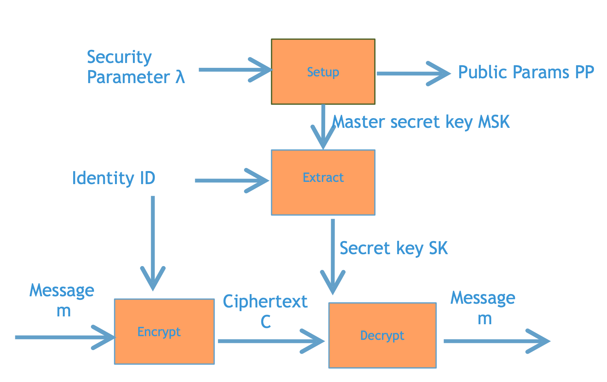
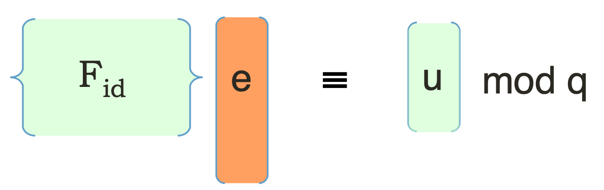
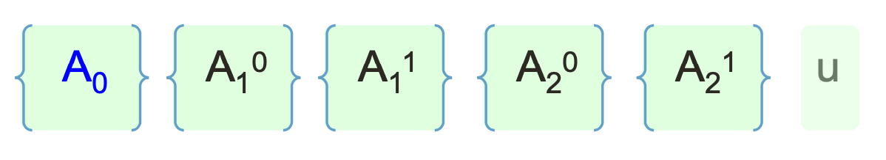
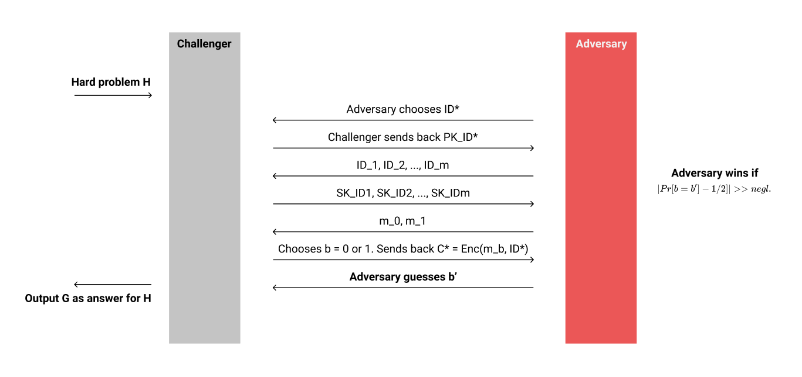

# 格密码学进阶03：基于格的Identity-based Encryption（身份加密）

### 上期回顾

上一期，我们了解了Lattice Trapdoor的具体构造。基于Trapdoor，我们可以有效的逆向计算基于SIS与LWE的两个单向函数$f_\mathbf{A}, g_\mathbf{A}$。

我们再来快速的回顾一下Lattice Trapdoor的构造。

首先，我们需要选择一个Uniform Random的矩阵$\mathbf{B} \in \mathbb{Z}_q^{n \times m'}$，然后再选择一个高斯分布的短矩阵$\mathbf{R} \in \mathbb{Z}_q^{m' \times n \log{q}}$。随后，我们就可以构造我们的问题矩阵$\mathbf{A}$：
$$
\mathbf{A} = [\mathbf{B} \vert \mathbf{G - BR}]
$$
这个矩阵对应的Trapdoor就是矩阵$\mathbf{R}$了，因为我们可以通过$\mathbf{R}$来把$\mathbf{A}$转换到到工具矩阵$\mathbf{G}$上：
$$
\mathbf{A} \cdot \begin{bmatrix}\mathbf{R}\\\mathbf{I}\end{bmatrix} = \mathbf{G}
$$
通过这个构造，我们就可以把基于$\mathbf{A}$的单向函数问题$f_\mathbf{A}, g_\mathbf{A}$转换为基于$\mathbf{G}$的单向函数问题$f_\mathbf{G}, g_\mathbf{G}$。因为工具矩阵$\mathbf{G}$的结构公开已知，所以我们可以很轻易的求解$f_\mathbf{G}^{-1}, g_\mathbf{G}^{-1}$从而计算$f_\mathbf{A}^{-1}, g_\mathbf{A}^{-1}$。

Lattice Trapdoor的构造非常简单，设计也很巧妙。接下来，这一期我们来看看基于Lattice Trapdoor最直观的应用：**身份加密**（**IBE**）。

### 身份加密（Identity-based Encryption，IBE）

IBE的概念想必大家之前也有所耳闻，具体的在这篇文章中就不多解释了，在zhihu上有很多其他大佬对于IBE系统给出了非常详细的解读。

在这里我们给出一个很简单的解读方式：**IBE就是一个可以任意选择公钥的公钥加密系统**。

具体是什么意思呢？基于Diffie-Hellman的ElGamal公钥加密系统我们都知道，需要提前经过密钥生成（KeyGen）的阶段才能生成一对乱码一样的公钥和私钥。随后我们把公钥公布出来之后，其他人就可以通过公钥加密了。这样的系统虽然可行，但是当网上需要公钥加密的人越来越多之后，难免会遇到很大的问题：每个人都有属于自己的一串乱码公钥，如果想要和任何其他人通讯，就必须要记住别人的公钥。

像这样的所有人都记住所有人的公钥的系统，我们称之为**PKI**（**Public Key Infrastructure**）。PKI的缺点就在于当人数越来越多的时候，整个系统就变得非常没有效率，公钥的存储成本非常大。

IBE想要解决的问题就是，如果Alice给Bob发消息，并不需要提前记住Bob的公钥，而是直接把消息加密在Bob的名字下面。当Bob解密的时候，他只需要他证明他是Bob本人，就可以解开密文看到原文了。

为了保证这个IBE系统能够正常的运作，我们还需要一些额外的定义。首先，一个群体需要有一个信任的管理员，这个管理员拥有整个群体的万能公钥（MPK）和万能私钥（MSK）。管理员可以通过MSK来给每个人签发基于每个人名字的私钥$SK_{ID}$，同时公布MPK给所有人看。当Alice给Bob发消息的时候，她会基于MPK和Bob的ID（"Bob"）创建密文。随后Bob就可以通过他专属的$SK_\text{Bob}$来解密。这样的话，所有人只需要记住MPK和接收消息的人的ID，就可以安全的交换消息了。

如果放到一张图上来说的话，大概就像上图所述。我们可以看到，一个IBE系统就是把对方的ID作为了加密的时候使用的公钥。对应的在解密的时候，我们通过MSK和ID提取出专门的密钥$SK_{ID}$进行解密。

IBE是一个相对来说比较老的密码学构造了，在将近20年前被提出，并且基于双线性配对已经有了很好的构造。这一期，我们就来看看如何使用Lattice Trapdoor来构造这个系统。

### Regev加密系统回顾

首先，我们需要回顾一下**Regev Encryption**加密系统。我们这里的IBE构造，精髓就基于Regev Encryption的一个变种。

如果大家看过我之前的【初探全同态加密】系列的话，那应该会对基于LWE的Regev加密系统有一定的了解。我们在这里快速的回顾一下：

- $KeyGen$：首先，我们需要创建一个LWE的问题实例，即创建一个问题矩阵$\mathbf{A}$，然后随机选择一个密钥$\mathbf{s}$和噪音$\mathbf{e}$，最后我们计算$\mathbf{b = As + e}$。随后我们输出私钥$sk = \mathbf{s}$，公钥$pk = (\mathbf{A, b})$。
- $Encrypt(pk, \mu \in \{0,1\})$：我们加密一个bit的方式很简单，只需要随机选择一个blinding factor $\mathbf{r} \in \mathbb{Z}_2^m$，然后计算$c_0 = \mathbf{r}^t \mathbf{A}$，$c_1 = \mathbf{r}^t \mathbf{b} + \lfloor q/2 \rfloor \mu$。随后我们输出密文为$(c_0, c_1)$。
- $Decrypt(sk, ct=(c_0, c_1))$：如果要解密的话，我们只需要计算$c_1 - c_0 \cdot \mathbf{s} = \mathbf{r}^t \mathbf{e} + \lfloor q/2 \rfloor \mu$。因为噪音向量的分布我们控制的很小，所以我们可以直接通过观察结果的值是否小于$q/4$来判断$\mu$是0还是1。

具体的Regev加密的正确性和安全性，可以参见【初探全同态加密】这一专题。

我们之前学到的Regev Encryption的精髓在于，因为LWE问题的困难度，我们可以安全的把密文$x$隐藏在一个看似随机的向量$\mathbf{b}$中。然而作为密钥生成方我们知道LWE问题的解，所以我们可以很轻松的从密文中移除$\mathbf{b}$这一项，剩下原本的原文和一些小范围的噪音。

如果看过【Lattice学习笔记】，想必大家都会知道，既然有基于LWE的系统出现，那么肯定就会有基于LWE的小兄弟——SIS的系统出现。我们能否**把这个Regev加密系统转化成基于SIS难度的系统**呢？

Gentry，Peikert与Vaikuntanathan在08年的论文**GPV08**中，对于Regev的加密体系进行了一个细小的变换，得到了一个基于SIS难度的系统——**Dual Regev加密系统**。具体方案如下：

- $KeyGen$：因为Regev的密钥生成是生成一个LWE的实例，我们这里想必就要生成一个SIS的实例了。如同上图所述，我们选取随机的$\mathbf{A}$，和密钥短向量$\mathbf{e}$，计算$\mathbf{u = Ae} \text{ mod }q$。随后我们输出私钥$sk = \mathbf{e}$，公钥$pk=(\mathbf{A, u})$。
- $Encrypt(pk, \mu)$：我们选取一个随机的LWE问题的解$\mathbf{s}$，噪音向量$\mathbf{x}$，和一个单独的噪音值$x$。然后我们计算$c_0 = \mathbf{A}^t \mathbf{s} + \mathbf{x}$，$c_1 = \mathbf{u}^t \mathbf{s} + x + \lfloor q/2 \rfloor \mu$。随后输出$(c_0, c_1)$。
- $Decrypt(sk, ct=(c_0, c_1))$：解密和之前是一样的，我们计算$c_1 - \mathbf{e}^t c_0 = \lfloor q/2 \rfloor \mu + x - \mathbf{e}^t \mathbf{x}$。由于后两项都为噪音分布空间中很小的值，所以我们可以很简单的提取出原文$\mu$来。

Dual Regev模式的精髓在于，在密钥生成的阶段，我们不会生成任何LWE的实例，而这个实例是在加密的过程中被随机选择出来的。相比起Regev是在密钥生成阶段就锁定了唯一的一个LWE实例，而在加密阶段选择一个随机的向量$\mathbf{r}$来增加随机性。

Dual Regev模式的好处在于它的公钥部分$(\mathbf{A, u})$是**纯平均随机分布**的。因为我们随机的挑选了平均分布的$\mathbf{A}$，并且选择了高斯分布的$\mathbf{e}$，我们知道$\mathbf{u}$一定是呈平均随机分布的！相比起普通Regev模式下的公钥$(\mathbf{A, b})$作为LWE的问题实例，$\mathbf{b}$并不是平均随机分布的！虽然在DLWE假设中，我们假设$(\mathbf{A, b})$是computationally和平均分布相似的，但是在statistical（概率分布）的层面上，$\mathbf{b}$并不是Uniform的。

关于Dual Regev公钥的平均分布看起来没什么用，但是**对于IBE系统来说至关重要**。为什么这么说呢？这是因为IBE系统中我们要求任何ID都可以当作加密使用的公钥，然而这一特性Dual Regev下**公钥的平均随机分布**正好是完美契合的，这对于之后的安全性证明帮助非常大。

### 基于Dual Regev的IBE架构

了解完Dual Regev的具体构造之后，接下来我们就可以尝试基于它来实现IBE了。

我们知道一个IBE系统下，我们需要可以把任意的ID当作公钥进行加密。所以我们需要想办法在密文和密钥中“嵌入”这么个ID的值进去。

在了解怎么做之前，我们再来看一下**Dual Regev的精髓**在哪里。

我们在选择Dual Regev系统的密钥的时候，就像之前的图上所述，我们需要先选择一个关键的SIS问题实例，即一组$\mathbf{A, e, u}$：
$$
\mathbf{Ae} = \mathbf{u} \text{ mod }q
$$
然后我们可以对着这个SIS问题的题面，即$\mathbf{A, u}$进行Regev公钥加密。随后可以根据这个SIS问题的解$\mathbf{e}$，对密文再进行解密。这也就是说，**Dual Regev的核心就在于这个SIS问题和它的解**。

我们可以把这个idea延伸到IBE上来。如果任何人可以根据要加密的对象的ID来构造一个SIS的问题矩阵$\mathbf{F}_{ID}$，那么他们就可以基于这个$\mathbf{F}_{ID}$和任意挑选的一个$\mathbf{u}$来进行Dual Regev加密。接下来我们只要搞清楚，拥有ID的这个人如何掌握这么个密钥$\mathbf{e}$使得SIS等式成立，就大功告成了。

把这个问题用图描述出来，我们发现，其实这种思路的IBE就是把原本随机生成的SIS矩阵$\mathbf{A}$替换成了一个任何人可以efficiently生成的这么一个IBE矩阵$\mathbf{F}_{ID}$罢了。

由于普通的Dual Regev中，我们都是随意的挑选$\mathbf{A}, \mathbf{e}$然后再计算$\mathbf{u}$的，现在我们反了过来：提前计算好了$\mathbf{u}$，并且任何人都可以生成固定的$\mathbf{F}_{ID}$，那么我们怎么才能让拥有ID的人得到一个有效的$\mathbf{e}$满足SIS呢？

是不是非常的有即视感？这个时候，就需要轮到我们的Lattice Trapdoor出场了。

我们上一期学到的Trapdoor，告诉我们我们可以构造一个看似随机的$\mathbf{A}$，但是自带一个“后门”$\mathbf{R}$，让我们可以有效的计算基于$\mathbf{A}$的SIS/LWE单向函数的反函数。这里我们当然也要构造这么一个$\mathbf{A}$，并且想办法嵌入到我们的$\mathbf{F}_{ID}$中。**嵌入的方法不同，最后得到的IBE也不同。**

下面我们就来看看第一种IBE体系——**CHKP10 IBE加密系统**。

### 【CHKP10】IBE加密系统

Cash，Hofheinz，Kitz和Peikert在2010年发表的CHKP10中，给出了一个非常优雅的基于Lattice的IBE构造，我们来看看是怎么实现的。

#### ID的选择

首先，即然说到了IBE，我们就要先来看看这个ID到底是什么东西。如果Alice想要给Bob发送消息的话，那么这个ID就是一个字符串“Bob”。如果在学校里给别的同学发消息的话，那么这个ID很有可能就是收件人的学号，等等。

因为ID这里有很多种含义，为了方便我们IBE系统的构造，我们就定义ID为一个长度为$l$的二进制字串。因为我们可以把任何字符串或者编号转换为二进制，所以只需要解决二进制下的ID，就等于解决了所有IBE的应用了。

在这里，为了方便我们对于IBE系统的展示和运算，我们定义ID就是一个2 bits的一个数字：
$$
\lvert ID \rvert = 2\\
ID \in \mathbb{Z}_2^2
$$

#### 公共参数生成

一个IBE系统的第一步就是生成它的公共参数了，即生成我们上文所述的MPK与MSK。

在CHKP10中，我们首先需要使用我们上一期讲到的Trapdoor的方法，生成一个带有Trapdoor $\mathbf{R}$的随机矩阵$\mathbf{A}_0$。随后，对于ID的每一个bit，我们都生成两个随机矩阵$\mathbf{A}_i^0, \mathbf{A}_i^1$。最后，我们再随机选取一个看得顺眼的$\mathbf{u}$，就搞定了。

图上所述的就是当ID为两位的时候，我们一共需要生成6个关键元素：带陷门的$\mathbf{A}_0$，对应每一位随机生成的$\mathbf{A}_1^0, \mathbf{A}_1^1, \mathbf{A}_2^0, \mathbf{A}_2^1$，和一个向量$\mathbf{u}$。

这6个关键元素，就是我们IBE系统的MPK了。同时，$\mathbf{A}_0$的Trapdoor $\mathbf{R}$，就是这个系统的MSK。

#### 生成ID矩阵

当我们进行加密的时候，首先我们需要根据加密的ID计算出对应的$\mathbf{F}_{ID}$以便我们进行Dual Regev加密。当我们拿到了上面生成的公共参数之后，就可以把这些参数根据对应的ID的值组合起来，就可以构成$\mathbf{F}$了。我们举个例子，如果我们加密选择的ID是01的话，那么我们就可以把$\mathbf{A}_0$矩阵和对应每一个bit的$\mathbf{A}_i^b$拼接起来：
$$
\mathbf{F}_{ID} = [\mathbf{A_0} \vert \mathbf{A_1^0} \vert \mathbf{A}_2^1]
$$
这样一来，最后会得到一个长条形的$\mathbf{F}_{ID}$，我们随后就可以通过它来使用Dual Regev进行IBE加密了。

但是到这里还没有结束。我们知道，Dual Regev的精髓在于我们需要提前知道一个短的密钥$\mathbf{e}$，使得$\mathbf{Ae} = \mathbf{u} \text{ mod }q$。这里也一样，我们需要找到对应的$\mathbf{e}$使得：
$$
\mathbf{F}_{01} \mathbf{e} = [\mathbf{A}_0 \vert \mathbf{A}_1^0 \vert \mathbf{A}_2^1] \mathbf{e} = \mathbf{u} \text{ mod }q
$$

#### 使用Lattice Trapdoor计算密钥

接下来，我们需要计算出这个ID对应的密钥$\mathbf{e}$。

首先，我们已知了$\mathbf{A}_0$这个矩阵的Trapdoor $\mathbf{R}$，同时其他的两个矩阵$\mathbf{A}_1^0, \mathbf{A}_2^1$是随机生成的。这也就是说，我们需要找到一个长矩阵，并且满足：
$$
[\mathbf{A_0} \vert \mathbf{A_1^0} \vert \mathbf{A}_2^1] \begin{bmatrix}
\mathbf{a}\\
\mathbf{b}\\
\mathbf{c}
\end{bmatrix}
= \mathbf{u} \text{ mod }q
$$
我们需要求解的就是这$\mathbf{a, b, c}$三个部分。解决方案十分简单：我们随机的选择$\mathbf{b}$和$\mathbf{c}$的值，使得整个等式变成：
$$
\mathbf{A}_0 \cdot \mathbf{a} = \mathbf{u} - [\mathbf{A_1^0} \vert \mathbf{A}_2^1] \begin{bmatrix}
\mathbf{b}\\
\mathbf{c}
\end{bmatrix} \text{ mod }q
$$
这样一来，求解$\mathbf{a}$就变成了计算基于$\mathbf{A}_0$的SIS OWF的反向函数。我们只要使用$\mathbf{R}$来构造$f_{\mathbf{A}_0}^{-1}$，然后再计算出$\mathbf{a}$就大功告成。最后，我们输出对应于这个ID的IBE密钥：
$$
\mathbf{e} = \begin{bmatrix}
\mathbf{a}\\
\mathbf{b}\\
\mathbf{c}
\end{bmatrix}
$$
真正在使用场景中，整个群组中拥有MSK的管理员会计算出这个$\mathbf{e}$并且发给ID为01的人。这样一来这个人就可以解开所有发给01的密文了。

#### IBE加密

当我们成功的构建$\mathbf{F}_{01}$之后，就可以进行Dual Regev加密了。由于之前讲过了，这里就快速的带过。
$$
Enc(\mu \in \{0,1\}, ID=01) \rightarrow \\
(c_0 = \mathbf{F}_{01}^t \mathbf{s} + \mathbf{x}, c_1 = \mathbf{u}^t \mathbf{s} + x + \lfloor q/2 \rfloor \mu)
$$
和之前的构造相同，我们选取随机的向量$\mathbf{s}$，和对应的噪音$\mathbf{x}, x$以便完成加密。

#### IBE解密

解密和之前也是一样的，ID为01的人就可以通过$\mathbf{e}$来计算：
$$
c_1 - \mathbf{e}^t c_0 = \lfloor q/2 \rfloor \mu + x - \mathbf{e}^t \mathbf{x} \approx \lfloor q/2 \rfloor \mu
$$

### CHKP10的安全性论证

以上就是CHKP10的IBE加密体系的全貌了！接下来是最重要的部分，即**安全性论证**（**Security Proof**）。

一般讨论类似于IBE一样的加密系统的话，我们的安全性论证一般都会使用一个**security game**来描述。在这个game中我们作为**Challenger**，我们的任务是尝试去“挑战”解决一个公认的难题，比如LWE。随后，在这个game中还存在着一个**Adversary**，它的目标是尝试攻破我们描述的IBE系统。然后整个game可以被描述为，Challenger把想要解决的LWE难题包装成一个IBE的系统，然后让Adversary去尝试攻破它。我们把IBE的构造设置为，如果Adversary可以有效的攻破它，那么我们就可以利用Adversary输出的结果来解决我们想要解决的LWE问题。

这其实就是变相地说，我们可以把LWE问题伪装成一个IBE，进而证明我们提出的IBE的系统的安全性。因为如果这个系统可以被攻破，那么就代表它对应的LWE问题也能被攻破。

简单的画了个图描述了一下整个security game的大致流程。

1. 首先，Challenger会接收到一个困难的问题实例，比如LWE。
2. 随后开始IBE系统的构造。我们作为Challenger需要能够回答来自Adversary的一些问题。第一类问题是**公钥问题**，即Adversary提供任意的ID，我们需要返回过去对应这个ID的IBE加密矩阵$\mathbf{F}_{ID}$。在这类问题中，Adversary需要决定一个它想要破解的ID，即$ID^*$。
3. 第二类问题就是**密钥问题**（**Key Queries**）。这个过程中，Adversary可以任意的选择合理的ID，只要并不是$ID^*$，我们就要回答对应这个ID的私钥$SK_{ID}$。
4. 在Adversary问完问题结束之后，我们的security game进入了最后的阶段。Adversary选择并且提供两段长度相同的密文$m_0, m_1$，然后发送给Challenger。随后Challenger会随机选择一个bit $b \in \{0,1\}$，然后基于$b$的值构造密文$C^* = Enc(m_b, ID^*)$，并且把密文发送给Adversary。
5. Adversary需要基于密文，判断并输出$b' \in \{0,1\}$，尝试猜出我们选择的$b$的值。
6. 最后，我们根据Adversary给出的答案，尝试解决一开始得到的困难问题。

由于篇幅原因，我们不会构建完整的一套security game，而是着重于focus在**Challenger与Adversary的交互**上。观察这个game当中的交互之后，可以总结出几点关键。

#### IBE安全证明的关键点

首先，第一点我们已经提到过了，就是作为Challenger本身，我们需要能够回答Adversary提出的密钥问题。这也就是说，我们需要有能力可以创建对应的$\mathbf{F}_{ID}$的Trapdoor。

但是需要注意的是，因为我们的目的是为了解决一个困难问题（比如SIS/LWE），所以我们需要把这个问题嵌入到security game当中来。放到IBE的场景中来的话，比较可行的方式就是：我们只能生成一部分（Adversary选择的）ID的密钥。但是对于Adversary一开始决定的$ID^*$，我们使用输入进来的困难问题作为它的公钥。这样一来，如果Advesary可以破解基于$ID^*$下的Dual Regev的话，那么代表我们也可以利用Adversary来破解构造它的困难问题了。

这一构造意味着什么呢？这代表我们作为Challenger本身并不能知道$ID^*$的密钥。这也间接的要求了我们不能知道整个IBE系统的MSK。但是我们又需要在不知道MSK的情况下任意的构造出Adversary提出的任意其他ID对应的密钥。

在这样的构造下，如果我们可以在不知道MSK和$ID^*$的前提下，成功的回答Adversary提出的各种问题，这就意味着这个IBE系统中，除了$ID^*$之外的其他ID的加密解密流程，我们就算不知道$SK_{ID^*}$，也可以完全**simulate**（**模拟**）出来。

说到模拟的概念，了解零知识的朋友都不陌生了。假如我不知道$SK_{ID^*}$，也可以完全模拟出IBE系统里其他ID的transcript（交互信息）的话，那就代表其他的ID下的加密解密的transcript对于$SK_{ID^*}$这一消息来说是零知识的！

#### IBE Transcript Simulation

现在我们的问题明确了：我们需要在不知道$ID^*$的前提下，构造其他的ID的密钥，并且仍然保留IBE的正确性。此外，我们还可以基于已知的困难问题，构造一个困难的密文$C^*$发给Adversary。

接下来，我们就来看一看构造吧。为了方便演示，我们假设$ID^* = 11$。

首先，因为构造要求，我们知道我们不可能会知道$SK_{ID^*}$，这也就代表了我们并不知道MSK，即$\mathbf{A}_0$的Trapdoor。其次，我们想使得$ID^*$下的所有密文都基于困难的SIS/LWE问题。基于这两条要求，我们可以随机的选取$\mathbf{A}_0, \mathbf{A}_1^1, \mathbf{A}_2^1$，并且确保这三个矩阵是纯随机的（没有Trapdoor的存在）。

这样一来，我们来看看基于$\mathbf{F}_{ID^*}$的IBE加密矩阵：
$$
\mathbf{F}_{ID^*} = [\mathbf{A}_0 \vert \mathbf{A}_1^1 \vert \mathbf{A}_2^1]
$$
由于这三个矩阵都是没有Trapdoor的，所以$\mathbf{F}_{ID^*}$也是没有Trapdoor的。如果Adversary可以破解基于$\mathbf{F}_{ID^*}$的Dual Regev，这也就代表它可以破解基于$\mathbf{F}_{ID^*}$的SIS/LWE啦。

实现了困难问题这一要求之后，我们再来看一看密钥问题（Key Queries）。为了能够成功的生成其他ID下的SK，解决的方法很简单：我们只需要生成带有Trapdoor的$\mathbf{A}_1^0, \mathbf{A}_2^0$就行了。原理很简单，只要我们的$\mathbf{F}_{SK}$的构造中有任何一个带有Trapdoor的矩阵，那我们就可以生成整个SK啦。举个例子：
$$
\mathbf{F}_{01} = [\mathbf{A}_0 \vert \mathbf{A}_1^0 \vert \mathbf{A}_2^1]
$$
我们可以就利用$\mathbf{A}_1^0$的Trapdoor来生成$SK_{01}$。

这就是CHKP10 IBE的安全性论证的全貌了。我们回顾一下，整个证明的核心在于两点：

1. 我们可以在不知道$SK_{ID^*}$的情况下生成其他所有ID的密钥。这代表了就算知道了其他所有ID的密钥，我们也不能还原出$SK_{ID^*}$。
2. 我们把$ID^*$下的IBE公钥变成了一个纯随机生成（没有Trapdoor）的SIS/LWE矩阵。这样如果存在可以破解我们IBE security game密文的Adversary，我们就可以利用这个Adversary来攻破SIS/LWE。

Q.E.D.

### 写在篇尾

这一期，我们了解了基于Lattice构造（尤其是Lattice Trapdoor）下的身份加密（IBE）体系。

稍微总结一下这一期的内容：首先我们了解了IBE大概的定义，并且看到了帮助我们构造IBE的Dual Regev加密系统。随后我们看到了CHKP10提出的IBE的结构，随后在最后面我们看到了这一结构的安全证明和对应的security game。

CHKP10下的IBE，虽然构造非常优雅，但是我们不禁会发现一个**弊端**：用于加密的矩阵$\mathbf{F}_{ID}$太长了。

我们观察可以发现，现在$\mathbf{F}_{ID}$的长度，和ID有多少个bits是直接挂钩的。这也就代表了，如果我们要发送消息给一个256bits的地址，我们可能需要构造一个非常非常大的$\mathbf{F}_{ID}$来用作IBE加密的矩阵。这一点对于整个IBE体系的实际应用是毁灭性的。

一种对策是我们像之前讨论多项式环下的Ring-SIS/LWE一样，我们把整个问题转化到Ring中，这样可以减少一点矩阵存储和相乘运算的开支。但是在维度上来看，ID和公钥的比例仍然是$O(n)$的增长。我们能否消减这一增长的比例呢？

Agrawal，Boneh与Boyan在2010年同时提出了**ABB10**的格IBE构造。他们的构造的公钥大小永远都是恒定在$O(1)$的，这一点相比起CHKP10是非常大的突破。

下一期，我们就来看一看ABB10这一更加高效率的IBE构造。

### References

本文内容主要参考于IIT Madras的教授[Shweta Agrawal](https://www.cse.iitm.ac.in/~shwetaag/)的讲座。

