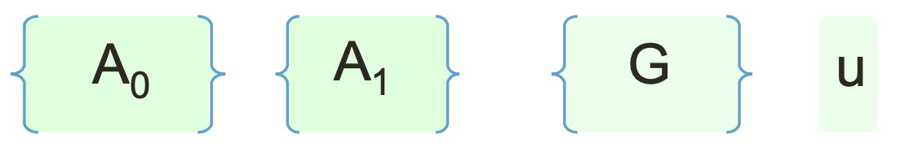

# 格密码学进阶04：更高效率的IBE（ABB10）

### 上期回顾

上期文章中，我们了解了Lattice Trapdoor的第一个实践用处——即身份加密IBE。同时，我们也看到了最简单的CHKP10 IBE身份加密系统。

粗略的概括一下CHKP10做了什么：我们把代表Identity（身份）的$ID$拆分成二进制的bits，然后每一位都对应选择一个LWE的矩阵$\mathbf{A}_i^b$。我们最终把这些选好的矩阵全部拼接起来，再通过实现预留的Trapdoor找到对应这个大矩阵的密钥，就可以进行Dual Regev的加解密了。

像这种根据Identity的每一个bit选择矩阵组合起来变成一个新矩阵的构造在密码学中非常常见，这里先留作一个悬念，如果后面有机会写到基于GGH15的Multilinear Map而实现的Indistinguishability Obfuscation（iO）的话，我们会发现非常相似的构造。

在上期的最后，我们同样也发现了CHKP10构造的一个缺陷：公钥的大小和ID的长度是等比线性增长的，这会大大影响这个IBE体系的存储空间和计算效率。

其实呢，CHKP10只是我们了解完Lattice Trapdoor之后入门的第一种IBE构造。同样是在2010年，整个密码学圈子里还诞生出了另一种IBE的构造——**ABB10**。

### 【ABB10】IBE加密系统

**ABB10**，顾名思义，是由**Agrawal，Boneh与Boyan**三位在2010年提出的。ABB10不同于CHKP10的是：它的加密矩阵$\mathbf{F}_{ID}$是恒定大小的，并不会随着$ID$的长度变长而变大。我们来看看ABB10的具体构造吧。

#### 公共参数生成

ABB10的公共参数生成较为简单。首先，我们需要指定两个随机的问题矩阵$\mathbf{A}_0, \mathbf{A}_1$，以及SIS问题的结果向量$\mathbf{u}$。最后，我们还需要借助之前讨论过的工具矩阵$\mathbf{G}$。

我们生成$\mathbf{A}_0$的时候，需要通过之前的Trapdoor生成方法来生成。$\mathbf{A}_0$的Trapdoor $\mathbf{R}$就是我们的MSK了。

乍一看，参数生成的部分和CHKP10基本相似。真正有区别的地方在于ID矩阵的生成。

#### 生成ID矩阵

首先，我们设定用户的身份$ID$为一个正整数。

计算ID矩阵$\mathbf{F}_{ID}$的方法很简单，我们只需要把$ID$的值乘以$\mathbf{G}$矩阵，然后叠加在$\mathbf{A}_1$上即可：
$$
\mathbf{F}_{ID} = [\mathbf{A}_0 \vert \mathbf{A}_1 + ID \times \mathbf{G}]
$$
对应某个$ID$的密钥$\mathbf{e}_{ID}$和之前一样，就是基于$\mathbf{F}_{ID}$的SIS问题的短向量解：
$$
\mathbf{F}_{ID} \cdot \mathbf{e}_{ID} = \mathbf{u} \text{ mod }q
$$
找到这个密钥的方法也和CHKP10是一样的，因为我们知道了$\mathbf{A}_0$的Trapdoor $\mathbf{R}$，所以不管我们怎么变换$\mathbf{A}_1$位置上的值，永远都可以找到整个$\mathbf{F}_{ID}$的SIS解。

#### IBE加密

为了完整性与正确性，我们来快速的看一下ABB10下是如何实现加密算法的。

和CHKP10一样，我们使用Dual Regev的加密算法来加密$\mu$。首先我们选择一个随机的向量$\mathbf{s}$和对应的噪音$\mathbf{x}, x$，随后输出：
$$
Enc(\mu \in \{0,1\}, ID) \rightarrow \\
(c_0 = \mathbf{F}_{ID}^t \mathbf{s} + \mathbf{x}, c_1 = \mathbf{u}^t \mathbf{s} + x + \lfloor q/2 \rfloor \mu)
$$

#### IBE解密

解密的过程也非常相似，我们只需要计算$c_1 - \mathbf{e}^t c_0$即可：
$$
c_1 - \mathbf{e}^t c_0 = \lfloor q/2 \rfloor \mu + x - \mathbf{e}^t \mathbf{x} \approx \lfloor q/2 \rfloor \mu
$$

### ABB10的安全论证

了解完ABB10的构造之后，接下来最重要的部分就是安全性的论证了。再上一篇文章研究CHKP10的时候，我们已经学习了关于Simulation的这一概念。这也就是说，只要我们能够在不知道MSK的情况下“模拟”出整个IBE体系，并且与Adversary成功进行交互，那么就代表这个体系是安全的。

具体来说的话，这个论证需要以下的要求：

1. Adversary任意选择一个自己的身份$ID^*$。
2. 我们作为Challenger并不知道$ID^*$对应的密钥，所以也不能知道MSK。
3. Challenger需要能够提供给Adversary任何其他的$ID_i \ne ID^*$所对应的IBE密钥。
4. 最后，Challenger需要根据Adversary的身份以及提供的$m_0, m_1$构造出一个IBE密文。如果Adversary可以破解这个密文的语义安全（即可以分辨密文中到底是哪条消息），那么我们可以利用这个Adversary来解决格中的难题。

我们逐步讨论每一个环节。

#### IBE身份矩阵的生成

在上文中，我们已经知道了ABB10 IBE的身份矩阵的构造：
$$
\mathbf{F}_{ID} = [\mathbf{A}_0 \vert \mathbf{A}_1 + ID \times \mathbf{G}]
$$
接下来，我们需要巧妙的利用这个结构，构造出我们想要的$\mathbf{A}_0, \mathbf{A}_1$，进而能满足前三个要求。

首先，因为我们不能知道MSK，所以我们需要**诚实的**构造$\mathbf{A}_0$矩阵，即随机的选择一个没有Trapdoor的平均分布矩阵。

接下来，我们需要想办法把$ID^*$这一特殊的身份嵌入在我们的$\mathbf{F}$矩阵当中。为什么呢？因为上述的要求表示，我们需要恰好在$ID^*$这个身份上失去生成密钥的能力，然而对于其他的身份，我们仍然可以生成有效的IBE密钥。

因为我们实现就知道了Adversary的身份$ID^*$，所以我们可以随机选择一个矩阵$\mathbf{R}$，然后设定$\mathbf{A}_1$的值为：
$$
\mathbf{A}_1 = [\mathbf{A}_0 \mathbf{R} - ID^* \times \mathbf{G}]
$$
这样一来，如果我们把$\mathbf{A}_1$代入回原本的$\mathbf{F}$矩阵的话，那么就会变成这样：
$$
\mathbf{F}_{ID} = [\mathbf{A}_0 \vert \mathbf{A}_0 \mathbf{R} + (ID - ID^*) \times \mathbf{G}]
$$
一旦出现了这样的结构，这个身份矩阵$\mathbf{F}_{ID}$就变得非常特殊了。首先，如果$ID \ne ID^*$的话，那么我们就会得到一个类似于MP12给出的Lattice Trapdoor一样的构造：
$$
\mathbf{A} = [\mathbf{B} \vert \mathbf{G} - \mathbf{BR}]
$$
这里的$\mathbf{A}_0$对应了$\mathbf{B}$，唯一的区别只是$\mathbf{G}$和$\mathbf{BR}$的符号发生了变化而已，然而这并不会影响我们生成Trapdoor的能力。因为$\mathbf{R}$是我们自己选取的，这个$\mathbf{R}$就可以被当作Trapdoor来使用，从而生成任何$\mathbf{F}_{ID \ne ID^*}$对应的IBE密钥。

最后，我们再来看如果$ID = ID^*$的情况下，我们会发现带有$\mathbf{G}$的这一项**彻底的消失了**（**vanished**）！这样以来，整个矩阵就变成了：
$$
\mathbf{F}_{ID} = [\mathbf{A}_0 \vert \mathbf{A}_0 \mathbf{R}]
$$
因为$\mathbf{A}_0, \mathbf{R}$都是随机选择的平均分布矩阵，所以整个$\mathbf{F}_{ID}$也是一个平均分布的没有Trapdoor的矩阵了。一旦失去了$\mathbf{G}$之后，就没有办法把基于$\mathbf{F}_{ID}$的SIS或者LWE问题规约到之前讨论过的$f_\mathbf{G}^{-1}, g_\mathbf{G}^{-1}$上，我们也就不能轻松求解SIS或者LWE了。

如果Adversary仍然可以分辨出基于$\mathbf{F}_{ID}$下的密文的话，那么这代表Adversary可以不借助任何Trapdoor还原SIS问题的解。这一能力超出了我们对于SIS问题困难度的假设，所以是不存在的。如果存在的话，我们就可以拿这个Adversary出去任意的破解其他的SIS问题。

#### Simulation与实际的比较

最后，我们再来比较一下上述描述的Simulation与实际的IBE加密算法。

在实际的版本中，我们所生成的MSK就是$\mathbf{A}_0$的Trapdoor，如果是通过我们之前描述的MP12构造的话，那么就是$\mathbf{R}$矩阵。因为我们知道了$\mathbf{A}_0$的Trapdoor，我们就可以随机的选择$\mathbf{A}_1$。

在Simulation中，我们使用了$\mathbf{A}_0 \mathbf{R} - ID^* \times \mathbf{G}$来构造$\mathbf{A}_1$矩阵。因为$\mathbf{R}$是随机选择的，根据Leftover Hash Lemma，我们可以推测出$\mathbf{A}_1$的分布对于不知道$\mathbf{R}$的人来说也是随机平均分布的！这里的MSK就是我们选择的$\mathbf{R}$。

我们相比两种情况下的MSK与$\mathbf{A}_0, \mathbf{A}_1$之后，会发现其实不管是实际版本还是Simulation，我们选择的参数的概率分布都是一样的。这也就是说，如果我们把某个体系中Challenger与Adversary沟通的Transcript（通讯记录）存下来，给另一个人看，那么那个人并不能分辨这个Transcript所对应的是实际的还是Simulation。这就是密码学中统称的**Indistinguishability**（**不可分辨性**）。

一旦我们证明了实际版本与Simulation的不可分辨性之后，我们的安全论证也就基本完成了。如果快速的回顾一下核心的话， 那就是我们可以把$ID^*$这个身份嵌入在$\mathbf{F}_{ID}$矩阵当中，从而导致当$ID = ID^*$的时候，Trapdoor就自然消失了。这一巧妙的构造让我们可以在不知道$ID^*$的密钥的情况下，正确的生成其他的$ID \ne ID^*$的密钥。

