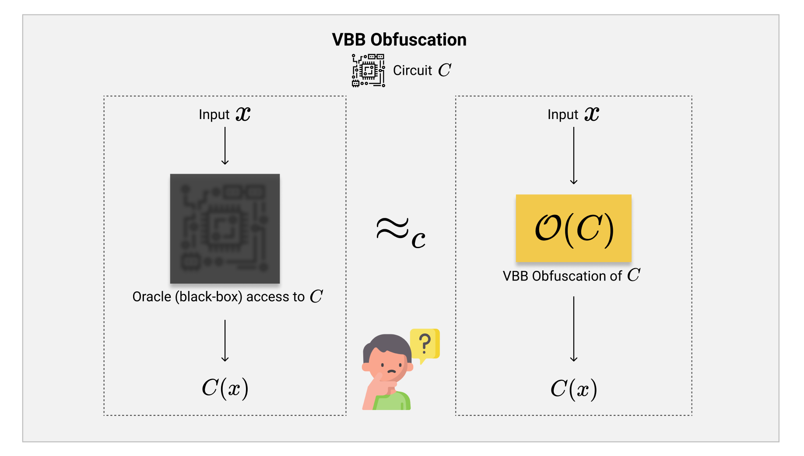
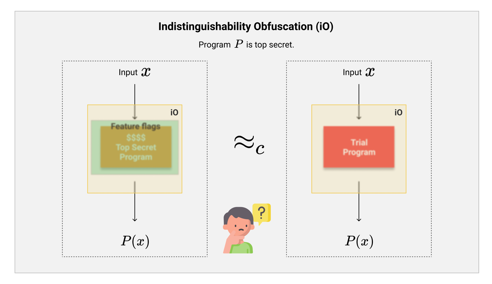

# iO入门01：什么是iO（Indistinguishability Obfuscation）

### 写在前面

千呼万唤始出来，我们终于要讲到格密码学最令人激动的话题——$\mathcal{iO}$了！

$\mathcal{iO}$，全名为**Indistinguishability Obfuscation**，中文大概译作**不可区分混淆**，是密码学中一种非常近似于黑科技一样的存在。如果iO真的存在的话，那么我们的整个数字世界都会为止发生改变。

$\mathcal{iO}$又被称为是**Crypto-complete**（**密码学完备**）的。这是因为如果真的存在$\mathcal{iO}$的话，我们可以基于$\mathcal{iO}$构建出几乎所有的密码学构造：从公钥加密，到**Functional Encryption**（函数加密），**Watermarking**（数字水印），**Multiparty Key Agreement**（多方公钥交换），**Deniable Encryption**（可否认加密）等等的十分酷炫的密码学构造，都可以基于iO来实现。

这也就是说，如果我们能够实现$\mathcal{iO}$的话，那我们几乎就可以放下其他密码学的假设和体系，单纯的使用$\mathcal{iO}$就可以构造出一切的密码学应用。接下来需要做的就只是不停的优化和加固$\mathcal{iO}$的构造就行了。

带着对$\mathcal{iO}$的浓厚兴趣，笔者在今年暑假的时候深度的探索学习了一下iO的历史和现状。听了不少talk以及啃了不少篇paper之后，感觉对于$\mathcal{iO}$的现状有了一个大概的了解，于是打算写下来再一次巩固对于这个专题的知识。

这一期，我们来看看**iO是从哪里来，以及它究竟是一个什么样的概念**。


### 从程序混淆（Software Obfuscation）开始

要想知道Indistinguishability Obfuscation是什么，我们不妨先来看一看Obfuscation是什么。

我们都知道，作为程序员，最宝贵的自然是我们写的代码了。一旦我们写的源码被人看到了，那么基本上花的心血和知识产权都被人一览无余。假如我们写了个画面非常精美，性能也很好的一款游戏，并且卖出去也买的很好，但是一卖出去就被人给反编译拿到源码了的话，那么第二年也许就会有无数第三方的游戏开发者直接copy我们的技术，并且做出跟我们差不多的游戏。

那么为了让我们写的程序卖出去之后不被人能够发现到底背后藏了些什么秘密（比如说非常强大的算法，或者是很聪明的数据结构等等），我们在导出程序准备卖出去之前可以采取一些手段来**混淆（obfuscate）我们写的程序**，在维持原本相同的功能性的同时，即使我们写的程序被人拿到了，别人也没有办法非常有效的把它还原成源代码，把我们辛辛苦苦积累的秘密全部拿走。

一般来说，我们现在会使用的**程序混淆方法**有两种。


#### 代码混淆（Code Obfuscation）

在我们写程序的时候，往往都会根据实际的使用场景给变量或者函数命名。比如说一个计算下一秒展示的图像的函数，我们可以起名为`calculate_next_frame()`。一个代表UI控制器的变量，我们可以起名为`ui_controller`，等等。如果被别人看到了一段这样的代码，那么别人一下子就可以看明白这段程序到底在做什么。

于是，为了防止让我们的程序本身给外人提供太多的信息（以及使得程序的运转效率变得更高），我们会在导出程序的时候，把这些标注性的符号（symbols）统统的摘除掉。比较简单的实现方法是直接**全文替换关键词**，比如说把整段代码中所有的`ui_controller`全部替换成`a0123456`，这样一来，程序的symbols本身就无法暴露关于程序运转的内容了。

这一类的代码混淆器（Obfuscator）当今市面上很多，比如webpack就会在导出JavaScript至production的时候，自动的使用**minify**的功能来简化（并且混淆）JS代码。在我们编译Java与Kotlin程序（如安卓开发）的时候，同样我们可以使用**ProGuard**来进行代码的缩减和混淆化操作。


#### 代码编译（Compilation）

第二种方法更加简单：我们直接输出编译过后的代码（可执行文件），这样别人就没法直接打开这个文件看到原本的代码了。

为什么编译之后的代码不会暴露出原本的源码信息呢？这是因为编译器在把**人可以看的懂的源代码**转换成**电脑可以看得懂的机器码**的这个过程中，就等于是把我们上面描述过的**symbols**全部去除了。同时，由于现代的Compiler都可以通过大量的代码优化（Optimization），比如Loop Unrolling（循环展开）等等的方法来改变代码的结构，使得最后生成的机器码和我们原本写的代码大相径庭。虽然说编译器的主要任务并不是用于混淆我们的代码，但是它通过把我们熟悉的代码转换成我们比较陌生的机器码的形式，变相的让我们对于同样的程序变得”不认识“了。

所以当别人看到我们发布的可执行文件中的机器码的时候，只会是一脸懵逼的啦。


#### 对人的混淆并不是严格意义上的混淆

比较可惜的是，我们刚刚提到的当今常用的这两种方法，其实**并不能作为真正意义上的混淆**。

这是为什么呢？这是因为我们在做的事情，**在密码学的定义上是非常脆弱的**。这就像是上世纪二战的时候，我们通过各种各样的暗号以及暗码来加密通讯的电报，然后在另一头通过某一本小说或者报纸来解读出原文一样。整个系统的目的就在我们使用各种乱码一样的名字，错综复杂的逻辑结构（比如循环展开），以及不同的表述方式（把C变成汇编），尽可能使得看到我们最终混淆输出的人无法从输出中有效的提取和源代码有关的信息来。

```c
char*M,A,Z,E=40,J[40],T[40];main(C){for(*J=A=scanf(M="%d",&C);
--            E;             J[              E]             =T
[E   ]=  E)   printf("._");  for(;(A-=Z=!Z)  ||  (printf("\n|"
)    ,   A    =              39              ,C             --
)    ;   Z    ||    printf   (M   ))M[Z]=Z[A-(E   =A[J-Z])&&!C
&    A   ==             T[                                  A]
|6<<27<rand()||!C&!Z?J[T[E]=T[A]]=E,J[T[A]=A-Z]=A,"_.":" |"];}
```

比如说上述的C混淆代码，虽然说看似一团乱码，我们作为人类难以去理解这串代码到底在做什么。但是如果我们一旦把这样的代码放入编译器中，去分析整个编程语言的语法结构，把每一行的指令做的事情都归纳出来的话，那么就能看出些端倪来了。

这就跟我们在写代码的时候拥有查重和检查作弊的autograder一样，电脑程序可以非常轻松的看出一段代码中的逻辑联系，并且把两段看似完全不同（symbols不同）的代码关联起来，找到它们的共同特点。

我们上面描述的这两种“混淆”的方法，在电脑程序的分析下就变得一览无余，可能一下子就被看出来源码到底做了什么事情了。这也就是说，如果我们想要达到真正意义上的Obfuscation的话，那我们就不能依靠人的鉴别能力来判断混淆方法的好坏，而要通过计算机的方法来判断！


### 真正意义的混淆：VBB Obfuscation（虚拟黑盒混淆）

了解完我们通常听说的程序混淆之后，接下来我们就来看真正的密码学中对于Obfuscation的定义：**Virtual Black Box Obfuscation**，简称**VBB**。

VBB中文即**虚拟黑盒**，理解的方式非常简单：假如我们把一个程序（电路）$C$硬生生的嵌入到了一个无法打开的黑匣子里面，并且我们可以在黑匣子的一头把输入$x$放进去，于是另一头就会自动的输出$C(x)$来。因为整个电路从头到尾都藏在黑匣子中，所以我们无法得知任何与$C$的具体构造的相关信息。**我们唯一可以做的，就是提供输入，观察另一头的输出**。VBB就好比是虚拟化的黑匣子，通过VBB混淆的程序$C$，我们无法通过这个混淆输出得知任何与$C$的构造有关的信息。唯一可以做的就是提供输入$x$，并且计算得出$C(x)$。



如图中所示，我们假设存在一个VBB的Obfuscator（混淆器）$\mathcal{O}$，我们提供一个电路$C$，它就会输出混淆过后的电路$\mathcal{O}(C)$出来。任何一个有限算力的adversary，都无法从$\mathcal{O}(C)$中得到除了计算$C(\cdot)$可以得到的信息之外，其他与$C$的构造有关的任何信息。这就是说，虽然adversary看到了$\mathcal{O}(C)$，但是除了计算$C$之外，无法从中获得任何其他有用的信息，整个混淆输出都是**无法理解**（**unintelligible**）的。

注意这里我们规定了当adversary拥有了混淆输出$\mathcal{O}(C)$之后，唯一可以做的就是任意的计算$C(\cdot)$的输出结果，但是不能得到除此以外的任意信息。我们为了让Obfuscation变得有意义，我们往往会定义混淆的电路$C$为一个有意义的，**输出并不会暴露自己本身信息**的电路。这是因为**Obfuscation本身保护的是电路**（或者函数），**而不是他们的功能性**。如果电路自己会输出跟自己有关的信息，那么Obfuscation是无法阻止adversary通过电路本身的漏洞来了解到这些内容的。

这个定义有点像在讨论MPC的时候定义多方计算的函数$f$一样，协议本身只能保证MPC的过程不会暴露任何其他人的信息，但是不能保证函数$f$本身会暴露出其他人的信息（比如说输出三个人输入的最大值等等）。


#### VBB Obfuscation的应用

早在上个世纪的时候，大家就开始畅想，如果我们真的可以实现VBB Obfuscation的话，那么我们可以用这个技术来实现什么应用呢？

最简单的应用就是我们之前描述的程序混淆。我们在开发新的应用程序的时候，只需要在输出代码之前通过VBB来混淆一下整个程序，那么我们就可以**确保购买软件的人永远都无法反向破解**出任何和我们应用中有关的信息了！这对于一些拥有专利算法的公司（比如图像处理、机器学习等等）是一个非常大的帮助，因为保护了他们的代码就等于守住了他们所有的知识产权。

其次，基于VBB还有一个比较有趣的应用，这是上个世纪的一个偶然的想法，变相的打开了Obfuscation领域研究的大门：**使用VBB来实现公钥加密**。

我们都知道， 在Diffie-Hellman出现之前（包括之后），我们只拥有一系列可靠的对称加密系统，比如上世纪的**DES**，以及现在的**AES**。对称加密系统的问题在于，如果我们想要与另一方进行加密通讯，那么通讯的双方需要实现约定好使用的密钥（encryption key）。然而，Diffie-Hellman一类的密钥交换又基于不让人那么放心的DLog（离散对数）问题。这让不少人都在探讨，还有没有别的方法可以让通讯的另一方变相的“知道”我们选择的密钥。

其实，在原本Diffie-Hellman提出DH密钥交换的【DH76】中，这两个大佬已经提出来了一种**公钥加密**（**PKE**）的新思路：我们能否随机生成一个密钥$sk$，然后把这个密钥嵌入进一个专门负责加密的程序$C$中呢？这个程序$C_{sk}$的功能如下：
$$
C_{sk}(m) \rightarrow Encrypt(sk, m)
$$
这也就是说，这个程序可以使用内嵌的对称加密密钥$sk$来加密任何输入进来的消息，随后输出密文。当我们得到$C_{sk}$之后，密钥交换就变得非常简单了：我们只需要**向对方发送该电路的VBB混淆**$\mathcal{O}(C_{sk})$即可！

当对方收到混淆过后的$C_{sk}$，即$\mathcal{O}(C_{sk})$之后，就可以生成任何消息的密文了。但是因为VBB Obfuscation的安全性规定，对方无法从这个混淆输出中提取出任何与$sk$有关的消息，所以这个协议是安全的。由于我们实现已经知道了$sk$的值，我们就可以在另一头解密啦。

同理，对方也可以如法炮制，发送一个$\mathcal{O}(C_{sk'})$过来，我们就可以基于对方选择的密钥$sk'$来生成任意的密文了！**一条往返的加密信道就可以如此被简单的打开**。

如果我们真的可以实现VBB Obfuscation，那么除了PKE之外，几乎所有密码学中比较高级的构造都可以用非常简单的程序+VBB来完成。唯一需要做的就是把需要隐藏的部分嵌入在程序当中，被VBB遮挡起来即可。


#### VBB Obfuscation的不可能性

当然，我们畅想了那么久VBB的概念，肯定会想到：为什么到现在我们还没有如此简单的实现高级的密码学应用呢？这其实是因为，在VBB的概念提出不久后，很快就被**泼了一盆冷水**。

在2001年的时候，**Barak-Goldreich-Impagliazzo-Rudich-Sahai-Vadhan-Yang**七位大牛真正意义上的对于Obfuscation这一概念做了系统性的研究，并且发表了一篇文章（简称【BGI+01】）：**On the (Im)possibility of Obfuscating Programs**。

【BGI+01】一篇文章系统性的分析了VBB Obfuscation，提出了一些重要的问题。

首先，我们需要知道到底什么样的程序/电路才适合Obfuscation。如果一个程序的功能性本身就是print出自己的源代码，或者做一些非常有规律的事情，那么我们完全都不需要看这个程序本身，光是看这个程序的输出，就可以知道这到底是一个什么样的程序。对于这一类的程序/电路，我们称作为**Learnable Program**，因为我们可以从程序的输出本身了解到程序本身的逻辑结构。想必我们也明白了，Learnable Program其实并没有什么Obfuscation的必要，因为就算不是VBB，而是真的把这个程序装在一个黑盒中，我们也可以很简单的通过它的输出来判断出程序的结构。真正需要Obfuscation的程序，应该需要符合**unlearnable**的要求，也就代表我们无法从一个程序的输出中得到任何与这个程序有关的信息。

一看到这个定义，就有点密码学的味道了。没错，密码学中常见的加密算法，PRF等等，都是非常适合Obfuscate的例子。比如说我们上文提到的PKE算法，我们等于是Obfuscate了一个嵌入了私钥的加密算法。因为输出的加密密文符合加密算法本身的语义安全属性，所以我们无法从密文中得之任何和程序有关的信息。

【BGI+01】中，着重分析了unlearnable的程序，并且提出了一种基于OWF构造的特殊的程序$C^*$：不管是多牛的Obfuscator，都无法混淆$C^*$！这一类程序的特性在于，只要我们拥有计算这个功能性的**任何程序**（不管我们怎么混淆、怎么改变），那我们就一定可以从中提取出某个属性$\pi$。然而，如果我们真的把$C^*$放入黑盒中，只拥有Oracle Access（只能隔着黑盒运行）的话，我们就无法提取出这个属性$\pi$。

文章中非常强有力的证明了这一类电路的存在，这等于是在说：**通用的VBB Obfuscation是绝对不可能的**。具体的证明和$C^*$的结构比较复杂，不过我们不需要过于了解这一部分细节，只需要知道这个结果即可。如果我们翻开近十多年来与Obfuscation有关的论文来看的话，基本上每一篇的开头第一段都会引用【BGI+01】中得到的**通用VBB混淆的反例**，这个反例简称为VBB Impossibility Result。

当【BGI+01】提出了这个不可能性的结果之后，整个密码学界在震惊之余，还是有些**悲伤**的。一直以来畅想的VBB概念被找到了一个反例之后，说不定就会有第二个、第三个。这样的不完美性对于强迫症十足的理论计算机科学家来说，是毁灭性的。

那么在之后的近20年内，密码学界在Obfuscation这一领域到底有和发展呢？在【BGI+01】之后，其实大家分为了两派。一派的人还是坚守在VBB的阵营中，专门研究除了$C^*$程序之外的**其他可行程序的VBB构造**。另一派的人，则是研究了Obfuscation下的一个分支，这也是我们这次的主题：**Indistinguishability Obfuscation**。


### iO的诞生：不可区分混淆

【BGI+01】这一篇文章中，不仅找到了VBB Obfuscation的一大反例，并且还在最后提出了一种对于Obfuscation的新型定义：如果假设被混淆的一对程序$C_1, C_2$**拥有同样的功能性**，我们能否构造一种混淆算法，使得**第三方无法区分这两个电路的混淆结果**呢？


对于这样一类，拥有同样功能性的程序被混淆之后变得不可区分这一特性，我们称之为**不可区分混淆**，即Indistinguishability Obfuscation，简称$\mathcal{iO}$。

借助上图，我们来系统性的了解一下$\mathcal{iO}$的系统性定义。

$\mathcal{iO}$是一个**PPT Algorithm**（概率多项式时间的算法），通俗的说就是一个比较高效率的程序。这个程序的输入是一个待混淆的程序/电路$C$，而输出则是这个输入程序的不可区分混淆$\mathcal{iO}(C)$。

$\mathcal{iO}$主要需要满足**三大属性**：

1. 首先，我们需要满足**Functionality Preserving**（保持功能性），即被混淆的程序需要和混淆之前一样，**保持完全一样的功能性**。

$$
\forall_x : C(x) = \mathcal{iO}(C)(x)
$$

2. 其次就是**Indistinguishability**，即不可区分性啦。对于两个功能性完全一样的程序$C_1, C_2$，即$\forall_x : C_1(x) = C_2(x)$，就算这两个程序的实现方法完全不同，我们也无法有效的分辨他们的混淆结果。换句话来说的话，如果有两个相同功能的程序，而我们看到了只看到了一个未知的$\mathcal{iO}$结果的话，我们无法分辨到底是哪个程序被混淆了。

$$
\lvert Pr[A(\mathcal{iO}(C_1)) = 1] - Pr[A(\mathcal{iO}(C_2)) = 1] \rvert = negl
$$

3. 最后一点是**Efficiency**，即高效率。这一条属性指出了，$\mathcal{iO}(C)$的输出一定不能太大，最多是原本程序大小的多项式倍数，即$\lvert \mathcal{iO}(C) \rvert \le poly(\lvert C \rvert)$。为什么需要这一条约束呢？这是因为如果没有这一条效率的约束，整个混淆操作就失去了实际使用的意义。我们甚至可以构造出非常简单的$\mathcal{iO}$结构：假如一个程序$C$的输入是$n$位$\{0, 1\}^n$而输出是$m$位$\{0, 1\}^m$，那我们只需要输出一个$2^{n+m}$大小的表格，把所有$C$输入值和输出值一一对应。这样一个巨大的表格也是不可区分混淆了，因为只要功能性不变，那么输入和输出的一一对应也不会改变！为了排除这一类无意义的$\mathcal{iO}$构造，我们需要规定一个理想的$\mathcal{iO}$算法输出的程序大小相比起输入的程序大小来说不会变得过大。

如此看下来，不禁觉得$\mathcal{iO}$这一概念的定义**非常的微妙**。在$\mathcal{iO}$被提出的初期，的确也受到了不少人的质疑，因为“**混淆相同功能的程序**”这件事情显得非常的自相矛盾：即然拥有同样的功能性，我们为什么需要混淆它们呢？退一步说，就算我们无法区分混淆结果，但是这到底有什么用呢？

不过，学术界很快的就追赶上了$\mathcal{iO}$的应用前沿。经过若干年的探索，我们发现，其实$\mathcal{iO}$非常好用，甚至用起来和VBB是一样的。VBB之前能做到的事情，$\mathcal{iO}$基本上也可以做到！


### iO的简单应用

如果不信的话，我们一起来看两个$\mathcal{iO}$可以实现的最简单的应用吧！


#### 最强混淆算法

虽然我们知道VBB已经是不可能实现了，不过通过iO，我们仍然可以非常完美的**混淆一个程序**。

回到我们最初的软件开发的例子中，假如我们开发出了一个绝密的算法，并且写出了一个程序$P$，我们可以用前文所描述的方法，花费十天半个月，使用代码混淆、逻辑混淆、再次编译之类的技巧修改程序，使得常人根本无法看得懂它的构造。假如我们通过这样的方法，得到了一个最强混淆版本的（相同功能的）程序$P^*$。


如果我们拥有$\mathcal{iO}$，那我们完全不需要做这么多费劲的人工混淆操作，直接就得到相同的效果！

如上图所示，因为$P$与$P^*$的功能性是一样的，这也就代表了我们无法分辨$\mathcal{iO}(P)$和$\mathcal{iO}(P^*)$。这也就是说，我们啥事都不做，直接给这个最简单的程序$P$套一层$\mathcal{iO}$，得到的结果居然和最强混淆过后的$P^*$的$\mathcal{iO}$结果是一样的。

这样一来，如果我们想要充分的混淆一个程序$P$，使得其构造不被别人发现，我们只需要输出$\mathcal{iO}(P)$就行了。


#### 限制软件功能

在我们进行软件开发的时候，还有一件非常头疼的事情，那就是**软件试用版的开发**。假如我们在写一个游戏，我们已经把整个游戏写好了，但是想开放一部分的游戏免费给玩家试用，这个时候我们面临两种选择：

1. 第一种方案，就是我们把整个游戏复制一份，然后把收费版的功能和逻辑全部都一一删除掉，最后就留下免费试用的部分并且发布出去。这种方案虽然是最好的，但是整个过程会花费大量的精力，最后生成的“阉割”版本的游戏甚至可能还会有未知的bug需要我们来修补。
2. 第二种方案则非常简单，我们直接在软件内部设置一组**feature flags**（功能开关），可以选择性的打开或者关闭一部分的功能。我们可以在试用版的软件中把收费的功能对应的flag都关闭，这样整个程序就不会运行任何付费的功能了。这种方案相对来说比较常见，但是问题在于，一旦黑客破解了我们的程序，然后把收费功能打开的话，那么这些功能就一览无余了。

显然相比起来，第二种方案是实现起来最简单的，但是有没有办法可以让我们获得和第一种方案一样的安全性呢？



这个时候，就轮到$\mathcal{iO}$登场了。参照图中所示，我们同时对第一种方案中的试用版程序与第二种方案中的限制版程序进行$\mathcal{iO}$处理。我们观察发现，因为左右两边的程序在功能性上是完全相同的，所以我们无法分清看到的混淆输出到底是来自第一种方案还是第二种方案。

这样一来，我们就可以基于第二种方案的限制版程序，施加一层$\mathcal{iO}$，得到两全其美的方案啦。


#### 更多应用

基于$\mathcal{iO}$的应用，可不止我们看到的这么一点点。就像文章开头所说的，$\mathcal{iO}$被称作为**Crypto-Complete**（密码学完备）。这是因为基于$\mathcal{iO}$，我们可以实现PKE，FHE，Witness Encryption，Functional Encryption，Deniable Encryption等等极其强大的密码学构造。由于篇幅原因，我们后面有机会专门来讲一讲这些构造的具体实现方式。


### 构造iO：近代历史回顾

铺垫这么多关于$\mathcal{iO}$的背景和衍生的应用，我们不禁会想到，这么神奇的一个密码学构造，究竟该如何实现呢？现在，我们终于可以回归**这一期的主题**了：基于合理的密码学假设构造$\mathcal{iO}$系统。

当$\mathcal{iO}$的概念在【BGI+01】中被提出之后，密码学界沉寂了许多年，大家一时都没有找到可以满足$\mathcal{iO}$要求的密码学结构。

然而，这一僵局在2013年被打破了。2013年的时候，**Garg-Gentry-Halevi**三位大佬一举之下提出了非常有名的【GGH13】**Multilinear Map**（多线性配对）构造。这一构造基于Ideal Lattice中的一系列假设，使得我们突破了双线性配对的限制，一下子进入了多线性配对的世界。【GGH13】被提出的同一年，**Garg-Gentry-Halevi-Raykova-Sahai-Waters**提出了【GGH+13】的$\mathcal{iO}$构造。这一构造正是使用了【GGH13】的Multilinear Map作为基础而构造的。

【GGH13】又是震惊了密码学界的一件大作。在此之后，大家又开始了对于多线性配对构造的探索。同一年，**Coron-Lepoint-Tibouchi**提出了【CLT13】的多线性配对构造。在稍后的2015年，**Gentry-Gorbunov-Halevi**又放了大招：提出了【GGH15】的多线性配对结构。这一结构一举止下离开了原本的Ideal Lattice假设，直接来到了普通的Lattice假设中，只需要基于简单的LWE假设，就可以实现较为安全的多线性配对了。由于【GGH+13】的$\mathcal{iO}$构造并不基于某个特殊的多线性配对，所以我们也可以使用【CLT13】或者【GGH15】来完成【GGH+13】的$\mathcal{iO}$构造。如果以后有更好的多线性配对实现，我们只需要进行替换就行了。

然而，正当在15年左右，$\mathcal{iO}$与多线性配对的主题大火的时候，学术圈同时也把**Cryptanalysis**（**密码分析**）的目标对准了这一系列新出炉的构造。想必大家都不陌生，在2016年的时候，西电的胡予濮教授与贾惠文博士成功的**攻破了**【GGH13】中提出的多线性配对下**进行N方密钥交换的安全性**。同时，基于【GGH+13】的$\mathcal{iO}$构造也被**Miles-Sahai-Zhandry**在【MSZ16】中被部分攻破。

即然【GGH13】不行了，那么另外两个如何呢？不幸的是，【CLT13】也早已被攻破，而【GGH15】也苟延残喘，基本上不剩什么安全性可言了。自从2015年之后，Obfuscation与多线性配对的领域就进入了一个怪圈，提出的方案马上被攻破，然后再基于攻击重新改善方案，随后再被攻破。大家戏称此为：**Infinite Break-and-repair Cycle**。


#### 混沌之后新的开端

虽然【GGH13】，【CLT13】与【GGH15】给了我们很好的多线性配对构造，并且我们可以直接套用进【GGH+13】中直接实现$\mathcal{iO}$，但是数不尽的安全性漏洞让我们总是放不下心来。一阵混沌之后，留下一地鸡毛。

然而， 在大风大浪之中，有一批学者沉下心来，开始慢慢的研究$\mathcal{iO}$的本质：即然多线性配对可以带给我们$\mathcal{iO}$，我们可不可以削减对于多线性配对的要求，降低配对的层数，能否找到一个最低的上线（lower bound）呢？同时，我们能不能基于其他的方法来实现$\mathcal{iO}$呢？

在2015年的时候，$\mathcal{iO}$界又出了两篇神作：**Bitansky-Vaikuntanathan**提出的【BV15】与**Ananth-Jain**提出的【AJ15】，分别通过不同的方法，证明了假如存在**Compact FE**（即简短密文的Functional Encryption），那我们就可以实现$\mathcal{iO}$。这一条基于FE来进行$\mathcal{iO}$构造的路线和主流的【GGH+13】不同，带来了全新的思路。

基于这一系列新的发现，在2016年左右，当时还在UCSB的**Huijia Lin**开始钻研：我们能否约束多线性配对的层数，可以在**恒定的层数**内实现$\mathcal{iO}$呢？她在【Lin16】中发现，这的确是可行的！紧接着，在【Lin17】中，她把多线性配对的维度（层数）降到了5层。同在2017年的时候，她与Tessaro在【LT17】中成功的把这一要求降到了3层。这也就是说，只要我们拥有一个**三线性配对**（**Trilinear Map**）的构造，我们就可以实现$\mathcal{iO}$了！

这一新发现，仿佛是整个$\mathcal{iO}$界在一场混沌之后的一个全新的开端。在此之后，大家逐渐开始探索**基于简单、易证明、模块化假设**的$\mathcal{iO}$构造。值得一提的有两条线：

1. 第一条线是基于Lin的一系列发现而延续下去的一条线。直到现在，最新的研究成果为**Jain-Lin-Sahai**的【JLS20】，可以成功的使用**双线性配对，LWE，LPN，与OWF**这四条假设成功的构造出$\mathcal{iO}$来。这也就是说，我们已经可以基于已知的构造来实现$\mathcal{iO}$了！
2. 第二条线也很有意思，是**Brakerski-Dottling-Garg-Malavolta**在去年的【BDGM19】与【BDGM20】相继提出的新的$\mathcal{iO}$框架：**split-FHE**。通过结合**全同态加密FHE**（如GSW）以及**线性同态加密LHE**（如Damgård-Jurik），通过巧妙的circular-security假设，可以使得密文在两个加密体系中来回周旋，最终得出$\mathcal{iO}$来！大概的思路非常的巧妙：我们把需要混淆的程序**使用FHE加密**，然后**同态的计算这个程序**，最后通过一个特殊的解密方法得到计算的结果。这样一来，我们等于是在用FHE的安全性来实现$\mathcal{iO}$的不可区分性。

由于这两条线都是基于Lattice的假设而实现的，所以熟悉格密码学的我们会意识到，绝大多数时间我们都需要**和噪声作斗争**。的确，在这两条线中，其实idea都很简单，真正最难的地方，在于如何**遮挡住会泄漏和程序有关的噪声**，使得$\mathcal{iO}$的不可区分属性成立。这一技巧在第一条线中被称为**Noise Smudging**（噪声掩盖），而在第二条线中则是使用了**Hash Function**（或者**CRS**）来实现的。


### 写在最后

由于篇幅原因，这期就写到这里啦。

这一期，我们详细的了解了Obfuscation是什么，以及VBB的假设是什么样的。在了解了VBB Impossibility Result之后，我们学习了$\mathcal{iO}$的定义，以及拥有$\mathcal{iO}$之后，我们可以做些什么。在最后，我们快速的过了一遍为了实现$\mathcal{iO}$近些年在学术圈的发展。

总的来说，目前$\mathcal{iO}$分为**三个流派**：GGH一派，Lin等人的基本假设派，以及最后的Brakerski等人的split-FHE派。其实还有一些比较非主流的流派，比如尝试构造Trilinear Map来直接实现$\mathcal{iO}$等等，不过因为安全性的一系列问题，我们就不纳入主要的流派啦。

其实看完这一系列paper下来，笔者感觉这几年做的事情都**非常相似**，无疑就是在跟噪声作斗争，以及活用FHE的特性来回的倒腾密文，得到我们想要的运算结果。

从下期开始，我们从【GGH15】的多线性配对以及【GGH+13】的$\mathcal{iO}$构造入手，**从头开始学习熟练使用魔法。**

