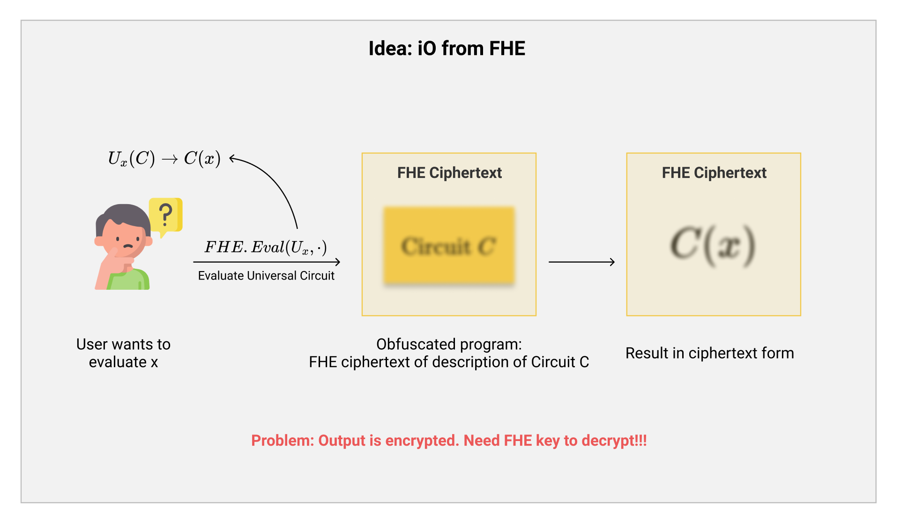
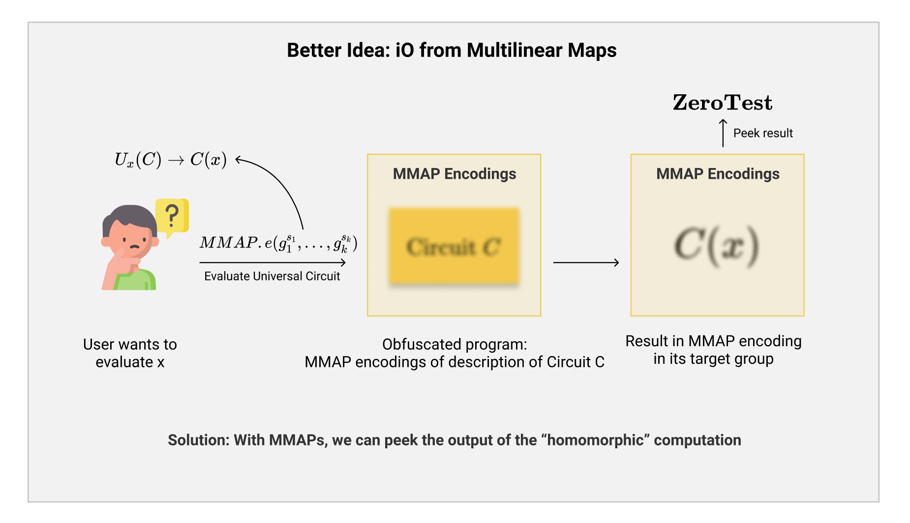
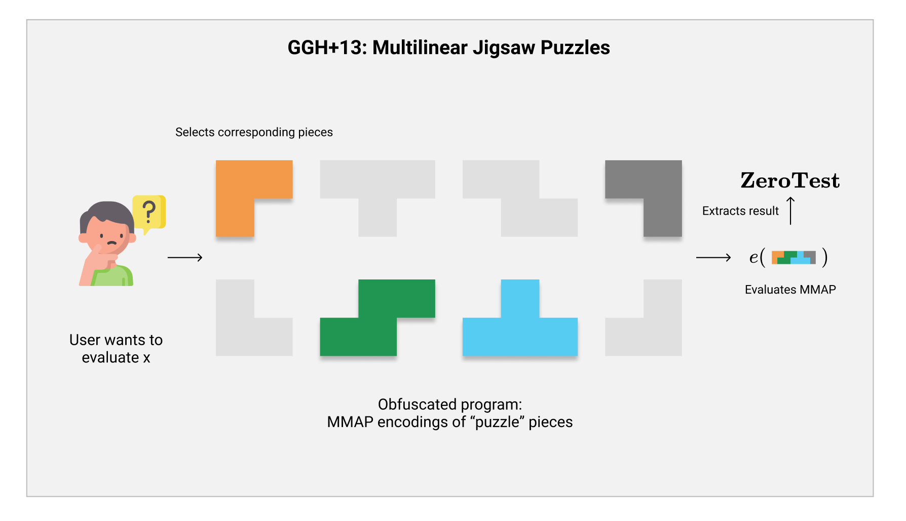
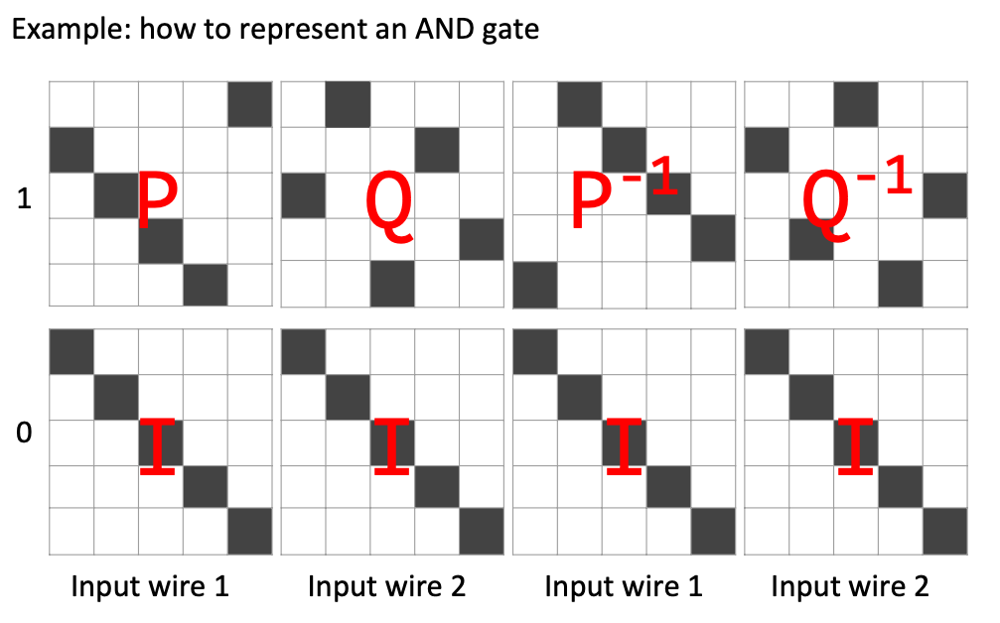
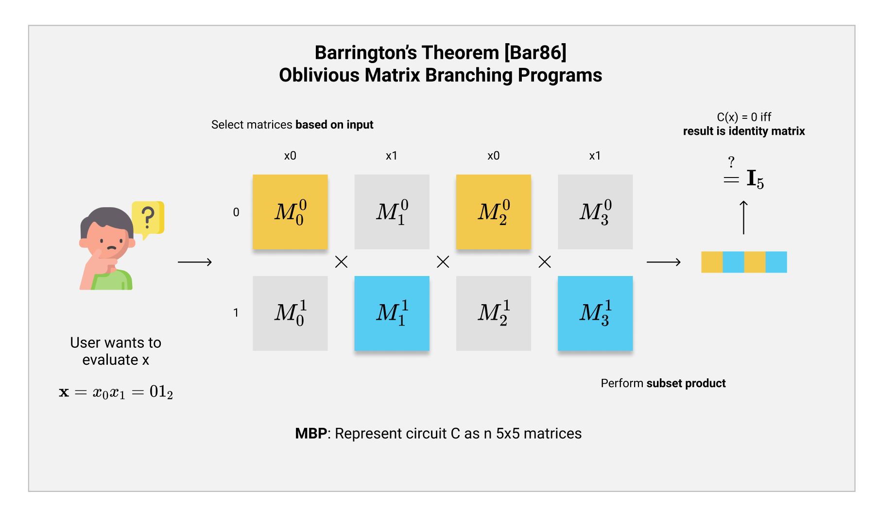

# iO入门02：基于多线性配对的iO构造：多线性拼图（Multilinear Jigsaw Puzzle）

### 写在前面

距离上一期介绍$\mathcal{iO}$之后又过去了很长的时间。在这段时间里，笔者工作和学习略忙就没怎么来得及写新的文章。同时笔者也在疯狂的补习$\mathcal{iO}$这一方面的paper，为了写的文章内容的正确性，纵览了上下十多年的学术研究。希望这篇文章能够对于想要学习了解$\mathcal{iO}$的读者们带来一定的帮助！

我们在上期回顾$\mathcal{iO}$的历史的时候讲到过，自从**Barak et. al.**在【**BGI+01**】中提出了$\mathcal{iO}$这个构想之后，一直到2013年，才由**Garg et. al.**在【**GGH+13**】中提出了第一个较为有信服力的$\mathcal{iO}$构造（**Candidate**）。【GGH+13】的$\mathcal{iO}$构造依赖于一种同样在2013年被刚刚提出的**多线性配对**（**Multilinear Map**）这一构造所带来的一系列特性。正因如此，很大一部分程度上，【GGH+13】的$\mathcal{iO}$构造的安全性依赖于它所用的多线性配对的安全性上。我们在上期的时候也稍微提到过，现有的很多Multilinear Map的构造如【GGH13】、【CLT13】以及【GGH15】都存在一些潜在的漏洞，有的甚至已经被**完全攻破了**。

好在，【GGH+13】仅仅是把多线性配对**作为一个包装好的工具来直接使用**，即只需要Multilinear Map对应的一系列算法的**黑盒访问**（**Oracle Access**），并不需要关心Multilinear Map具体的实现方法。这一点确保了，即使我们攻破了原有的Multilinear Map构造，我们也可以构造出新的替换上去，继续使得【GGH+13】保持原有的安全性。

我们上期在最后也提到了，自从多线性配对的概念被提出了之后，整个学术界就进入了一系列的攻防战，戏称**Break-and-Repair Cycle**。这是因为之前提出的构造多多少少还是存在了一些小的安全问题，而这些问题就会被特定的**Cryptanalysis**（**密码分析**）攻击所指定，随后攻破多线性配对的安全性。这就是为什么现在学术圈**更加倾向于**假设更清晰、构造更简单的新一代$\mathcal{iO}$的构造，如上期最后提到的今年得到突破性发展的【JLS20】以及【BDGM20】等等。

虽说如此，笔者还是觉得一圈看下来，【GGH+13】的$\mathcal{iO}$构造可以说是非常优雅、高效的设计。虽说它依靠了多线性配对这一非常不寻常（nontrivial）的构造假设，但是藏在整个构造背后的巧妙设计还是非常吸引人的。

话不多说，我们这一期就来**深刻的学习一波**【GGH+13】的$\mathcal{iO}$构造吧！

P.S. 秉承深入浅出的概念，这一期我们只学习**多线性配对的概念**，但是并不讨论它的构造。因为【GGH+13】并不需要关心到它的具体结构，我们只需要知道如何调用多线性配对实现$\mathcal{iO}$的目的即可。下一期我们再深入了解Multilinear Map中的【GGH15】构造。

### $\mathcal{iO}$与全同态加密（FHE）

在我们进入长篇大论的讨论多线性配对以及具体构造的正文之前，我们不妨稍作休息，来重温一遍当年构造出【GGH+13】的这帮大佬们当时的研究思路。

我们把时间退回到2013年初。这个时候，距离**Gentry**在【Gen09】提出**FHE**的可能性以及**Bootstrapping**的概念才过去了4年不到的时间。紧接着Gentry的发现，学术界投入了大量的经历开始研究更加高效实用的FHE构造。在这个领域比较有代表性的研究者有Brakerski，Vaikuntanathan，Gorbunov，Halevi，Sahai，Waters等等。

当FHE的概念大红大火的时候，一部分的研究者们把目光聚集到了尘封了12年依旧的【BGI+01】对于Indistinguishability Obfuscation的畅想上。在此之前，大家都没有想出来要怎么构造这么一个可以“混淆”别的算法的这么一个机制。然而，当我们拥有FHE之后，**这一切变得不一样了**。

FHE提出的概念，无疑就是我们可以**在我们不知道内容的密文上同态的计算任何的函数**$f$，并且最后可以得到正确的运算结果（的密文形态）。

光是这个概念，就非常的具有**混淆**的味道。很多人一下子就想到了一个idea：如果我们把想要混淆的电路$C$的描述作为密文放入到FHE的密文中，然后基于FHE的密文我们可以同态计算内嵌了输入$x$的**Universal Circuit**（**全能电路**）$U_x$。

全能电路这一概念我们在之前的文章中有所提到过，大致来说$U(C, x)$是一个万能的电路，其功能如下：我们输入一个电路$C$的描述，与$C$的输入$x$，然后全能电路就可以计算这个输入的电路在$x$上的值$U(C, x) = C(x)$随后输出。
$$
U(C, x) = C(x)\\
U_x(C) = C(x)
$$
为了方便同态计算，我们在这里把输入的$x$值“嵌入”到$U$当中，构成只有一个输入的全能电路$U_x$。这样，我们在FHE加密的电路描述$C$上计算$U_x$，就可以得到这个电路的输出结果即$C(x)$了！

看起来我们距离$\mathcal{iO}$已经非常接近了，但是现在拥有一个致命的问题：因为我们使用了同态运算，我们得到的$C(x)$的输出结果**仍然是FHE的密文形态**。这也就是说，如果没有一个FHE的密钥来解开密文，那么这个结果等于是**没有任何用处的**。同理，如果我们拥有了FHE的密钥，那么我们就可以很轻松的解开一开始用到的$C$的密文，直接读取出被混淆的电路$C$的描述！

遇到这个瓶颈，问题就一下子变得很棘手了。和我们之前讨论【KW18】**基于GSW的NIZK**一文中提到的问题一样，我们无法直接公开FHE的密钥，这样任何人都能解开$C$（类比于在【KW18】中，任何人都可以看到证明方的witness）。同时，我们也不能选用更弱的FHE，这样直接威胁到了密文的安全性。

在【KW18】中，Kim于Wu成功的构造出了基于GSW的**全同态承诺**（**FHC**）然后通过一系列的indirection来**使得NIZK的验证方可以正确的解开一个FHE的密文，而不影响其他FHE密文的安全性**。在我们这里，问题变得更加严峻了：由于我们的应用场景是$\mathcal{iO}$，所以我们只能**一次性的生成输出**混淆的电路，然后之后所有的内容就全部公开了。由于我们在混淆的时候并不知道混淆电路的使用者会选择什么样的输入$x$，所以我们**没有办法提前计算出可以让使用方解开他的密文的一次性解密密钥**。

#### 尝试“宽松”（Relax）FHE结构

经过一系列无用的尝试之后，大家逐渐开始意识到：FHE的定义对于$\mathcal{iO}$的应用来说，实在是**太“严格“了**。因为FHE归根结底是一个**加密算法**，所以它的一系列安全性，让我们**无法选择性的向用户公开密文中的信息**。所以就算用户可以成功的同态计算出$C(x)$的密文形式，我们也没有办法在保护FHE加密的安全性前提下让用户得知$C(x)$的具体答案。

这个时候，大家就开始思索着，我们能不能找到一个类似FHE的这么一个工具，即可以让我们在不知道“密文”中包含的信息的情况下，“同态”的计算任意的函数$f$，并且还提供一系列的接口让我们可以“提取出”密文中的一部分信息出来。

而这个问题的答案，正是本次文章的主角：**多线性配对**。

### 多线性配对（Multilinear Map）简介

**Multilinear Map**，即多线性配对，简单来说就是一个抽象的数学工具，可以让我们结合一系列的**群元素**（**Group element**），并且可以从结合的结果中提取出一部分的信息出来。

假设我们现在拥有$k$个**循环群**（**Group**）$\mathbb{G}_1, \dots, \mathbb{G}_k$，并且我们定义一个目标循环群$\mathbb{G}_T$。那么一个$k$阶的多线性配对（Multilinear Map）对应一个算法$e$：
$$
e: \mathbb{G}_1 \times \mathbb{G}_2 \times \dots \mathbb{G}_k \rightarrow \mathbb{G}_T\\
e(g_1^{s_1}, g_2^{s_2}, \dots, g_k^{s_k}) = g_T^{\prod s_i}
$$
这也就是说，$e$可以输入$k$个对应了$\mathbb{G}_1, \dots, \mathbb{G}_k$的群的元素$g_1^{s_1}, g_2^{s_2}, \dots, g_k^{s_k}$，然后并且巧妙的把输入的元素的幂数相乘起来，最后叠加在输出的群中，得到$g_T^{s_1 s_2 \cdots s_k}$作为结果。通过这样的构造，我们在不知道$s_1, s_2, \dots, s_k$的值的情况下，通过这个多线性配对的$e$算法，在$k$个encoding即$g_1^{s_1}, g_2^{s_2}, \dots, g_k^{s_k}$上**计算**就可以得到$s_1 s_2 \dots s_k$的乘积在group $\mathbb{G}_T$中的encoding $g_T^{\prod s_i}$。

同理，我们也可以在同一个group中对于两个group element $g^a, g^b$使用这个group内定义的group operation $\boxplus$ 得到$a$与$b$的和的encoding：
$$
g^a \boxplus g^b = g^{a+b}
$$
如果大家跟着我们前文的思路看到现在的话，会发现这个概念**和FHE中的同态运算非常的相似**！这里的group operation $\boxplus$ 对应了同态运算中的加法运算，而多线性配对算法$e$则对应了同态运算中的乘法运算。我们会发现：多线性配对$e$所能支持的级数$k$，代表了所对应的“同态计算”所能支持的乘法电路深度。

如果我们构造了$k = 3$的多线性配对的话，给定$g^a, g^b, g^c, g^d$，我们就可以计算最多三层以内的乘法和任何层数的加法如$g_T^{abc + bcd + c}$，但是我们不能计算出$g_T^{abcd + bcd + acd}$（因为包含了4层乘法）。

然而我们在前文已经讨论过了，光拥有FHE的特性对于构造$\mathcal{iO}$来说还不够，这是因为FHE的定义太过于**严格**了，计算结果是由密文形态存储的，所以我们不能简单的在不暴露密钥的情况下让用户得知计算结果。这里，多线性配对就完美的解决了这个问题：它提供了一系列的算法，使得我们可以**提取出一部分关于密文的信息**！

#### 零测试算法（ZeroTest）

使得我们能够提取出密文信息的方法，恰巧就是多线性配对所拥有的另一个特性：零测试（ZeroTest）。

一个Multilinear Map系统还定义了一个算法$\mathbf{ZeroTest}$，这个算法输入一个目标group $\mathbb{G}_T$中的元素$h$，随后可以验证这个群元素$h$是不是0在这个group中所对应的encoding：
$$
\mathbf{ZeroTest}(h \in \mathbb{G}_T) \rightarrow h \stackrel{?}{=} g_T^0
$$
拥有了这么个算法之后，瞬间一切变得豁然开朗起来。

这也就是说，我们可以首先通过多线性配对算法$e$把一系列encode了$\{s_i\}_k$的群元素$\{g_i^{s_i}\}_k$组合起来，得到它们的乘积所对应的encoding $g_T^{\prod s_i}$，随后我们就可以使用$\mathbf{ZeroTest}$算法来验证$\prod s_i$是否为0。这样我们只需要精心的设计使用多线性配对组合的电路，我们就可以通过这么一个零测试的算法来逐渐的推测出”密文“（即encoding）包含的具体信息。

这就好比是原本的FHE是一个彻底的黑盒，信息放进去同态计算之后啥也看不到，除非把盒子打开。然而现在，使用多线性配对的话，我们就像是在盒子上**打了一个小小的针孔**。基于这个细微的零测试孔，我们就可以试图通过同态运算来变换内部的信息的状态，再透过这个小孔来提取出一部分的信息来！

举个简单的例子，假如说我们用多线性配对encode了一个NP问题的witness $w$。那么我们就可以在$w$上使用多线性配对来“同态计算”NP问题的验证电路$R_x(\cdot)$。我们紧接着就会得到在目标group中的结果$g_T^{R_x(w)}$，我们就可以通过$\mathbf{ZeroTest}$来判断证明是否通过：
$$
\mathbf{ZeroTest}(g_T^{R_x(w)}) = yes \iff R_x(w) = 0
$$
拥有了这么一个“超能力”之后，我们接下来的目的就是设计一系列的机制，使得密文在满足某些要求的时候会变成0，**从而实现FHE所不能实现的功能**。

#### 安全性的挑战

虽然我们这次不会介绍多线性配对的具体构造方案，但是在接下来正式介绍【GGH+13】之前，我们来最后看一下多线性配对的最大问题：**安全性**。

为什么要提安全性呢？这是因为我们可以很轻易的发现，由于上述我们描述的多线性配对的**功能实在是太强大了**，所以要真正安全的实现这么一个强大（但不能过于强大）的系统，非常的有挑战性。

首先，我们整个构造的前提就在于多线性配对中的这些group encoding都是可以**遮盖住原文本身的**。这也就是说，如果我看到了代表$s_1$的$g^{s_1}$，我无法从中提取出$s_1$的信息来。这一点在Diffie-Hellman协议中对应了**离散对数假设**。这一要求的原因显而易见：如果我们可以轻易的从encoding中提取出原文的信息，这就好比是FHE失去了加密的安全性一样，整个系统就会变得无意义。

其次，一个多线性配对的构造要**强制性的使得我们只能进行多线性配对操作**。具体的意思就是，假如我们构造一个$k$阶的多线性配对系统，那么任何一个Adversary都不能在这个系统的encoding上计算**非多线性配对的操作**。这些操作比如有超出$k$阶的乘法，计算非线性函数等等。由于篇幅原因，我们在这里不多描述原因，但是往往对于多线性配对构造的攻击，会从找到这个构造中的一个非法操作开始逐步击破。

最后，也是最重要的，就是多线性配对的构造除了$\mathbf{ZeroTest}$之外不能过多的暴露关于encoding中信息。这就好比是如果我们只是打个小孔（允许零测试），那么我们就可以在一定的安全性保障下使用这个小孔来“提取”一部分信息，达到我们的计算目的。但是如果我们不小心打了个大孔，允许我们看到更多信息（比如说可以得知encoding的某一位），这一下子就会破坏整个构造的平衡。利用这个漏洞，Adversary说不定直接用它提取出所有的encoding来，那整个构造就失去意义了。

我们在这里描述的，仅仅是构造多线性配对的**一部分挑战**。如果纵览近几年来对于多线性配对的Cryptanalysis攻击，我们会发现各种各样的进攻途径，都是瞄准了多线性配对系统**在安全性与功能性之间巧妙的平衡性**上来的。这也就是为什么即使【GGH+13】的$\mathcal{iO}$算法提出之后，我们仍然并没有觉得我们彻底攻克了$\mathcal{iO}$问题的难关。

当然了，我们在这里不需要过于担心这一点问题！了解完Multilinear Map的大致构造之后，我们就终于可以**开始这一期的正题了**。

### 基于多线性配对的$\mathcal{iO}$

当我们假设拥有了**多线性配对**这一神奇的构造之后，我们之前提到的基于FHE的$\mathcal{iO}$想法的一系列弱点便迎刃而解。

假设我们把需要被混淆的程序放在多线性配对的group encoding中，随后我们在encoding上“同态计算”Universal Circuit，随后我们就可以得到$C(x)$的计算结果（的encoding）了。然而，和之前不同的是，我们可以轻松的使用$\mathbf{ZeroTest}$这一算法来得知$C(x)$是否等于0。如果我们进一步约束，电路$C$是一个boolean circuit（即$C:\{0,1\}^* \rightarrow \{0,1\}$，输出只为1 bit 1/0），那么依靠这个$\mathbf{ZeroTest}$我们就可以直接提取出计算的答案来了！
$$
C(x) = \begin{cases}
0, & \mathbf{ZeroTest}(g_T^{\prod s_i}) = 0,\\
1, & \text{otherwise}
\end{cases}
$$
我们知道，一个安全的多线性配对系统中，我们无法得知encoding的具体内容，所以自然的也无法分辨不同的电路$C_0, C_1$的encoding的差别（对应了$\mathcal{iO}$的不可区分性）。并且通过$\mathbf{ZeroTest}$的方法，我们也可以验证得知一个boolean circuit的运算结果，我们自然可以把一个$m$位输出的电路$C_m$拆分成$m$个1位输出的boolean circuit，然后用$m$组多线性配对的系统来分别计算每一位的结果，再把他们拼接起来（对应了$\mathcal{iO}$的功能性）。这样一来，**整个构造就大功告成了**。

这就是基于Mutilinear Maps的$\mathcal{iO}$的大概构造思路啦！接下来，我们就要顺着这个大方向摸清一条可行的路线，复现一遍【GGH+13】的构造～

### 【GGH+13】$\mathcal{iO}$的第一次尝试：多线性拼图

我们在上一段中，已经大概的指明了一个大致的方向，但是在这个方向上，仍然有很多问题还没有解决：

- 如何使用多线性配对的$k$阶乘法组合来代表电路$C$的计算？
- 如何让用户来选择自己的输入？
- 如何确保我们的$\mathcal{iO}$构造仍然保持不可区分性与功能性？

带着这些问题，在2013年**Garg-Gentry-Halevi-Raykova-Sahai-Waters**提出了【GGH+13】的$\mathcal{iO}$构造，正是秉承了我们上一段的思路，并且巧妙的解决了我们提出的这几个问题。

【GGH+13】中所提出的构造，他们称之为**Multilinear Jigsaw Puzzle**（**多线性拼图**）。在他们的构造中，一个对于电路$C$的混淆输出就是$k$对多线性配对中的元素$\{g_{i, b}^{s_i}\} : i \in [k], b \in \{0, 1\}$。用户可以根据自己的输入和一定的要求选择这$2k$个元素中的$k$个元素，紧接着使用多线性配对的$e$算法像把它们组合起来，最后再使用$\mathbf{ZeroTest}$，就可以得到计算的答案。因为整体的计算过程就好比是用户在拼拼图一样（使用$2k$块拼图中的$k$个拼出计算的结果），所以被形象的称为**多线性拼图**啦。

如上图所示，用户只需要根据规则选取对应的拼图块，拼接在一起计算多线性配对之后，就可以提取出$C(x)$的计算结果了。我们还可以注意到，这一些拼图块**每一块都有自己特有的形状**，这代表了我们只能选择组合一部分的拼图块在一起，只有拼接成一个符合要求的图案之后才能提取出有价值的计算结果来。这一特性恰恰就是【GGH+13】的精髓，确保了被$\mathcal{iO}$混淆的电路可以安全的运行，并且不会暴露出任何其他信息出来。

### 构造多线性拼图（MJP）系统

聊完了Multilinear Jigsaw Puzzle（简称**MJP**）的大致概念之后，不禁会觉得这样的构造非常的生动形象，不得不佩服作者当时的想象与创造力。

其实呢，虽然【GGH+13】是第一个被提出的的$\mathcal{iO}$ Candidate，**MJP构造并不是凭空而来的**。它的结构非常多的借鉴了前人留下的被研究了很多的计算框架。基于这些框架作者又发现了一系列的问题，并且找到了修补的方法。

接下来，我们就跟随着作者的脚步一起，重新走一遍【GGH+13】的路。

#### Matrix Branching Program

我们之前已经提出了对于$\mathcal{iO}$构造的大概想法，即：

1. 使用某种方法把电路表达成多线性配对的encoding。
2. 利用多线性配对来进行”计算“。
3. 使用$\mathbf{ZeroTest}$来提取出计算结果。

有了这个想法之后，很自然的我们就会产生一个问题：有没有一个**已经存在的计算模型**，可以很好的适配我们这里的需求呢？

答案当然是肯定的。如果看过笔者的【全同态加密】系列的第四篇，即Bootstrapping的文章的话，我们其实在那里提到过一次。这个神奇的计算框架就是**Matrix Branching Program**（**矩阵分叉程序**），简称**MBP**。

MBP和电路，多项式，图灵机一样，是**表达计算**（**computation**）的一种形式。

假如说我们有一个由各种逻辑门组成的电路$C$，并且它的深度（即逻辑门的层数）为$d$，一共需要$l$ bits的输入和1 bit的输出，即$C : \{0, 1\}^l \rightarrow \{0, 1\}$。如果想要计算这个电路在某个输入$x \in \{0,1\}^l$的情况下的输出到底是什么的话，我们就会把$x$中的$l$个bit一个一个拆开，依次放到电路第一层所对应的逻辑门的输入处，随后根据每个逻辑门的规则计算$d$层，最后就能得到$C(x)$的输出啦。

同理，在MBP中，“**计算**”的概念有一些小的改变。同样的这个电路$C$，我们如果用MBP表示的话，那么它就变成了$n$组**正方形二进制矩阵**$\{\mathbf{M}_{i,b} : i \in [n], b \in \{0,1\}\}$。其中的每一个$\mathbf{M}_i$，都对应了$C$的$l$位输入中的某一位（这个对应关系$\mathbf{inp}: [n] \rightarrow [l]$ 是公开并且恒定的）。每一个$i$值对应的$\mathbf{M}_i$都有两个矩阵，即$\mathbf{M}_{i, 0}, \mathbf{M}_{i, 1}$。这两个矩阵分别对应了输入的这一位是0还是1。

计算MBP的方式很简单：我们从0开始，依次选择$i \in [n]$，然后根据对应关系$\mathbf{inp}(i)$选取输入$x$中的某一位$x_{\mathbf{inp}(i)}$。随后我们根据这一位的值（是0还是1）选择对应的矩阵$\mathbf{M}_{i, x_{\mathbf{inp}(i)}}$。最后我们把选出来的$i$个矩阵依次相乘，就可以得到MBP程序$P$在输入$x$上的计算结果啦：
$$
P_{MBP}(x) = \prod_{i=0}^{n-1} \mathbf{M}_{i, x_\mathbf{inp}(i)}
$$
如何读取MBP的计算结果呢？如果最后我们相乘得到的输出为**Identity Matrix**（**单位矩阵**）的话，那就表示计算输出0，反之就是1。这也就是说，如果MBP程序$P$和电路$C$的功能相同，而$P(x) = \mathbf{I}$的话，那就表示$C(x) = 0$。
$$
C(x) = 0 \iff P_{MBP}(x) = \mathbf{I}
$$
我们拿上面的图举个例子。上图是AND门的MBP形态，其中1、3组矩阵对应AND的第一个输入$x_0$，而2、4组矩阵对应了AND输入的第二个输入$x_1$。假如说$x_0 = 1, x_1 = 0$，那么如果要计算$x_0\ \mathbf{AND}\ x_1$的话，我们就需要在1、3组选择$x_0 = 1$对应的位置（即$\mathbf{P}, \mathbf{P}^{-1}$矩阵），而2、4组选择$x_1 = 0$对应的位置（即$\mathbf{I}$）。最后，我们把这些选出来的矩阵依次相乘，就能得到运算结果了：
$$
\mathbf{P} \cdot \mathbf{I} \cdot \mathbf{P}^{-1} \cdot \mathbf{I} = \mathbf{I}
$$
我们发现结果得到了$\mathbf{I}$，这也就代表了$0\ \mathbf{AND}\ 1 = 0$啦。如果觉得好奇的话不妨代入其他的值进去试试～

#### MBP的复杂度

MBP程序改变了我们对于传统意义上“**计算**”的认知，通过输入的值来选择不同的矩阵组合，并且把这些选出来的**子集相乘**（**subset product**）的方法，我们就可以得到计算结果了。

然而真正使得MBP发光发热的，在于1986年计算机科学家David Barrington提出的**Barrington‘s Theorem**。在【Bar86】中，Barrington指出，任何一个$\mathbf{NC_1}$复杂度中，深度为$d$的电路$C$，都可以被转化成一个$2n$个二进制矩阵组成的Matrix Branching Program，并且$n \le 4^d$。这代表了，如果电路$C$的深度为$log(n)$，即**对数之间**内可以完成计算，那么所转化成的MBP的长度为$poly(n)$，即**多项式时间**内可以完成计算。最神奇的地方在于，Barrington证明了，不管是什么样的电路，只要在$\mathbf{NC}_1$的范畴中，那么MBP中的每个矩阵都只需要$5 \times 5$的大小。

也就是说，一个矩阵就是25个bits，一个$n$阶的MBP程序就是$25 \times 2 \times n = 50n$个bits就可以搞定。

#### $\mathcal{iO}$的初始框架：MBP

了解完MBP的结构之后，如果我们还没有忘记上面描述的多线性拼图的idea的话，会意识到**MBP对于“计算”的表述方法和计算多线性配对的方法十分一致**！给定一个$n$对矩阵的MBP，我们只需要$n$次矩阵乘法，就可以得到计算结果。随后我们只需要从这个结果中减去单位矩阵$\mathbf{I}$，就可以通过$\mathbf{ZeroTest}$来判断结果是否等于$\mathbf{I}$了。

因为MBP和多线性配对构造的高度相似性，【GGH+13】的构造也就从这里开始。抛开多线性配对的部分，我们先来看看如何用MBP来计算我们想要混淆的电路$C$。

首先，我们使用Barrington‘s Theorem把一个$d$层的$l$ bits输入的电路$C$转换为$2n$个$5 \times 5$的二进制矩阵$\{\mathbf{M}_{i,b} \in \{0,1\}^{5 \times 5}\}$。这个MBP的描述如下：
$$
P_{MBP} = \{\mathbf{inp}(i), \mathbf{M}_{i, 0}, \mathbf{M}_{i, 1}\}_{i=0}^{n-1}
$$
其中，$\mathbf{M}_{i, b}$就是在$i$层对应了0和1输入的矩阵。而$\mathbf{inp}(i)$就是一个随着程序本身公开的mapping，告诉我们在$i$层到底要看输入$x$的哪一位。比如说在之前的AND门的例子里：
$$
\mathbf{inp}(0) = \mathbf{inp}(2) = 0\\
\mathbf{inp}(1) = \mathbf{inp}(3) = 1
$$
这就代表了，对于第一对和第三对矩阵$\mathbf{M}_{0, b}, \mathbf{M}_{2,b}$，我们需要选择输入的第一位$x_0$的值，即$\mathbf{M}_{0, x_0}, \mathbf{M}_{2, x_0}$。同理，第二对和第四对矩阵对应了第二位输入$x_1$。最后我们把这些矩阵相乘就可以计算出AND程序的结果：
$$
x_0\ \mathbf{AND}\ x_1 = 0 \iff \mathbf{M}_{0, x_0} \mathbf{M}_{1, x_1} \mathbf{M}_{2, x_0} \mathbf{M}_{3, x_1} = \mathbf{I}_5
$$
基于这个框架，我们对于一个电路$C$的“混淆”其实就是把它通过Barrington‘s Theorem转化成一系列的矩阵表达形式$P$。这样用户就只需要根据自己的输入$x$的每一位选择对应的矩阵，最后再把他们乘起来，就可以知道计算的结果了。

#### 使用多线性配对计算MBP

当我们得到了一个最原始的计算框架（即MBP）之后，接下来我们可以做的，就是使用**多线性配对**把整个框架卷起来（wrap up），在多线性配对的系统内计算MBP程序。

如果有一个$n$对矩阵的MBP程序$P$，那么我们知道计算这个MBP一共需要做$n$次矩阵相乘就可以了。虽然说一个矩阵中包含了25个单独的bits，但是如果我们把$n$次矩阵乘法拆开来看，最后得到的$5 \times 5$的结果，也可以被表达为这$50n$个bits之间最多$n$阶的**线性组合**（相加与相乘）。这也就是说，我们可以把这个$n$阶的MBP程序放入一个$n$阶的多线性配对中，使用多线性配对算法$e$来“计算”矩阵相乘，最后把得到的$5 \times 5$的矩阵和单位矩阵$\mathbf{I}_5$相比较，就可以知道MBP的运算结果了。

我们系统性的描述一下整个流程：

1. 首先，我们假设多线性配对系统中，一个元素$s$在$i$层的encoding为$g_i^{s}$。我们同理把这个概念扩展到矩阵的encoding上（分别encode矩阵的每一个单独元素），即一个矩阵$\mathbf{A}$在$i$层的encoding为$\mathbf{g}_i^{\mathbf{A}}$。
2. 如果我们想要“混淆”一个$d$阶$l$ bits输入的电路$C$，那么我们首先使用Barrington‘s Theorem把这个电路转换成一个长度为$n$的MBP程序。我们生成$2n$个矩阵，和对应这个MBP程序的$\mathbf{inp}$ mapping。

$$
P_{MBP} := \{\mathbf{inp}(i), \mathbf{M}_{i, 0}, \mathbf{M}_{i, 1}\}_{i=0}^{n-1}
$$

4. 随后，我们使用多线性配对把所有的$\mathbf{M}$矩阵都encode成对应$i$层上的encoding形式，得到：

$$
\{\mathbf{g}_i^{\mathbf{M}_i, b} : i \in [n], b \in \{0,1\} \}
$$

5. 为了方便在多线性配对中校验MBP程序的计算结果，我们额外需要计算在目标group中单位矩阵$\mathbf{I}_5$的encoding $\mathbf{g}_T^{\mathbf{I}_5}$。
6. 最后，我们输出对于电路$C$的混淆$\mathcal{iO}_{MBP}$：

$$
\mathcal{iO}_{MBP} := \{\mathbf{inp}(i), \mathbf{g}_i^{\mathbf{M}_{i, b}} : i \in [n], b \in \{0,1\}\}, \mathbf{g}_T^{\mathbf{I}_5}
$$

当用户想要在$\mathcal{iO}_{MBP}$中计算输入$x$所对应的输出时，过程也很简单：

1. 首先，从0开始，对应每个$i$上，先看$\mathbf{inp}(i)$标注了要读取的是$x$的哪一位，得到$x_{\mathbf{inp}(i)}$。
2. 随后，我们根据这个值，取出对应的encoding $\mathbf{g}_i^{\mathbf{M}_{i, x_{\mathbf{inp}(i)}}}$。
3. 我们把选出的$n$个encoding使用多线性配对结合起来，计算矩阵相乘。我们在这里定义$\mathbf{e}$为使用普通的多线性配对算法$e$实现的矩阵相乘：

$$
\mathbf{g}_T^{\prod \mathbf{M}_{i, x_{\mathbf{inp}(i)}}} = \mathbf{e}(\mathbf{g}_1^{\mathbf{M}_{0, x_{\mathbf{inp}(0)}}}, \dots, \mathbf{g}_n^{\mathbf{M}_{n-1, x_{\mathbf{inp}(n-1)}}})
$$

4. 最后我们得到了在目标group中MBP的计算结果。因为我们实现额外得到了在这个group中的单位矩阵$\mathbf{I}_5$的encoding，我们就可以直接在这个group中把两者相减，再进行$\mathbf{ZeroTest}$，如果零测试成功的话，那就表示我们的MBP计算的结果是单位矩阵，即$C(x) = 0$了。

$$
C(x) = 0 \iff \mathbf{ZeroTest}(\mathbf{g}_T^{\prod \mathbf{M}_{i, x_{\mathbf{inp}(i)}} - \mathbf{I}_5}) = 0
$$

通过上述的步骤，我们发现可以无损的把一个电路$C$转换成多线性配对encoding形式的MBP，然后再巧妙的通过多线性配对的特性进行计算，最后再用$\mathbf{ZeroTest}$提取出MBP程序的计算结果。这充分的保证了$\mathcal{iO}_{MBP}$的**正确性**（**correctness**）。

#### 安全性的问题

我们在上面只证明了我们提出的$\mathcal{iO}_{MBP}$构造的正确性，但是并没有论证**安全性**。

那我们这个协议现在的安全性到底如何呢？答案肯定是不行的！现在这个构造千疮百孔，拥有几个**巨大的安全性问题**。

首先，最大的一个问题在于**多线性配对的group encoding**。

为了保证多线性配对中计算的MBP的正确性，我们要确保encoding的正确性。如果我们encode多个不同的数字$x_0, x_1$，都能够得到相同的encoding $g^{x}$，那么就算最后$\mathbf{ZeroTest}$的结果验证正确，我们无法得知到底这个encoding是不是对应正确的$x$值，这个构造就失去了soundness。

如果我们要确保soundness的话，那么就要尽可能的确保一个输入元素$x$和它的group encoding $g^x$是一一对应的。这也就是说输入空间内的任何一个$x$值都（尽可能）会uniquely的对应到一个encoding上。这样一来，如果我们有两个完全相同的矩阵$\mathbf{M}_0, \mathbf{M}_1$，他们的encoding也会是一模一样的！

这一点看起来没问题，但是实际上对于$\mathcal{iO}$的**indistinguishability**要求是毁灭性的。如果再拿上面讨论过的AND门所对应的MBP来举例子的话，我们可以生成两个功能一模一样的MBP程序$P_0, P_1$，都用来计算AND。其中，$P_0$和之前图中展示的组成一致，分别由8个矩阵组成：
$$
P_0 := \begin{bmatrix}
\mathbf{P} & \mathbf{Q} & \mathbf{P}^{-1} & \mathbf{Q}^{-1}\\
\mathbf{I} & \mathbf{I} & \mathbf{I} & \mathbf{I}
\end{bmatrix}
$$
其中1、3列对应输入的第一位，2、4列对应输入的第二位。

我们对于$P_1$稍作一些微调，把下面一整排的单位矩阵$\mathbf{I}$全部换掉，换成两对随机矩阵以及其反矩阵：
$$
P_1 := \begin{bmatrix}
\mathbf{P} & \mathbf{Q} & \mathbf{P}^{-1} & \mathbf{Q}^{-1}\\
\mathbf{R} & \mathbf{I} & \mathbf{R}^{-1} & \mathbf{I}
\end{bmatrix}
$$
我们会发现，同样的输入$x_0 x_1$，在$P_0, P_1$这两个MBP中计算的结果是完全一样的，只是$P_0$中最下面一排拥有四个一模一样的单位矩阵$\mathbf{I}$。如果对应$\mathcal{iO}$的不可区分定义的话，我们知道，两个相同功能的程序$P_0, P_1$的混淆形态$\mathcal{iO}(P_0), \mathcal{iO}(P_1)$应该在概率的分布上保持一致，满足**computationally indistinguishable**的特性。

然而，我们现在的简单$\mathcal{iO}_{MBP}$构造并不满足这一点要求。因为每个矩阵对应的encoding是unique的，并且encode的过程中也没有任何**随机性**（**randomness**）的参与，所以肉眼看就能够看到两个encoding是否对应了同一个矩阵。

在正式的security game中，adversary提交上述的$P_0, P_1$给我们的混淆算法，我们随机选择$b \in \{0,1\}$，输出$\mathcal{iO}_{MBP}(P_b)$。这个时候，因为adversary知道MBP程序$P_0$的最下面一排是四个一模一样的矩阵，所以他就可以在混淆输出中**找到对应下面一排的四个encoding**，只需要比较一下encoding是否全部相等，就知道被混淆的程序是$P_0$还是$P_1$了。

除了这个问题之外，还有一些对于MBP程序的**通用攻击**，比如我们不遵守MBP程序的计算规则，或者试图去改变矩阵中的内容等等，都对于我们现在脆弱的$\mathcal{iO}_{MBP}$有着致命的影响。

### 写在最后

由于篇幅原因，我们这一期先开个头，下一期继续完善我们的$\mathcal{iO}$构造，解决这一些安全问题。虽然说我们这里被这一些安全性的问题给困住了，但是只需要有耐心的去思考**导致这些问题的本质**，就可以找到正确的解决方法。【GGH+13】这一篇paper也是一样，短暂的提出了idea之后，**大部分时间都在修修补补潜在的安全隐患**。所以我们不要放弃，再继续坚持一下就是胜利了。

本期，我们介绍了**FHE**构成的$\mathcal{iO}$的大致思路，以及**多线性配对**相比于FHE的优点在哪里。最后，我们看到了和多线性配对系统相辅相成的$\mathcal{iO}$计算框架：**矩阵分叉程序**（**MBP**）。当我们把一个电路$C$转化成MBP程序之后，我们接下来只需要用多线性配对把整个程序“卷起来”，把矩阵转化成encoding的形式，就大功告成了。我们在最后得到了【GGH+13】的$\mathcal{iO}$构造雏形：$\mathcal{iO}_{MBP}$。

其实看到这里，想必我们能够隐约的感觉到，计算MBP程序的时候选择一部分的矩阵进行相乘（组合），其实就有点像拼拼图了。只是现在每一块拼图还是方方正正的，没有花纹和棱角。下期开始，我们专攻安全性，从我们的简单构造（**toy protocol**），逐步推导到【GGH+13】的**多线性拼图**的完全态～

