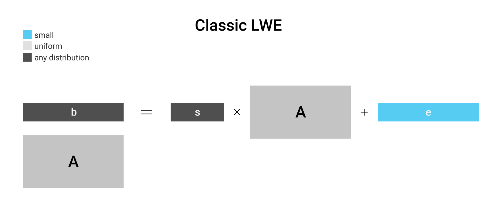
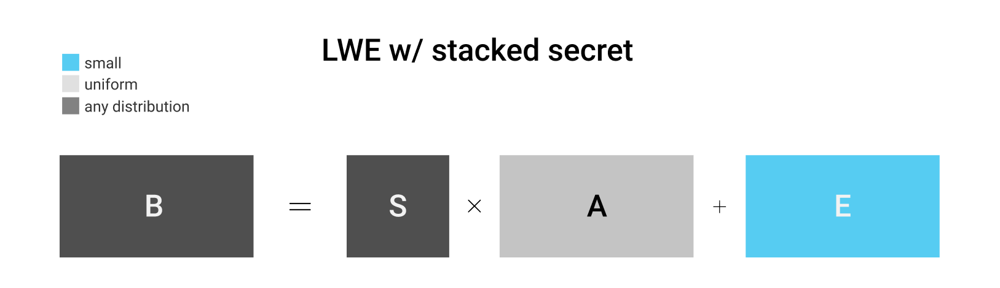
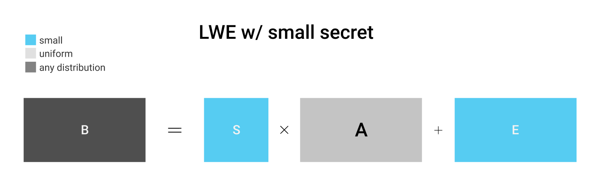
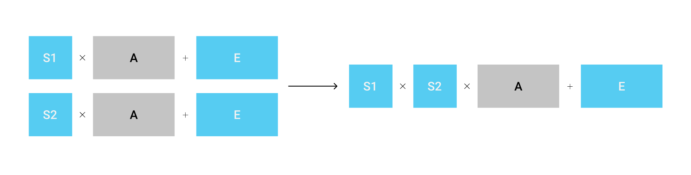
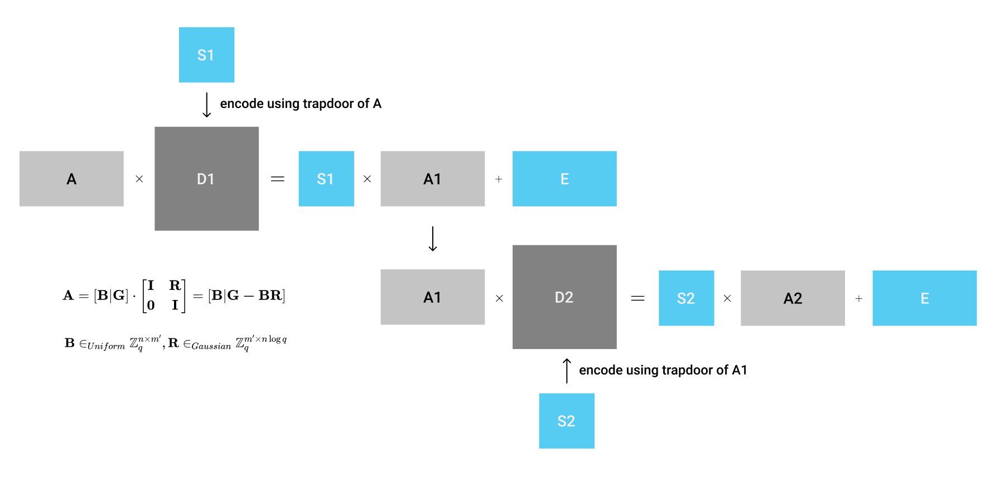
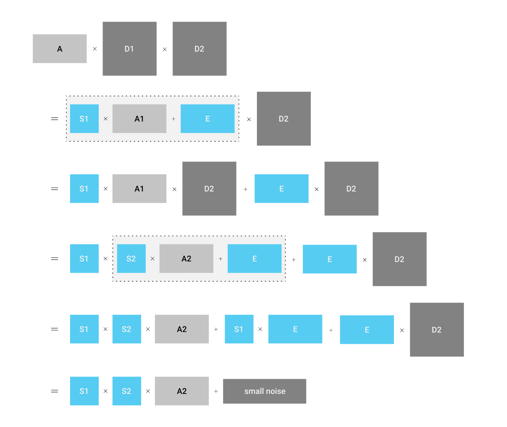
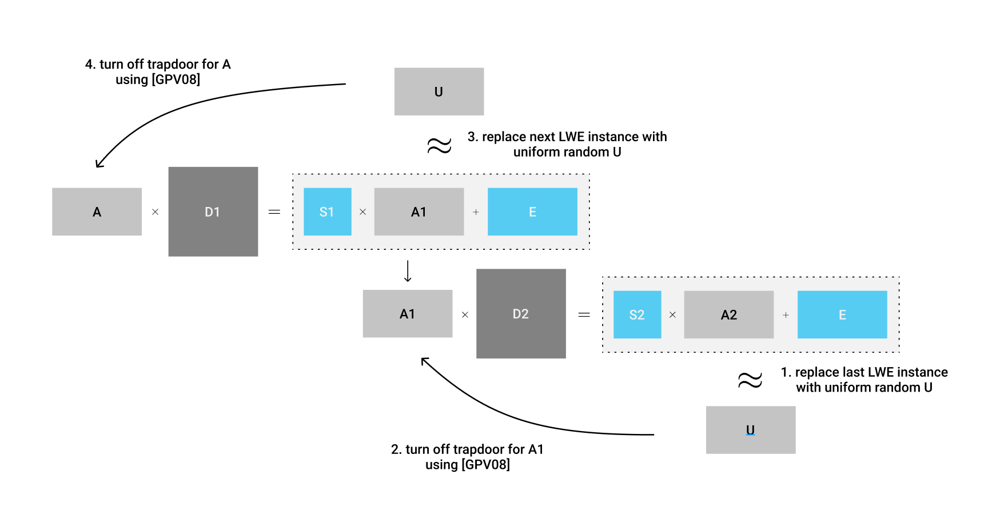
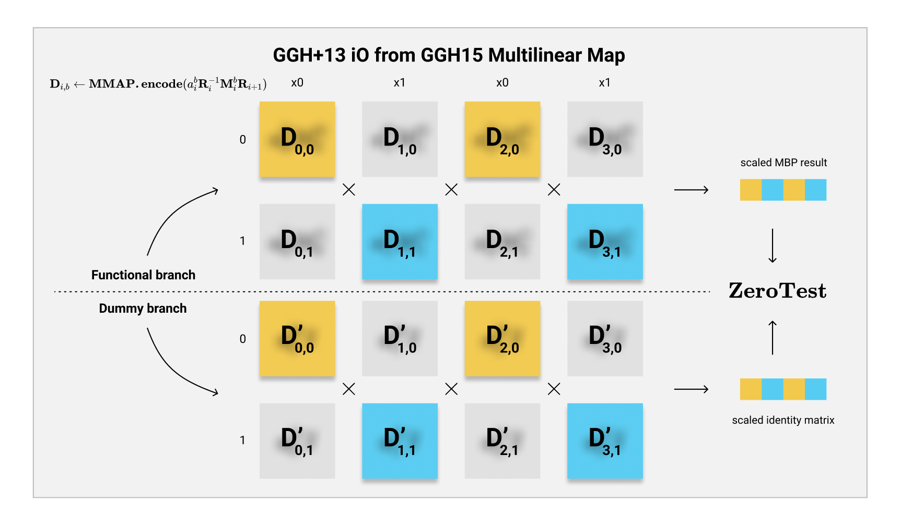
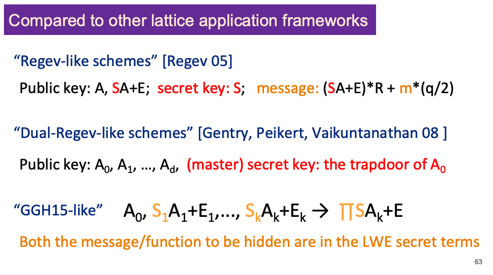

# iO入门04：基于GGH15构造多线性配对

### 写在前面

自从上一篇讨论【GGH+13】以来，不知不觉的已经过去了三个多月。几个月没有更新，不是笔者偷懒了，而是前一阵子在学算法和量子计算，课业太重实在无力写作。上周，这个学期刚刚结课，我们来补全$\mathcal{iO}$系列的第四篇文章：**构造多线性配对**。

对于**Multilinear Map**这一密码学构造，我们在$\mathcal{iO}$系列的前面三篇文章都有所提到过，这是一个比起FHE更有灵活性的密码学协议。FHE虽然强大，但是弱点在于它的安全性确保了FHE无法暴露出任何与密文有关的信息。而我们在进行混淆的时候，需要把被混淆的程序作为密文保存下来，但是得需要变相的在保证密文本身不泄漏的情况下计算这个程序。而多线性配对恰恰给了我们这一点自由度，在一个完美的加密系统中**打了一个小孔**，使得我们可以变相的来进行密文程序运算。

今天，我们就来看一看较为经典的MMAP构造：【GGH15】Graph Induced Multilinear Maps from Lattices，出于Gentry，Gorbunov与Halevi之手。

P.S. 本篇文章主要启发于**Yilei Chen**大神的讲座。

### 重温LWE问题

如果从之前的文章一路看来，想必大家对**LWE问题**已经非常不陌生了。在开始学习GGH15之前，我们需要重新回顾一下LWE问题的定义，并且引出一个新的变种来方便我们完成多线性配对的构造。

如上图所示，一个经典的LWE问题的定义中，一般包含了四个元素：代表LWE问题实例的$\mathbf{A}$矩阵，代表“密钥”的$\mathbf{s}$向量，代表噪音的$\mathbf{e}$向量，以及最后通过线性结合得到的$\mathbf{b}$向量。在Computational LWE问题中，我们要试图通过$(\mathbf{A, b})$这一对矩阵来试图求解出最初的密钥向量$\mathbf{s}$来。而在Decisional LWE中，我们需要判断看到的这一对矩阵究竟是代表一个LWE问题实例，还是一个根据平均概率分布抽取的随机矩阵。

了解了LWE的经典定义之后，我们可以基于它的矩阵结构，进一步扩展（堆积）LWE中的$\mathbf{s}$向量，使其从一个私密向量变成了一个**私密矩阵**。同理，我们也需要增加$\mathbf{e}$以及$\mathbf{b}$的维度，使得等式成立。如果LWE问题是困难的，那么这个新的形式的LWE问题仍然是困难的。因为我们可以把$\mathbf{B, S, E}$矩阵的每行拆分开来（变成$k$行），和原本的$\mathbf{A}$矩阵就可以分别组合成$k$个单独的LWE问题了。

我们在讨论经典LWE问题的时候，一般都是随机的生成$\mathbf{s}$向量，平均随机（uniform random）的生成$\mathbf{A}$矩阵，但是从一个限定噪声区间$\mathbf{x}_B$中随机生成$\mathbf{e}$向量。然而，在【ACPS09】中，Applebaum，Cash，Peikert与Sahai证明了其实如果我们从噪声区间中生成$\mathbf{s}$的话，所构成的LWE问题的难度仍然不变。详细的对于这一发现的解读我们在这里就不多描述了，不过熟悉**SIS问题**的话想必就不会陌生：就算是猜一个二进制的私密向量$\mathbf{s} \in \{0,1\}^n$，其实都是一个很困难的事情。

### Idea：使用LWE来实现多线性配对

我们知道，一个简单的$k$阶的多线性配对的构造大致如下：
$$
g, g^{s_1}, g^{s_2}, \dots, g^{s_k} \rightarrow g_T^{\prod s_i}
$$
这也就是说，我们分别在循环群$g$中encode了$s_1, s_2, \dots, s_k$这$k$个元素。而$k$阶的多线性配对恰好可以帮助我们把这些encoding全部都“积攒”在一块儿，得到$s_1 \cdot s_2 \cdot \dots \cdot s_k$的乘积在群$g_T$中的encoding。

【GGH15】的作者看着MMAP的定义之后，再看到了眼前的LWE问题的定义，不禁突发奇想：我们是否可以**使用LWE问题**来构造如下的“多线性配对”呢？
$$
\mathbf{A}, \mathbf{S}_1 \mathbf{A} + \mathbf{E}_1, \dots, \mathbf{S}_k \mathbf{A} + \mathbf{E}_k \rightarrow \prod \mathbf{S} \cdot \mathbf{A} + \mathbf{E} \text{ mod }q
$$
对于上面的式子，大概的理解方式为，我们可以把元素$\mathbf{S}_i$作为“密钥”encode在LWE问题中，变成$\mathbf{S}_i \mathbf{A} + \mathbf{E}_i$的形式。这样一来，一个$\mathbf{S}_i$的encoding其实就是以此为密钥的一个LWE实例。随后，如果通过某种神奇的累加方法，得到$\prod \mathbf{S}$对应的encoding（LWE实例），那么就大功告成了。

我们知道，一个多线性配对还需要具备另一个条件：支持$\mathbf{ZeroTest}$，即我们可以在最终得到的encoding中轻易的判断它encode的元素是否为0。在这里，因为我们最后得到的encoding $\prod \mathbf{S} \cdot \mathbf{A} + \mathbf{E}$是一个LWE实例，那么如果$\prod \mathbf{S}$为全0的矩阵的话，整个encoding就变成了噪声矩阵$\mathbf{E}$本身。这样我们可以通过检查这个矩阵是否在噪声分布区间内，轻易的判断多线性配对运算结果是否为0的encoding了。

这个构想非常完美！因为LWE的困难度，我们知道每个encoding都可以隐藏住随机分布的$\mathbf{S}_i$，并且LWE的噪声分布的特点让我们可以轻易的实现$\mathbf{ZeroTest}$。然而，现在我们需要弄明白，该如何实现这神奇的”多线性配对“运算，使得我们可以**结合多个LWE实例得到一个新的LWE实例**。这一运算的技巧，就是【GGH15】的精髓了。

### 串联LWE实例

接下来，我们就来深入的研究一下这个多线性配对运算的技巧，即如何“串联”多个LWE实例，使其变成一个新的LWE实例，并且encode了之前的两个secret。

上面这张图就很好的说明了我们想要做的事情。假设我们拥有两组LWE实例，$\mathbf{S}_1 \mathbf{A} + \mathbf{E}, \mathbf{S}_2 \mathbf{A} + \mathbf{E}$，我们能否找到一个方式，把它结合起来变成$\mathbf{S}_1 \mathbf{S}_2 \mathbf{A} + \mathbf{E}$呢？

乍一看，我们想要解决的问题似乎与FHE中的同态乘法非常相似。在**GSW**体系中，我们想要把两个嵌入在LWE实例中的密文相乘起来，得到一个乘积所对应的新密文。然而唯一不同的是，在GSW中，我们所encode的信息$\mu$是叠加在原本的LWE实例中的，LWE在GSW中的作用就好比是一个One-Time Pad，只是为了遮挡住要加密的密文。然而在GGH15中，我们所encode的信息，是存放在LWE实例的$\mathbf{S}$矩阵中的，这就好比是GSW中的“密钥”在这里变成了我们所要遮挡的“密文”。

如果我们强行的使得两个LWE实例相乘的话，撇开矩阵维度的问题不说，我们虽然可以使得$\mathbf{S}_1, \mathbf{S}_2$相乘，但是最后得到的结果中（$\mathbf{S}_1 \mathbf{A} \mathbf{S}_2 \mathbf{A} + \dots + \mathbf{E}^2$）仍然夹杂了很多我们不需要的信息，和我们真正想要的$\mathbf{S}_1 \mathbf{S}_2 \mathbf{A} + \mathbf{E}$还是差了一截。那么究竟该如何实现$\mathbf{S}$部分的相乘呢？

我们观察可以发现，如果我们单纯的把两组LWE实例相乘在一起，那么得到的结果的第一项$\mathbf{S}_1 \mathbf{A} \mathbf{S}_2 \mathbf{A}$中，多了一个$\mathbf{A}$矩阵。如果我们可以找到方法构造$\mathbf{A}$矩阵的inverse，即$\mathbf{A}^{-1}$，并且把它放到$\mathbf{S}_2$的前面的话，我们就可以变相的抵消掉这个多余的$\mathbf{A}$矩阵了。由于我们知道$\mathbf{A}$的数值分布是uniform random的，所以很难强行的找到它的inverse。

这个时候，我们就要借助一下另一个lattice中的重要工具：**lattice trapdoor**！

#### 引入Lattice Trapdoor

我们在之前的系列中深入的了解过【MP12】中构造Lattice Trapdoor（格陷门）的方案。总的来说，我们可以生成一个带有一个trapdoor $\mathbf{R}$的平均随机分布矩阵$\mathbf{A}$，并且基于这个矩阵构造困难的LWE或是SIS问题。在不知道trapdoor的存在的时候，$\mathbf{A}$就像是一个完全随机生成的LWE/SIS问题一样，困难不可解。但是一旦知道trapdoor $\mathbf{R}$的存在之后，我们就可以任意的生成此矩阵的inverse，以及对应的LWE/SIS OWF的preimage。

回到我们想要解决的问题上，假如我们生成了带有trapdoor $\mathbf{R}$的矩阵$\mathbf{A}$，那么我们就可以很简单的生成一个矩阵$\mathbf{D}_1$，使得：
$$
\mathbf{A} \mathbf{D}_1 = \mathbf{S}_1 \mathbf{A}_1 + \mathbf{E} \text{ mod }q
$$
同理，因为$\mathbf{A}_1$是平均随机分布的，它也完全可以是使用【MP12】生成的带有trapdoor $\mathbf{R}_1$的矩阵！假如我们这么做之后，我们就可以再利用$\mathbf{R}_1$生成一个矩阵$\mathbf{D}_2$，使得：
$$
\mathbf{A}_1 \mathbf{D}_2 = \mathbf{S}_2 \mathbf{A}_2 + \mathbf{E}
$$
如此一来，是不是有一点串联（套娃）的感觉了？我们再用图来描述一下刚刚描述的内容：

在上图中，我们可以提前使用【MP12】生成$\mathbf{A}, \mathbf{A}_1$这两个平均随机分布的矩阵，并且得到它们的trapdoor $\mathbf{R}, \mathbf{R}_1$。随后，我们就可以使用trapdoor，把原本两个LWE实例中的$\mathbf{S}_1, \mathbf{S}_2$变相的“encode”进矩阵$\mathbf{D}_1, \mathbf{D}_2$中了。最后，我们可以得到$\mathbf{A}, \mathbf{D}_1, \mathbf{D}_2$这三个矩阵作为最终的encoding。

如上的encoding，正是【GGH15】中的多线性配对encoding。多线性配对的计算也非常简单，我们只需要把这三项相乘：
$$
\begin{align*}
\mathbf{A} \mathbf{D}_1 \mathbf{D}_2 &= \left( \mathbf{S}_1 \mathbf{A}_1 + \mathbf{E} \right) \mathbf{D}_2\\
&= \mathbf{S}_1 \mathbf{A}_1 \mathbf{D}_2 + \mathbf{E} \mathbf{D}_2\\
&= \mathbf{S}_1 \left( \mathbf{S}_2 \mathbf{A}_2 + \mathbf{E} \right) + \mathbf{E} \mathbf{D}_2\\
&= \mathbf{S}_1 \mathbf{S}_2 \mathbf{A}_2 + \mathbf{S}_1 \mathbf{E} + \mathbf{E} \mathbf{D}_2\\
&= \mathbf{S}_1 \mathbf{S}_2 \mathbf{A}_2 + \mathbf{noise} \text{ mod }q
\end{align*}
$$
这样一来，我们就可以轻易的得到encode了$\mathbf{S}_1 \mathbf{S}_2$的新LWE实例啦。在这个例子中我们只有两层的嵌套（即只有$\mathbf{A}, \mathbf{A}_1$矩阵拥有trapdoor），但是我们可以继续扩展这个构造，分别加入带有陷门的$\mathbf{A}_2, \mathbf{A}_3, \dots, \mathbf{A}_{k-1}$，生成$\mathbf{D}_1, \dots, \mathbf{D}_k$。只要噪声项的乘积不超过噪声分布的区间，我们就可以通过$\mathbf{D}$矩阵的相乘，计算出代表$\prod \mathbf{S}_i$的LWE实例，即$\prod \mathbf{S}_i \mathbf{A}_k + \mathbf{E}$。

如此的结构，我们乍一看，是不是有点像**链条**一样，从$\mathbf{D}_1$一路通过trapdoor“链接”到$\mathbf{D}_k$，就可以得到所有encoding的乘积。因为这一形象的几何构造，这个方案也被称之为**GGH15 chain**。

### 【GGH15】的（非）正式构造

了解了GGH15 chain的原理之后，接下来我们就可以来完整的定义【GGH15】多线性配对系统了。由于完整版的GGH15构造较为复杂，我们这里就略微的描述一下大致构造的intuition。

#### 参数生成

如果要构造一个$k$阶的多线性配对的话，那么我们首先需要选取LWE实例的参数$n, m, q, x_B$等等，并且根据对应的维度要求生成$k$个带有trapdoor的矩阵$\mathbf{A}_0, \mathbf{A}_1, \dots, \mathbf{A}_{k-1}$以及一个平均随机生成的矩阵$\mathbf{A}_k$。

#### Encode

当我们生成完参数之后，紧接着我们就可以使用这些参数来encode $k$个矩阵$\mathbf{S}_i$，生成对应的$\mathbf{D}_i$。对于在第$i$级上的$\mathbf{S}_i$，我们会使用上一级的trapdoor $\mathbf{R}_{i-1}$来生成$\mathbf{D}$矩阵：
$$
Encode(\mathbf{S}_i) \rightarrow \mathbf{D}_i\\
\mathbf{A}_{i-1} \mathbf{D}_i = \mathbf{S}_i \mathbf{A}_i + \mathbf{E}_i
$$
依次方式，我们可以生成$k$个输入$\mathbf{S}_1, \dots, \mathbf{S}_k$的encoding $\mathbf{D}_1, \dots, \mathbf{D}_k$。

#### 相同级数的运算

多线性配对系统中，有一个要求是同为$i$阶的encoding可以相互线性组合（相加、相减）。用通用的方式表示的话，就是给定$g_i^{s_1}, g_i^{s_2}$，我们可以简单的计算出$g_i^{s_1 + s_2}$。

在GGH15的构造中，这一特点显而易见。假如我们拥有两个$i$阶的encoding $\mathbf{D}_i, \mathbf{D}_i'$，我们可以直接相加这两个encoding得到$\mathbf{S}_i, \mathbf{S}_i'$相加所对应的encoding：
$$
\mathbf{A}_{i-1} (\mathbf{D}_i + \mathbf{D}_i') = (\mathbf{S}_i + \mathbf{S}_i') \mathbf{A} + (\mathbf{E}_i + \mathbf{E}_i')
$$

#### 多线性配对计算

GGH15的重头戏，即多线性配对真正的计算方式，我们已经在前文介绍过了。简单的来说，给定$k$个从1到$k$级的GGH15 encoding $\mathbf{D}_i$，以及$\mathbf{A}_0$，我们就可以把它们一次相乘，得到：
$$
\mathbf{A}_0 \mathbf{D}_1 \cdots \mathbf{D}_k = \mathbf{S}_1 \cdots \mathbf{S}_k \mathbf{A}_k + \mathbf{noise}
$$
这就是我们多线性配对的结果啦，即$k$个encoding相乘之后所对应的encoding。

#### ZeroTest

$\mathbf{ZeroTest}$的部分我们之前也提到过了，因为最后我们得到的是$\prod \mathbf{S}_i \mathbf{A}_k + \mathbf{noise}$的形式，所以正好是一个LWE的instance。假如$\prod \mathbf{S}_i$乘积为0的话，那么剩下的只有噪声分布，我们可以轻松的通过thresholding来判断我们看到的多线性配对结果是否encode了0值。

### 【GGH15】的安全论证

了解完GGH15的结构之后，我们紧接着就要思考一个严峻的问题：因为我们使用了带有trapdoor的$\mathbf{A}$矩阵来生成$\mathbf{D}$矩阵，并且我们使用了这些trapdoor生成了一系列的$\mathbf{D}$矩阵，如何保证在trapdoor存在并且公开$\mathbf{D}$矩阵的情况下，仍然保证GGH15的安全性，即**encoding不会暴露原本的值**呢？

换句话来说，当我们构造lattice trapdoor的时候，虽然生成的$\mathbf{A}$矩阵是平均随机分布的，但是一旦知道trapdoor $\mathbf{R}$之后，$\mathbf{A}$的分布一下就变的很有规律，我们可以轻松的拆开$\mathbf{A}$还原回构造它的工具矩阵$\mathbf{G}$。然而，在GGH15中，我们不仅公开了$\mathbf{A}$，还公开了使用它的trapdoor生成的$\mathbf{D}$矩阵。这样一来，如何才能保证adversary无法通过$\mathbf{D}$中的信息“提取”出trapdoor来，攻破$\mathbf{A}$呢？

GGH15中，对于这一点疑惑，做出了非常优雅的解释。

回到我们之前的两层MMAP的例子，我们会发现拥有trapdoor的$\mathbf{A}, \mathbf{A}_1$两个矩阵像链条一样，链接起了整个MMAP的结构。接下来，我们如果根据这个链条的结构，**一步一步的拆开链接**，把trapdoor给去掉，那剩下的就只有LWE实例，安全性也就毋庸置疑了。

我们首先观察整个链条的尾端。我们发现，最后的$\mathbf{A}_2$，是没有任何trapdoor的随机矩阵。这也就是说，只要$\mathbf{S}_2$的分布足够随机（我们这里假设如此），那这就是一个没有泄漏任何信息的**LWE实例**。根据DLWE假设，我们可以把链条的最后一节替换成一个纯平均随机分布的矩阵$\mathbf{U}$。

替换完成后，链条的下一节，即$\mathbf{A}_1$的trapdoor部分就变成了：
$$
\mathbf{A}_1 \mathbf{D}_2 = \mathbf{U}
$$
接下来的问题就变成，已知了$\mathbf{A}_1$与$\mathbf{D}_2$的乘积为一个平均随机分布的$\mathbf{U}$，能否获取与$\mathbf{A}_1$的trapdoor有关的任何信息呢？这个问题的答案很妙：给定一个有trapdoor的$\mathbf{A}_1$以及平均随机分布的$\mathbf{U}$，假如我们不用这个trapdoor就可以生成$\mathbf{D}_2$，那么$\mathbf{A}_1, \mathbf{D}_2$就不会暴露出trapdoor的信息了。这就好比是，这个问题同时拥有了real的以及simulated的两个版本，在real版本中我们会使用$\mathbf{A}_1$的trapdoor来生成$\mathbf{D}_2$，而在simulated的版本中，我们可以不用trapdoor来生成。因为我们看到的信息是一样的，所以我们无法分辨自身到底处在real世界还是simulated世界中。

在**Gentry-Peikert-Vaikuntanathan**的【GPV08】一作中，正巧提及了**random preimage sampling**的问题。具体的意思就是说，给定一个$\mathbf{A}$矩阵和一个随机image $\mathbf{U}$，我们可以使用一种特殊的sampling方法，不用任何trapdoor就找到符合要求的preimage $\mathbf{D}$。这样一来，在real世界中使用trapdoor来生成的preimage $\mathbf{D}$的概率分布，和在【GPV08】的simulated世界中使用sampling来生成的preimage $\mathbf{D}'$，概率分布是**statistically indistinguishable**的。

说人话的话，这也就代表了，如果我们看到$\mathbf{A}_1 \mathbf{D}_2 = \mathbf{U}$这样的构造，我们就可以假设$\mathbf{A}_1$的trapdoor不存在，因为即使存在我们从现有的信息中无法得知。换句话说，这个操作叫做**关上陷门（turning off the trapdoor）**。

一旦trapdoor被关上之后，那么$\mathbf{A}_1$就变成了一个天真无邪的平均随机分布矩阵。我们就可以如法炮制，再次把$\mathbf{S}_1 \mathbf{A}_1 + \mathbf{E}$的部分替换成新的$\mathbf{U}$，再依次关上$\mathbf{A}$的trapdoor。

当所有的trapdoor都被关上之后，整个体系中所有的$\mathbf{A}_i$矩阵都可以被当作没有trapdoor的真·随机矩阵。这样一来，我们就确保了整个多线性配对体系的安全性了。

当然了，我们这里提到的“安全论证”只是GGH15 security proof的冰山一角。基于GGH15还有不少有趣的密码分析，不过我们主要的目的还是使用它来构造$\mathcal{iO}$，所以我们就不多讨论了。

### 结合【GGH+13】的$\mathcal{iO}$构造

如果你看到这里，祝贺一下你已经成功的掌握GGH15多线性配对构造的精髓了。接下来，我们学以致用，把我们在前几期了解到的【GGH+13】多线性拼图的$\mathcal{iO}$构造套入GGH15中，彻底完成我们整个$\mathcal{iO}$协议。

距离上期过去了一段时间，我们不妨快速的回顾一下【GGH+13】的$\mathcal{iO}$构造：**Multilinear Jigsaw Puzzle**。

我们知道，在【GGH+13】中，主要的“计算”是通过**矩阵分叉程序**（MBP）来实现的，而剩余的结构都是一系列的safeguard，确保整个$\mathcal{iO}$构造的安全性。

总的来说，当我们使用【GGH+13】来混淆一个电路$C$的时候，我们会得到一系列的矩阵的encoding，然后计算$C(x)$的时候就可以根据输入$x$的值来“选择”对应的encoding，再通过多线性配对的方法把这些encoding相乘，得到最终的结果的encoding。在真正的结构中，还需要有额外的几步safeguard，比如说需要再乘上**Bookend vector**（书挡向量），以及需要计算一个dummy branch的内容，与functional branch相减等等。最后，我们使用$\mathbf{ZeroTest}$算法来验证计算结果的encoding是否为0，依次来判断$C(x)$的结果是否等于0。

了解完GGH15的构造之后，我们会发现【GGH+13】中所需要的每一步都可以非常完美的接入GGH15的系统内。我们可以把**RBP**（随机化之后的MBP）矩阵全部用GGH15 encode成对应的$\mathbf{D}_{i,b}$矩阵，随后用户在计算的时候，就可以跟计算MBP的方法一样，根据$x$的值来挑选$\mathbf{D}$矩阵，再相乘起来计算多线性配对了！

这就是【GGH+13】搭配【GGH15】实现的$\mathcal{iO}$构造的完全体了。

### 写在最后

其实看到这里，大家可能会发现我们这一期对于GGH15的描述在很多地方较为概括，跳过了很多细节上的具体构造。这是因为还有很多细节和安全上的证明在GGH15提出之后，才后续慢慢的补上，并且持续的修修补补了很长时间。其实笔者觉得，GGH15**最大的takeaway point就在于使用lattice trapdoor的串联，构造了一个链条状的结构**，使得我们可以优雅的相乘多个LWE实例。

GGH15的构造也给基于lattice的密码学协议带来了新的一种思路。我们在这里引用Yilei Chen的一页slide：

我们一路走来，从最初的Regev加密以及GSW开始，我们使用LWE实例作为一个近似于平均随机分布的One-Time Pad，叠加在密文上实现加密。随后，当我们讨论到基于lattice的IBE/ABE构造的时候，我们切换成了Dual Regev的模式，使用并联的多个平均随机分布矩阵，以及提前生成好的trapdoor来实现功能性。到最后，在GGH15中我们把要encode的信息放在了LWE的密钥$\mathbf{S}$当中，通过trapdoor的串联，实现了多线性配对。也许，在未来我们还可以基于格中的LWE/SIS问题，构造出新的协议框架，说不定又可以碰撞出新的应用来。

到这，我们对于【GGH15】的多线性配对的讨论就结束啦。几个月没有写文章，文笔不禁变得有些生疏，篇幅比起往常略短，还请大家多多体谅。

其实自从GGH15等多线性配对的概念被提出之后，除了$\mathcal{iO}$之外，密码学界还提出了不同类型的混淆构造。我们在$\mathcal{iO}$系列的第一期就说到，当大家发现VBB混淆不可能实现之后，学术界遍一分为二，一部分人去研究$\mathcal{iO}$，而另一部分人则去研究限制了可以混淆的电路的功能性的另类混淆构造。

下一期，我们就来看一看一个基于GGH15就可以轻松实现的另类混淆结构，**Lockable Obfuscation**。