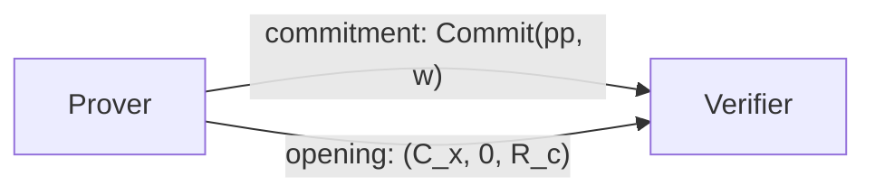

# 格密码学进阶08：基于GSW的NIZK（上）

### 写在前面

经过了漫长的铺垫，我们终于可以来正式的学习基于格的第一个较为酷炫的应用：**非交互零知识证明**（Non-Interactive Zero-Knowledge proofs，**NIZK**）。

去年12月份的时候，笔者开始写【浅谈零知识证明】这个专题，花了挺大的篇幅大概描述了**zkSNARK**，一个用在ZCash中并且基于LPCP的零知识证明体系。如果对于零知识证明这一概念还比较陌生的话，不妨再去回顾一下之前的这个专题～

这一次，我们来看一个完全不一样的NIZK构造方案。

P.S. 本文主要描述了Kim与Wu的paper【**KW17**】：Multi-theorem Preprocessing NIZKs from Lattices。

### NIZK的快速回顾

在开始之前，我们不妨先快速的回顾一下NIZK的定义。在一个零知识证明系统中，需要有**证明方**（Prover）与**验证方**（Verifier）。在这个协议中，Prover会生成一个**证明**（Proof），并且试图**说服**（convince）Verifier某些信息。通常来说，我们会使用NIZK来“证明”一些特定的信息。比如说，我们想要证明我们知道某个问题的解，但是并不想暴露这个解本身。

NIZK分为两部分，**NI**（非交互）与**ZK**（零知识）。

非交互这一部分很简单，要求证明方要一次性的（one-shot）生成一个Proof，发送给Verifier，随后Verifier验证收到的证明，输出验证结果，不能再有额外的interaction。对于某些符合要求的交互性协议（比如$\Sigma$协议），我们可以通过Fiat-Shamir来压缩成非交互协议。

零知识的定义要更为复杂一点，要求在整个协议执行时双方生成的任何交互（transcript）信息的概率分布能够被一个simulator（模拟器）来生成。当一个协议满足了ZK的条件之后，我们光看它的transcript，无法有效的分辨这个transcript到底是来自于真正的协议，还是来自于模拟器。这个特点带来的好处就是，协议的transcript无法暴露任何未公开的信息。一个零知识协议的tanscript就算公开出去，也没有有效的adversary可以还原出任何有用的信息。

关于零知识证明，还有几点经常会讨论到的属性。

#### Correctness

Correctness即正确性，主要规定了如果Prover是诚实的（Honest），真的知道想要证明的信息本身的话，那么Verifier一定会（或者绝大几率会）接受Prover生成的Proof。

#### Soundness

Soundness即健全性，主要约束了如果Prover是恶意的（Malicious），随便编造了一个Proof出来，那么Verifier会有相对来说比较小的几率接受这个Proof。一般来说，这个几率不需要太小，因为我们可以通过反复的iterate这个Verify的步骤来把这个几率不断的缩小，直到变成negligible。

#### Proof of Knowledge（PoK）

比较有意思的一个属性是PoK，即知识证明。这个属性代表了我们的这个零知识证明的Prover，一定需要”知道“一些内容才行。这个内容，一般写作$w$（witness），可能是某个问题的解，或者是某个特殊的relation，甚至是几个数字都可以。最关键的一点要在于，我们需要”证明“这个协议中的Prover真的”知道“这些内容。

为了证明PoK，我们需要对于一个交互协议构造出一个对应的Extractor（提取器）。这个Extractor可以充当Verifier的角色，任意的跟协议中的Prover进行交互。同时，它还拥有时间回溯的特异功能，可以在看到Prover的Proof之后，马上时间回溯到协议的开始，再进行不同的交互。如果Extractor可以通过多次不同的交互的transcript有效的“提取”出Prover想要证明的信息$w$的话，那么代表这个协议满足了PoK的属性。

一般来说，除了在分析协议的时候我们会看PoK这个属性之外，我们在构造新的协议的时候，也需要想着怎么把这个Extractor“埋进”这个协议当中，使得任何人只要通过多次交互，就可以提取出witness。在正常使用协议的情况下，PoK的属性并不会对于安全性有任何影响。这是因为在一次协议中Prover不会和Verifier进行多次交互。

我们可以把PoK看作一个更加严格的Soundness属性。Soundness规定了，如果不知道witness，那么无法通过验证。PoK规定了，就算Prover知道了witness，也需要能够被Extractor提取出来才行。

#### Honest-Verifier Zero-Knowledge（HVZK）

最后一个就是Zero-Knowledge了，具体的定义和我们之前讨论的相同，即整个协议的transcript不能泄漏任何有用的信息，甚至它的概率分布可以直接被模拟出来。

在分析零知识协议的时候，我们一般都会假设Prover可能会是恶意的（Malicious），即Prover有动机去做假，就算没有witness，也会试图convince Verifier使其相信他拥有正确的witness。一个协议的soundness有效的避免了Malicious的Prover。不过我们不会对于Verifier作出太多的要求，所以一般来说我们都会假设Verifier会**诚实**的遵守整个协议（Honest Verifier）。

HVZK的属性说明了，当Verifier是诚实的，而Prover可以是诚实或者是恶意的情况下，Verifier无法从transcript中提取出任何与witness相关的信息，甚至可以通过一个simulator来模拟整个transcript。

### NIZK的证明结构

如果之前了解过zkSNARK一类的SNARK零知识证明的话，肯定会对于零知识证明中证明的结构有一定的认知：我们会有一个电路$C$与公共参数$x$，Prover需要证明他拥有一个witness $w$使得电路满足$C(x, w) = 0$。这样的构造是一个非常常见的零知识证明framework，即我们把证明的内容变成了一个电路，然后我们证明的是我们知道某个输入会导致这个电路计算出的结果为0。

当然了，NIZK的范畴不仅仅是我们提到的这些。像是Schnorr protocol等等的$\Sigma$协议，都可以被转换为NIZK，然而这些协议中所“证明”的内容和结构也大不相同。我们在这里关心的NIZK，主要是为了证明Prover**知道一个NP问题的解**（**Proof of NP Relation**）。

如果要再严谨一点的话，我们这里讨论的Prover，需要证明某个问题实例$x$属于一个问题集合L中，而这个问题集合L又属于NP：
$$
x \in L\\
L \in NP
$$
L属于NP，这意味着存在一组关系集合$R_L$，任何在L中的实例$x'$都在$R_L$中拥有对应的witness：
$$
x' \in L \iff \exists w' \text{ s.t. } (x', w') \in R_L
$$
而PoK的属性则要求Prover不仅能够证明$x \in L$，还必须要真的知道对应$x$的witness $w$，使得$(x, w) \in R_L$。*理论扯完了，现在开始说人话。*

NP问题的一个特性就是我们可以快速的（在多项式时间内）验证某个解$w$是不是正确的。如果我们套用之前提到的NIZK的framework的话，我们可以把验证这个NP问题解的算法描述为一个efficient的电路$\mathbf{R}(x, w)$，其中$x$为公共参数（即NP问题的instance），而$w$为witness（即对应的解）。如果$w$符合要求，那么$\mathbf{R}$就会输出0。为了和之前的notation相同，我们后面还是会使用电路$C$来代表验证NP问题的解的电路$\mathbf{R}$。

在zkSNARK中，我们到底是如何证明这个电路的结果是0的呢？高度概括一下的话，最核心的原理在于我们把整个证明电路$C$的结构拆分成了一条条的约束（constraint），再把这些约束组成了一个R1CS程序并且转化成了多项式的形态。最后我们使用**LPCP**来随机抽查多项式上的点，以便检验Prover提供的witness $w$是否能够符合电路中的所有约束。

仔细观察一下的话，我们会发现其实zkSNARK中用到的最核心的工具就是LPCP，其他的结构都是把原本的问题层层转化，以便我们更有效率的进行LPCP协议。反而，我们一开始定义问题的时候所用的电路$C$，**并没有发挥电路本身“计算”的作用**，而只是被分解为了一条条constraint来帮助我们建立多项式。

P.S. 写到这里，作为一个EE背景出生的笔者还是感觉被深深的膈应了一下。原本期待把问题推到成电路之后，可以使用数字电路相同的知识来理解零知识证明中的一些要点，没想到zkSNARK在这里拐了个弯，奔着R1CS和多项式去了。

### 【KW17】活用证明电路：基于FHE的NIZK

这一期，我们来了解一个完全不同的NIZK结构：**基于GSW全同态加密体系的零知识证明协议**。

之前我们在讨论zkSNARK的时候，一直有个思维定势，就是我们所生成的电路$C$本身并没有实际的作用，只是作为生成constraint的参考而已。但是当我们拥有FHE这一项秘密武器之后，一切就发生改变了。在2017年的时候，Boneh的两个PhD **David Wu**与**Sam Kim**提出了【KW17】基于GSW FHE的NIZK构造。我们这次换一个角度，从作者的角度出发，试图从头还原这个构造。

#### Idea：同态计算证明电路

我们都知道，FHE可以让我们在密文上同态的计算任意的functionality $f$。当我们盯着SNARK中的证明电路$C$和它的输入$x, w$看很久之后，不禁会发散的想到：如果零知识的目的就是向Verifier“隐藏”witness $w$，那是不是可以把$w$使用FHE加密起来发送给Verifier，这样基于加密的语义安全属性，我们仍然可以把这个协议看成是“ZK”的。随后，当Verifier收到密文$ct_w$之后，只需要同态的计算$C(x, w)$，就可以得到电路$C$的结果了！这个时候，如果结果是0的话，那么Verifier就能知道$ct_w$中的witness $w$真的是符合证明电路$C$的一个正确解。

诶，这个idea感觉不错。我们先别着急，梳理一下我们刚刚想到的逻辑：

1. 首先，Prover把他的witness $w$使用FHE加密，得到$ct_w \leftarrow Enc(sk, w)$，并且把密文发送给Verifier。
2. 随后，因为Verifier已经知道公共参数$x$了，他可以把$x$嵌入（hardwire）到电路$C$中，得到$C_x(\cdot) = C(x, \cdot)$。然后他需要同态的在密文上计算$C_x$，得到一个加密过后的证明电路输出$ct_{C_x(w)} \leftarrow Eval(C_x, ct_w)$。
3. 最后，Verifier只需要想尽办法解开密文$ct_{C_x(w)}$，通过判断得到的解密结果是不是0，就能够知道$ct_w$中的witness是否是满足证明电路的正确解了！

一切都感觉很美好，但是乍一看，第三步有点问题：Verifier究竟要如何解开最后的密文$ct_{C_x(w)}$呢？

我们之前了解的FHE的框架基于公钥加密系统，所以这个系统也规定了，只有知道私钥$sk$的人才可以解开密文。如果Verifier拿到了FHE的$sk$，那么他也可以解开$ct_w$看到witness本身。如果Verifier可以暴力的破解$ct_{C_x(w)}$，那么这个FHE的安全性又成了问题……这看似变成了一个不可能的问题。

#### 换个思路：一次性解密密钥（Opening）

当一筹莫展的时候，我们不妨再想一想我们想要解决的问题：首先，我们希望Verifier可以很轻松的解开同态计算证明电路$C$之后的密文$ct_{C_x(w)}$，但是他又不能够解开最初的witness的密文$ct_w$。其次，我们还要确保FHE的普通属性不受影响（比如安全性、同态性、简短性）。

如果同时兼顾所有要求的话，我们突然想到了一个也许可行的idea：Prover能不能给Verifier**签发一个“一次性”的解密密钥**，使得他只能解开密文$ct_{C_x(w)}$，而并不能解开其他的密文。这样一来，Verifier就可以通过这个一次性的密钥来打开密文，看到$C_x(w)$的值了！

我们接着这个想法继续思考下去。

如果把这个“一次性密钥”的要求单独抽出来，那么我们可以构成如下的一个协议：

1. Alice使用FHE（或者任何算法）把一条消息$m$，加密（或者encode）成一个密文$c$，然后把$c$发送给Bob。
2. Bob收到$c$之后，并不能从$c$中获得任何与$m$相关的信息。
3. Alice生成一个一次性的”密钥“$r$，并且把$r$发送给Bob。
4. Bob可以用$r$来“解开”密文$c$，得到消息$m$。但是Bob不能用$r$来解开Alice发送的其他密文，比如encode了$m'$的$c'$。

Hmmm，这个协议，怎么看都感觉非常的熟悉。这不就是**Commitment Scheme**（**承诺**）嘛！

没错，我们这里的应用场景和承诺可以带给我们的功能是一样的，不过加上前面同态计算证明电路的特性之后，就变成了**全同态承诺**（Fully Homomorphic Commitment，FHC）。

如果我们拥有一个FHC系统的话，那我们可以重新修改一下这个零知识协议：

1. Prover使用FHC生成一个witness $w$的commitment $c_w$，然后发送给Verifier。根据commitment的binding特性，我们知道$c_w$是唯一的，只能够被“打开”成$w$。
2. 根据commitment scheme的hiding属性，Verifier无法从$c_w$中提取出$w$来。
3. Verifier可以同态的在$c_w$上计算证明电路$C_x$，得到一个新的承诺$c_{C_x(w)}$。
4. 最后，Prover向Verifier发送一个opening $r$，“打开”这个承诺，Verifier可以通过打开的$C_x(w)$的值，判断是否通过验证。

当我们拥有这样一个构造之后，把整个协议变成非交互性的也非常简单：因为Verifier在这里不会跟Prover有任何的沟通，Prover只需要一口气把$c_w$和对应$c_{C_x(w)}$的opening $r$发送给Verifier，这就是NIZK啦。

### GSW：从FHE到FHC

当我们了解了【KW17】的核心idea——全同态承诺（FHC）之后，下一步就是真正的来构造这样的一套系统，实现NIZK。

由于我们在之前讨论【BGG+14】的ABE构造的时候，着重的介绍了GSW中的双重同态特性，再加上上一篇文章，我们系统性的总结了代表GSW Dual Homomorphism的Key Equation，看到这里想必大家也明白了：没错，我们这里的FHC又要借助于强大的GSW来实现了。

我们快速的回顾一下【KW17】中所用的GSW结构。

#### 公共参数生成

首先，我们需要构造一个LWE实例$\mathbf{A}$（公钥），和对应的解$\mathbf{s}$（私钥）。其中，$\mathbf{A}$矩阵的构造为一个随机矩阵$\widetilde{\mathbf{A}}$加上一行LWE乘积$\mathbf{b}$：
$$
\mathbf{A} = \begin{bmatrix}
\widetilde{\mathbf{A}}\\
\mathbf{b} = \widetilde{\mathbf{s}}^t \widetilde{\mathbf{A}} + \mathbf{e}^t
\end{bmatrix}
$$
而私钥$\mathbf{s}$的组成和我们之前介绍GSW的时候用到的构造相同，即：
$$
\mathbf{s} = \begin{bmatrix}
\widetilde{\mathbf{s}}\\
-1
\end{bmatrix}
$$
由于我们已经了解过GSW的correctness证明了，所以我们在这里就不多在乎公钥$\mathbf{A}$和私钥$\mathbf{s}$的具体构造了。唯一我们需要知道的关系，就是当公钥和私钥相乘，我们可以得到一个近似0的值：
$$
\mathbf{s}^t \mathbf{A} = \mathbf{e}^t \approx 0
$$

#### GSW加密

加密的方法和我们之前看到的大致相同。如果要加密一个bit $\mu \in \{0, 1\}$，我们选取一个随机的short blinding vector $\mathbf{R}$，随后输出：
$$
C = \mathbf{AR} + \mu \mathbf{G}
$$
这里的$\mathbf{G}$是一个gadget matrix，用于重组之后同态计算时用到的二进制分解态密文。初步观察一下的话，我们可以理解这个密文为在消息$\mu \mathbf{G}$上叠加了一层基于LWE的OTP $\mathbf{AR}$。

#### GSW解密

解密的过程也非常简单，因为我们知道$\mathbf{s}^t \mathbf{A} \approx 0$，并且我们额外约束了$\mathbf{R}$是一个短矩阵，所以我们只需要给密文乘上$\mathbf{s}$，密文中的OTP $\mathbf{AR}$就会自动的被消除，剩下原本的消息和一部分噪声：
$$
\mathbf{s}^t C = \mathbf{s}^t \mathbf{AR} + \mu \cdot \mathbf{s}^t \mathbf{G} \approx \mu \cdot \mathbf{s}^t \mathbf{G}
$$

#### 同态运算

假如我们拥有两条密文$C_1, C_2$分别加密了$\mu_1, \mu_2$：
$$
C_1 = \mathbf{AR}_1 + \mu_1 \mathbf{G}\\
C_2 = \mathbf{AR}_2 + \mu_2 \mathbf{G}
$$
基于我们掌握的GSW同态运算知识，我们可以很简单的计算同态加法：
$$
C_{+} = C_1 + C_2 = \mathbf{A} \underbrace{(\mathbf{R}_1 + \mathbf{R}_2)}_{\mathbf{R}_+} + (\mu_1 + \mu_2) \mathbf{G}
$$
当我们把密文相加的时候，可以发现我们不仅把其中的消息$\mu_1, \mu_2$相加了，我们也得到了一个对应了加法操作的新的$\mathbf{R}$矩阵$\mathbf{R}_+$。

我们接下来计算同态乘法：
$$
C_{\times} = C_1 \mathbf{G}^{-1}(C_2) = \mathbf{A} \underbrace{\mathbf{R}_1 \mathbf{G}^{-1}(C_2)}_{\mathbf{R}_\times} + \mu_1 \mu_2 \mathbf{G}
$$
因为$\mathbf{R}$矩阵是short的，$\mathbf{G}^{-1}$二进制分解的密文也是short的，所以二者结合产生的新的矩阵$\mathbf{R}_\times$也是short的。这一属性确保了整个FHE系统的正确性。

和加法一样，我们在得到$\mu_1 \mu_2$的同时，也得到了代表了乘法运算的$\mathbf{R}_\times$。其实这一点和我们在【BGG+14】中所看到的特性是一样的！这也就是说，假如我们拥有$n$个密文$C_1, \dots, C_n$加密了$\mu_1, \dots, \mu_n$，其中每个密文都分别对应了独特的$\mathbf{R}_1, \dots, \mathbf{R}_n$，那么当我们在这些密文上同态计算一个函数$f$的话，我们会得到如下的结构：
$$
C_f = \mathbf{AR}_{f,\mu_1, \dots, \mu_n} + f(\mu_1, \dots, \mu_n) \mathbf{G}
$$
其中的$\mathbf{R}$矩阵包含了整个同态运算的所有信息，包括了$\mu_1, \dots, \mu_n$的输入，以及运算的函数$f$，都被某种意义的“encode”在了这个矩阵当中。

#### 双重同态性

【BGG+14】中指出，在GSW中，除了加密的消息拥有同态性质之外，我们在加密中所使用的randomness $\mathbf{R}$矩阵也会根据计算的functionality和消息本身被同态叠加起来。除此之外，【BGG+14】中还写道，我们可以用一种很清晰的表达方式来描述这种“encoding”：
$$
\mathbf{R}_{f,\mu_1, \dots, \mu_n} = [\mathbf{R}_1 \vert \cdots \vert \mathbf{R}_n] \mathbf{H}_{f, \mu_1, \dots, \mu_n}
$$
其中的$\mathbf{H}$矩阵为short。这就是说，最后的$\mathbf{R}$矩阵是由一开始的数个$\mathbf{R}_1, \dots, \mathbf{R}_n$矩阵聚在一起，通过某种包含了$f$与$\mu_1, \dots, \mu_n$信息的线性结合$\mathbf{H}$而组成的。而这个$\mathbf{H}$矩阵，只要已知$f$与输入$\mu$的值，就可以很方便的计算出来。

等下，**这个表达式是不是非常的似曾相识**？

没错！这就是我们上期看到的GSW Key Equation的一个变种。要把它变成我们上期看到的形式非常简单，首先我们在等式的两侧乘以LWE矩阵$\mathbf{A}$：
$$
\mathbf{A}\mathbf{R}_{f,\mu_1, \dots, \mu_n} = [\mathbf{A}\mathbf{R}_1 \vert \cdots \vert \mathbf{A}\mathbf{R}_n] \mathbf{H}_{f, \mu_1, \dots, \mu_n}
$$
由于我们知道GSW的密文$C$的构造是$\mathbf{AR} + \mu \mathbf{G}$，这也就是说，我们可以用$C - \mu \mathbf{G}$来代替$\mathbf{AR}$：
$$
C_f - f(\mu_1, \dots, \mu_n) \mathbf{G} = [C_1 - \mu_1 \mathbf{G} \vert \cdots \vert C_n - \mu_n \mathbf{G}] \mathbf{H}_{f, \mu_1, \dots, \mu_n}
$$
我们把整个等式的两边颠倒过来，这就是我们上一期得到的**Key Equation**了！（注意我们这里的notation和上期稍微不太统一。上一期中我们使用$\mathbf{A}$矩阵来表示密文，而这里我们使用$C$来表示。）

在上一期中，我们已经看到了$\mathbf{H}$矩阵的具体构造方法，所以这里就不多说明了。

总结一下我们学到的内容的话，可以归纳为这么一条：在GSW中，**我们拥有两种同态计算密文的方法**。

1. 第一种方法叫做**Input-independent Evaluation**，即我们不需要知道密文中的信息，也可以直接计算在密文上同态计算functionality $f$。具体的实现方法就是使用GSW的同态性质，给定$C_1, \dots, C_n, f$：
   $$
   C_f \leftarrow Eval(f, C_1, \dots, C_n)
   $$
   在计算的过程中，我们都不会知道密文中包含的消息的真正内容是什么。

2. 第二种方法是我们观察到的新方法，即**Input-dependent Evaluation**。这种方法等于是从Key Equation的另一头入手，给定对应了密文$C_1, \dots, C_n$一系列密文中的randomness $\mathbf{R}_1, \dots, \mathbf{R}_n$，然后我们可以通过functionality $f$与原文$\mu_1, \dots, \mu_n$生成$\mathbf{H}_{f, \mu_1, \dots, \mu_n}$矩阵，然后就可以得到同态计算结果$C_f$中的randomness $\mathbf{R}_f$。然后我们就可以生成$C_f$了。

我们先在这里记住这两种计算同态密文的方法，马上就会派上用场。

#### GSW：从加密到承诺

还记得我们一开始的idea吗？我们想的是通过一个**全同态承诺**的结构，可以让Verifier同态的计算对应$C_x(w)$的承诺，然后让Prover再解开它。Gorbunov-Vaikuntanathan-Wichs的【GVW14】中指出，我们**可以通过GSW来实现这个FHC系统**！

事实上，一个GSW的密文不仅是一个可以同态计算的密文，其实它也是一个承诺。举个例子：
$$
C = \mathbf{AR} + \mu \mathbf{G}
$$
这就是我们一开始看到的最简单的GSW密文$C$。我们盯着这个结构看很久，突然发现其实对于$C$这么个结构，我们可以有两种理解：

1. 第一种理解就是把它当作GSW的密文。那么$C$就是一个带有randomness $\mathbf{R}$的密文，其中加密了$\mu$的信息。
2. 不仅如此，我们还可以把$C$当作是对于$\mu$的一个commitment！而$\mathbf{R}$就是这个commitment的opening。

因为承诺结构的两大属性就是**binding**与**hiding**，我们不妨分析一下GSW密文结构的承诺的安全性如何。

首先我们来看binding，即一个$C$不能被打开成两组不同的$(\mathbf{R}, \mu), (\mathbf{R}', \mu')$。我们知道在GSW中，因为密文空间非常的sparse，所以一个密文只能被打开成一条独特的消息，我们不能给定$C$找到另一对$\mathbf{R}', \mu'$来打开它。这其实也就是GSW加密体系的correctness要求，即密文$C$可以被还原为原本的消息$\mu$。另外，因为这个特性是GSW的构造本身带给我们的，并没有依靠格中的难题（比如LWE/SIS），所以我们知道GSW FHC是**statistically binding**的。

其次，我们来看hiding，即给定了$C$，我们不能有效的从中提取出commitment的内容$\mu$。这一点相对来说好理解很多，因为GSW的安全性基于LWE，所以如果给定一个GSW的密文$C$，我们提取出$\mu$的话就需要解开对应的LWE问题。这代表GSW FHC是**computationally hiding**的。

整体总结下来，我们发现GSW的密文可以直接被当作一个**承诺**来使用，而密文中的randomness $\mathbf{R}$就是这个承诺的opening。这个承诺的安全性和GSW的安全性几乎是挂钩的，拥有statistically binding与computationally hiding两个property。

#### GSW FHC的结构

为了后续方便表述，我们系统性的用Commitment Scheme中的几个算法来定义一下GSW FHC。

首先，一个承诺系统需要实现生成一些公共参数$\mathbf{pp}$，即public parameters。在GSW FHC中$\mathbf{pp}$包含了在GSW中所用到的一系列公共参数，如$\mathbf{A}$矩阵与$\mathbf{G}$矩阵等等。

其次，我们需要定义一个承诺算法：
$$
Commit(\mathbf{pp}, \mu) \rightarrow c
$$
这个承诺算法基于公共参数以及要承诺的$\mu$，生成一个承诺$c$。在GSW FHC中，这一步就是生成一个随机的$\mathbf{R}$并且输出$\mathbf{AR} + \mu \mathbf{G}$。

因为GSW是一个同态的承诺系统，所以当生成一组承诺$c_1, \dots, c_n$之后，承诺方可以使用Input-dependent evaluation计算并公开一组opening $(f, y=f(\mu_1, \dots, \mu_n), \mathbf{R}_f)$来打开同态计算过$f$之后的承诺。

最后，我们需要定义一个验证同态承诺opening的算法：
$$
Open(\mathbf{pp}, \{c_i\}, f, y, \mathbf{R}_f) \rightarrow yes/no
$$
验证的方法也很简单，我们使用Input-independent evaluation的方法，根据$f$来同态计算$\{c_i\}$得到$c_f$。随后我们从结果中减去OTP的部分$\mathbf{AR}_f$，就能得到$f(\mu_1, \dots, \mu_n)$的值了。只要$\mathbf{R}_f$是一个满足条件的短矩阵，并且最后解密之后得到的值的确等于opening中的$y$的话，那么就代表验证通过了。

### 基于GSW FHC的NIZK

当我们熟练的掌握GSW FHC的结构之后，接下来我们就需要**把一个Commitment Scheme转换成一个Proof System**，来完成我们最后的NIZK。我们在这篇的开头花了不少篇幅讲了Proof System需要的一些基本要素，如Correctness，Soundsness，HVZK，PoK等等，所以现在可以直接跳过这些理论的部分。

因为我们在这里想要证明一个NP Relation（NP问题的解），所以和我们之前描述的方法一样，双方已经实现知道了要证明的问题实例$x$，我们可以把问题实例$x$嵌入进NP Relation的验证电路$R(x, w)$中，构成$C_x(w)$。当Prover知道一组符合验证条件的witness $w$之后，要证明的就是，他知道一个$w$，使得满足$C_x(w) = 0$。

基于我们刚刚学习的FHC结构，我们心中最理想的构造是这样的：

Prover只需要发送$w$的承诺$c_w$，与一组同态opening $C_x(\cdot), 0, \mathbf{R}_{C_x, w}$作为Proof本身。当Verifier收到Proof之后，只需要计算$Open(\mathbf{pp}, c_w, C_x(\cdot), 0, \mathbf{R}_{C_x, w})$，如果验证通过，那么代表Prover所承诺的witness的确可以满足这个NP Relation，进而代表Prover知道某个问题的解了。

由于在协议中，Verifier并不会做任何事情，所以这个协议自动满足了Non-interactive的要求，非常完美。

因为我们从一个Commitment Scheme变成了一个Proof System，我们需要用Proof System的一些properties来重新分析一下这个协议。

#### Correctness

正确性在这里毋庸置疑，因为GSW FHE的正确性确保了FHC的正确性，从而确保了NIZK的正确性。

#### Honest Verifier Zero-Knowledge

HVZK的要求较为复杂一点，所以我们可以来分析一下，这里暴露给Verifier的信息，是否满足零知识（HVZK）的要求。

首先，我们来看一下这个证明系统中Prover与Verifier之间交互的transcript，一共分为三个部分，我们按部分讨论：

1. 首先，Prover会发送对于witness $w$的承诺/密文$C_w$。因为GSW加密系统的security，我们知道这一部分不会暴露出任何和$w$有关的信息。如果要构造这一部分的simulator的话，我们可以让simulator随机生成一个0的GSW加密密文$C^*$，因为GSW是语义安全的，所以我们没有办法区分加密了0的$C^*$与真正的$C_w$。所以这部分OK。
2. 第二个暴露的部分是在打开承诺的时候会用到的$C_x(\cdot)$。我们知道在NIZK的场景下，$C_x(\cdot)$纯粹是为了证明NP Relation所用的公共参数与验证函数，所以这一部分也没有任何和$w$有关的信息。如果要模拟的话，我们可以随机生成一个内嵌了问题实例$x^*$的电路$C_x^*(\cdot)$。
3. 最后一部分是这个承诺的opening $\mathbf{R}_{C_x, w}$。由于我们知道这个$\mathbf{R}$矩阵是要在知道$w$的情况下才能生成的，并且生成的方式就是原本的承诺$C_w$中用到的randomness $\mathbf{R}_w$再加上一系列的线性变换$\mathbf{H}_{C_x, w}$。这也就是说，$\mathbf{R}$矩阵一定会**间接的**暴露出一部分与$w$有关的信息！

经过分析之后，我们发现整个GSW FHC大致满足HVZK的属性，唯独最后一个opening的$\mathbf{R}$矩阵会间接泄漏一部分$w$的信息。比较幸运的是，因为同态计算的$C$电路一般都比较复杂，所以对应的线性变换矩阵$\mathbf{H}$的构造也会变得比较复杂，所以光看到$\mathbf{R}$矩阵的值的话，一般很难找到一个有效的提取算法来把里面的$w$的信息提取出来。

虽然HVZK这部分属性并不完美，不过我们不需要担心太多。

#### Soundness

真正出现问题的属性，在于这个NIZK协议的Soundness。

Soundness规定了，如果Prover不知道一个满足要求的witness $w$，那么他生成的Proof不能通过Verifier的验证。我们仔细研究GSW FHC的定义会发现，如果Prover一切都遵守规则，即选择一个witness $w$，然后发送它的commitment $c_w$以及后面的opening的话，那么Verifier打开的话一定能看到Prover选择的$w$所对应的$C_x(w)$的值。

这也就是说，**只要Prover诚实的commit了他选择的witness** $w$，不管是不是正确的解，Verifier一定都能知道$C_x(w)$的值然后来判断是否接受Proof。如果Prover遵守游戏规则的话，那么这里的Soundness就和Commitment Scheme的binding property直接挂钩（因为binding告诉我们Prover不能临时改变主意，突然更换witness）。由于我们知道GSW FHC是statistically binding的，所以对应的这个NIZK证明体系也拥有**statistical soundness**。

这虽然看似没什么问题，但是最致命的一点在于：这一切都基于**Prover会诚实的Commit他选择的witness** $w$这一点上。换到GSW FHC的context中，这就代表Prover一定要诚实的构造出一个GSW的密文：
$$
C_w = \mathbf{AR} + w \mathbf{G}
$$
一旦Prover作弊，并没有按照事先制定的规则来走，而是给Verifier发了一些别的内容的话，那么后面Verifier通过GSW FHC而进行的一系列“同态验证”就没有用了，最后解开来的结果也完全不能相信。

现在问题来了：**Prover如何能够“证明”他给出的Commitment是符合要求诚实构造的呢**？留个悬念，我们下期再讲。

### 写在最后

我们最后遇到的soundness的问题，其实并不是一个简单的问题。在【KW17】中，作者也被这个问题给难住了！

一个可行的idea是，我们可以构建另一套零知识证明系统先来证明Commitment的诚实构造，然后再用这个Commitment来证明我们想要证明的NP Relation。但是这么一来，就是一个鸡和蛋的问题，如果我们使用其他的零知识系统（比如zkSNARK），那么我们等于是混合了多种密码学的假设（DDH，Pairings和LWE），得到的结构并不是理想的。能不能就只通过lattice中的LWE假设而构造出这个系统呢？

答案是肯定的，但是我们需要作出一些牺牲，放弃我们现有的one-shot NIZK框架，而是fallback到一个更加宽松的框架下：**Preprocessing NIZK**，即加入一个trusted setup环节来“确保”Prover的Commitment是诚实构造的。

此外，我们在讨论HVZK的时候还遇到的一个小问题，即$\mathbf{R}$矩阵会泄漏$w$的信息这么一个缺陷，是完全可以被修复的，只需要用到一点我们已经学到的小技巧。

具体我们下期再讲啦。

