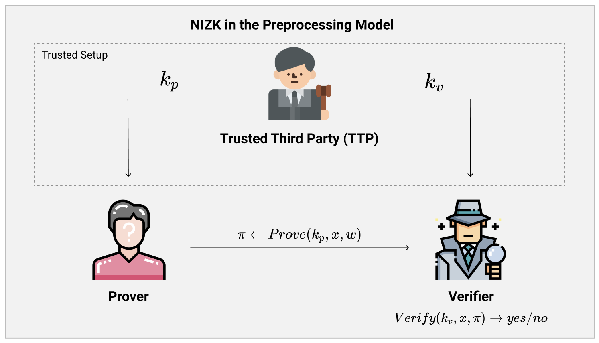
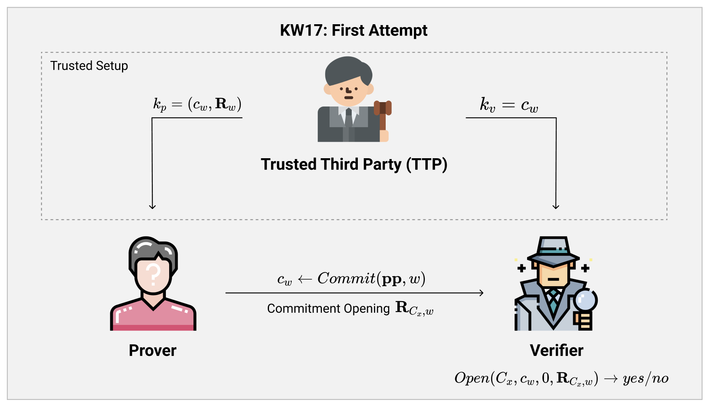
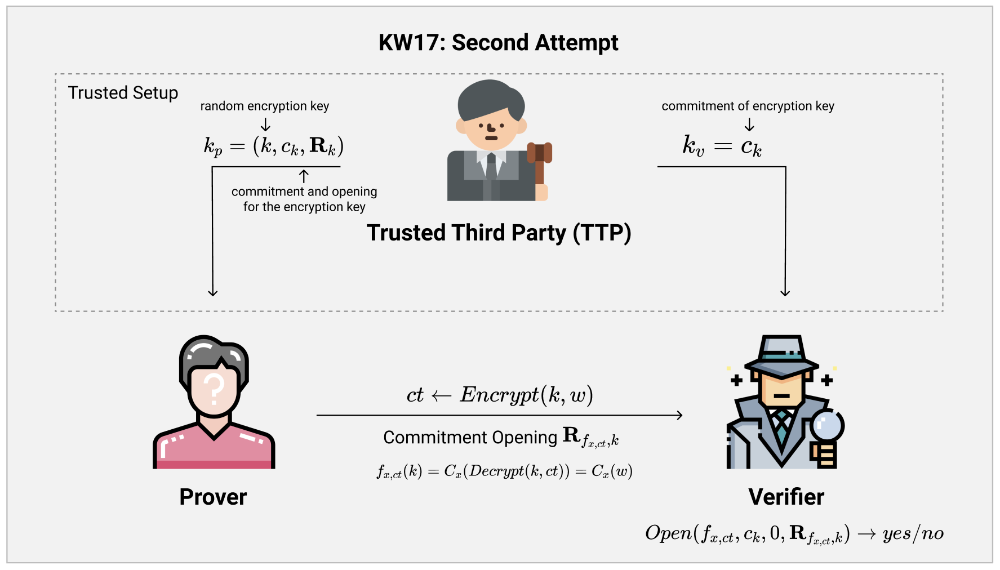
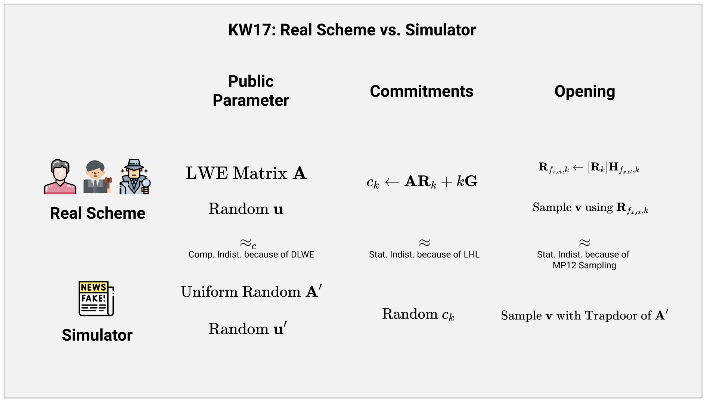
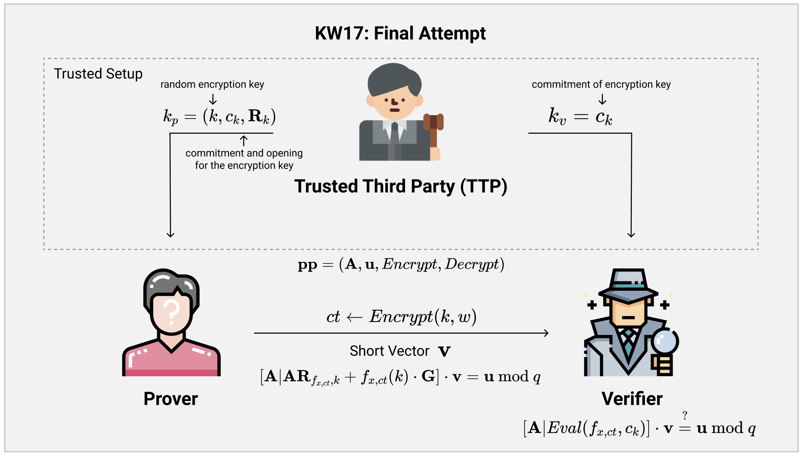

# 格密码学进阶09：基于GSW的NIZK（下）

### 上期回顾

上期，我们看到了【KW17】中基于GSW的NIZK构造。大概的构造思路是基于GSW全同态加密（FHE）的变种，即全同态承诺（FHC）。

基于GSW FHC，Prover可以把要证明NP Relation的witness $w$的承诺发送给Verifier，然后Verifier基于承诺$c_w$同态计算证明电路$C_x(\cdot)$。最后，Prover提供一个opening，可以让Verifier打开计算之后的结果，看到电路的输出。如果$C_x(w) = 0$，那么代表witness有效，证明也就通过了。

在上期的最后，我们也看到了【KW17】的NIZK的构造，虽然基于FHC的idea很有意思，但是也有两个缺陷。一个是同态承诺的opening $\mathbf{R}_{C_x, w}$在概率分布上会暴露出和$w$有关的信息。另一个更大的问题是，如果Prover没有遵守协议，并没有一开始诚实的发送一个GSW FHC的承诺$c_w$的话， 那么整个协议就失去了意义，毫无Soundness可言。

这期，我们就来着重的看看如何解决这两大问题，最后得到【KW17】的完全构造～

### Soundness的问题

首先，我们来看看如何解决最大的问题，即Soundness的问题。

我们知道，如果Prover并不会诚实的构造GSW FHC承诺的话，那么整个协议就会失去所有的可信度。但是比较头疼的是，我们并没有一个非常好的方法来“证明”Prover发送给Verifier承诺$c$真的是基于witness $w$诚实构造的GSW FHC承诺。最好的证明方法就是直接把$w$发送过去，但是这违背了我们原本零知识的要求。

我们在上期的结尾也稍微讨论过，还有一种可能性就是Prover可以事先零知识地证明他所公开的承诺是一个诚实构造的GSW FHC承诺。如果使用了别的NIZK方案，那肯定会变相的基于其他方案中的假设。但是由于我们在这里就是在尝试构造**纯粹基于Lattice假设的零知识证明**，所以这种方法并不可取。

#### 从NIZK到Preprocessing NIZK

乍一看，似乎我们已经束手无策了，没有办法通过GSW FHC来构造真正的NIZK。

因为真正的NIZK要求过于苛刻，Prover没有办法说服Verifier他发送的承诺是诚实的，所以我们现在卡在了这个点上无法继续下去。既然如此，我们可不可以**放松对于NIZK的要求**，使得我们可以绕过这个问题呢？

一个最简单的放松（relaxation）版本，就是**Preprocessing NIZK**，即加入一个**预处理**（Preprocessing）的阶段。在Preprocessing的阶段，一个协议的双方（即Prover与Verifier）可以委托一个**可信的第三方**（Trusted Third Party，**TTP**）进行一系列诚实的参数生成操作。

在参数生成阶段完成之后，TTP会把生成的参数分为两组：属于Prover的参数$k_p$，与属于Verifier的参数$k_v$。最后，TTP会把这两组参数**秘密的**发送给Prover与Verifier。在整个初始化的阶段中，Prover和Verifier都可以完全相信TTP生成的参数是诚实生成的，不会有任何造假的部分。

对于这一类由TTP生成参数并且发送给协议双方的结构，我们称之为Trusted Setup（可信初始化）。对于zkSNARK以及隐私货币技术比较熟悉的读者们可能对于这个定义并不陌生，我们在这里就不多描述了。

我们还可以把TTP做的部分**替换成一个MPC协议**来完成。因为协议双方完全信赖TTP，并且TTP也不会作假，这一要求和MPC能带给我们的非常相似。这样的话，Prover与Verifier只需要在协议的一开始进行一次MPC，就可以相互得到对应的初始化参数$k_p, k_v$了。

#### 基于Preprocessing Model的第一次尝试

当我们relax了对于NIZK的定义，采用了Preprocessing Model之后，相比起原来的NIZK规定，我们额外的多拥有了一次可信初始化的机会。

即然我们之前遇到的问题在于Prover没法证明他生成的承诺是可信的（诚实的），那我们索性缺啥补啥：直接**在可信初始化阶段生成证明所需要的承诺**$c_w$。

图上描述的就是【KW17】中基于我们的这一想法所做的第一次尝试。

我们可以看到，现在在Trusted Setup的环节，Prover悄悄地把他的witness $w$告诉TTP，然后TTP就根据$w$的值**诚实的**生成了对应的Commitment $c_w$以及对应的opening $\mathbf{R}_w$。随后，TTP把Commitment和Opening发送给Prover，而只把Commitment发给Verifier。

进行Trusted Setup之后，Prover和Verifier就可以和我们之前描述的步骤一样完成协议了！由于Verifier已经知道诚实构造的承诺$c_w$了，所以Prover只需要基于$w$的信息，通过我们上期描述的**Input-dependent Evaluation**计算出对应计算$C_x$的opening $\mathbf{R}_{C_x, w}$，随后再发送给Verifier就完成证明了。

当Verifier收到opening $\mathbf{R}$之后，他只需要使用**Input-independent Evaluation**，即在承诺上同态计算$C_x$，随后再用我们之前描述过的$Open$算法验证Prover发过来的opening，就知道证明是否能够通过了。

我们注意到，在这里我们的NIZK体系的soundness问题已经被完全解决了，因为任何需要诚实完成的部分都被我们挪到了TTP的Trusted Setup环节，这样一来似乎可以大功告成了。

#### Reusable Trusted Setup

然而，我们现在得到的Preprocessing NIZK的结构仍然有不尽人意的地方。

如果我们仔细观察之前的图例，我们会发现，在Trusted Setup的过程中，Prover就需要把他的witness $w$告诉TTP，以便完成初始化阶段。这代表着**每更换一次witness都需要重新进行可信初始化**！对zkSNARK的Trusted Setup环节熟悉的读者可能对这个不陌生，这基本上代表了如果Prover想要证明别的witness，或者是证明别的东西（那么witness也会相对跟着改变），协议的双方就需要重新进行一次Trusted Setup。

如果我们不依靠TTP，而是通过MPC协议来进行初始化的话，这就代表Prover和Verifier时不时的就要进行计算非常昂贵的MPC协议，以便确保双方都能拥有最新的witness的承诺。

这一点，直接就把我们的Preprocessing NIZK的构造推下了深渊。原本看起来非常简单实用的idea，现在变成一个一次性的，效率不是很高的协议。

当Kim与Wu探索到这里的时候，他们心中的疑惑和我们相同：能不能想办法使得Trusted Setup所生成的参数可以**被反复使用**（**reusable**）呢？换句话说，能不能进行一次Trusted Setup，但是生成的参数可以用与证明各种各样的问题的NIZK呢？

对于一次初始化之后，可以证明各种问题的NIZK，我们称之为**Multi-theorem Preprocessing NIZK**，这也就是【KW17】这一篇paper的标题了。

#### Adding a Layer of Indirection

为什么我们之前的Preprocessing NIZK构造只能用于一次证明呢？这是因为在Trusted Setup的过程当中，Prover必须要向TTP揭露witness $w$的信息，这也就代表了整个协议的初始化阶段是和witness所绑定的。

如果我们想要使得这个协议可以通过一次Trusted Setup就可以证明多个问题的话，那么我们必须得**从Trusted Setup中移除任何和witness有关的部分**。在【KW17】中，Kim与Wu所做的，是加入了一层**Indirection Layer**（间接层），使得初始化生成的承诺可以用于生成多个不同的NIZK。

这是怎么实现的呢？我们来看第二次尝试的具体协议结构。

根据图中所示，Kim与Wu所做的第二次尝试，就是在Trusted Setup的阶段生成了一个和证明所需要的witness无关的一组承诺：**一个用于加密用的密钥**$k$。

具体的来说，在Trusted Setup阶段，TTP会随机的生成一个**对称加密**用的密钥$k$。这里使用的对称加密算法可以是任意的算法，比如AES等，具体的实现算法并不重要。随后，TTP会诚实的生成对于$k$的一个GSW FHC承诺$c_k$，以及对应的打开这个承诺的randomness $\mathbf{R}_k$。最后Prover可以看到$k, c_k, \mathbf{R}_k$，而Verifier只能看到对于密钥的承诺$c_k$。

当我们把NIZK系统如此初始化完成之后，Prover手上就拥有了一个对称加密的密钥$k$，而Verifier拥有了一个$k$的承诺。

这个时候，假如说Prover想要向Verifier证明他拥有满足证明电路$C_x(\cdot)$的witness $w$的话，只需要做以下三步：

1. 首先，Prover把他选择的witness $w$用密钥$k$在选定的对称加密系统下加密，得到$ct \leftarrow Encrypt(k, w)$。
2. 随后是最精髓的一步，Prover把证明所用的公共参数$x$以及刚刚生成的密文$ct$嵌入在电路中，构造出如下的一个新的电路$f_{x, ct}(\cdot)$：

$$
f_{x, ct}(k) = C_x(Decrypt(k, ct)) = C_x(w)
$$

这个电路的输入是密钥$k$，而输出是我们原本证明电路的输出$C_x(w)$！它做的事情等于就是把Prover生成的$ct$使用$k$对称解密，还原回原本的witness $w$，然后再通过原本的证明电路，得到$C_x(w)$。

得到这个新的电路之后，Prover就可以根据$f_{x, ct}$的具体构造，再加上已知$k$的内容，通过**Input-Dependent Evaluation**得到对应的同态承诺的Opening $\mathbf{R}_{f_{x, ct}, k}$！

最后Prover就把$C_x, ct, \mathbf{R}_{f_{x, ct}, k}$打个包全部发给Verifier，就完成NIZK啦。

3. 当Verifier收到了Proof之后，他就需要根据$C_x$和$ct$的内容重新构建出电路$f_{x, ct}$出来。随后他可以在原本得到的承诺$c_k$上**同态的计算**（**Input-Independent Evaluation**）电路$f_{x, ct}$，最后得到对应了证明电路输出结果的承诺$c_{C_x(w)}$。得到了这个承诺之后，他就可以使用Prover发送过来的randomness opening $\mathbf{R}_{f_{x, ct}, k}$来打开并且检查这个承诺啦。

注意这里的Trusted Setup中没有任何一点提及到$C_x$或者$w$的内容，所以这个协议**可以反复的使用**！每次只需要Prover在Proof中添加对于问题的证明电路$C_x$的描述，Verifier就可以根据这个描述以及$ct$来重新构建一个新的$f_{x, ct}$出来，然后完成NIZK的验证啦。

我们通过修改最初的FHC承诺中的内容实现了重复使用初始化参数的要求，随后再基于承诺中的密钥$k$加密/解密真正用于证明的witness，从而实现了证明电路的计算。这样一来，我们就得到了【KW17】中描述的Multi-theorem Preprocessing NIZK的大致雏形了。

#### 安全性总结

自从添加了新的一层Indirection之后，我们整个协议的安全性发生了一些变化。因为现在Verifier额外还能看到$ct$，即witness $w$的密文，我们要求所选的对称加密算法是语义安全（Semantic Secure）的。这样的话，旁观者就不能从$ct$中提取出$w$有关的信息。

同时，我们在选择对称加密算法的时候，最好选择解密电路较为简单的算法，因为对于Verifier来说，他等同于是要在Commitment密文中**同态解密**其中的witness，如果解密电路较为复杂，那么整个Proof的验证计算量就会变得很大。

虽然对于选择的对称加密算法没有过多的要求，但是如果我们只想要基于Lattice的难题假设的话，要么我们就要选择不基于任何假设的算法，如AES等，或者是同样基于Lattice problem（如LWE/SIS）的加密算法，如Regev。

### Opening的问题

解决了最重要的Soundness问题，接下来我们就可以来看之前提到过的Opening的问题了。

我们基于新的模型，再复述一下之前描述的问题本身：因为Prover公开的Opening $\mathbf{R}_{f_{x, ct}, k}$包含了密钥$k$本身的信息，所以如果Verifier看到了多个$\mathbf{R}$矩阵之后，可以根据$\mathbf{R}$矩阵的概率分布分析出和$k$的分布有关的信息来。虽然并不能直接让Verifier知道密钥$k$的具体值，但是这一信息的泄漏直接导致了整个协议**并不是Zero Knowledge**的。

解决这个问题其实并不复杂，我们和解决上一个问题一样，再增加一层**Indirection**：如果Prover不揭露Opening $\mathbf{R}$的内容，而是向Verifier公开一个只有拥有了$\mathbf{R}$才能计算的某个难题的解，那么只要Verifier验证了这个解是正确的，那么就代表Prover肯定知道正确的Opening $\mathbf{R}$了。

在【KW17】中，Kim与Wu使用的Indirection Layer是一个和我们之前讨论的Lattice IBE/ABE相同的**SIS问题**。通过巧妙的把NIZK中用到的承诺**嵌入在SIS问题实例中**，只要Prover知道对应同态承诺的randomness $\mathbf{R}$，他就等同于拥有了对应这个SIS实例的MP12 Trapdoor，然后就可以生成SIS问题的解了。这样我们就可以让Prover间接的“证明”他真的知道$\mathbf{R}$而不暴露任何一点其他的信息。

接下来，我们来看看到底是怎么实现的。我们知道，在协议的一开始，Prover和Verifier手中所持有的关于密钥$k$的承诺结构如下：
$$
c_k = \mathbf{AR}_k + k \mathbf{G}
$$
随后，因为Prover知道$k$的值，所以他可以基于$\mathbf{R}_k$和证明电路$f_{x, ct}$的信息，通过**Input-Dependent Evaluation**计算出证明结果的承诺：
$$
c_{f_{x,ct}(k)} = \mathbf{AR}_{f_{x, ct}, k} + f_{x, ct}(k) \cdot \mathbf{G}
$$
在这里，为了更加方便的表述【KW17】中的SIS问题和MP12 Trapdoor的关系，我们修改一下证明电路$f_{x, ct}$的定义，使得当证明电路通过（输出0）的时候，我们的$f$电路会反向输出1：
$$
\begin{align*}
f_{x, ct}(k) &= 1 - C_x(Decrypt(k, ct)\\
&= 1 - C_x(w)\\
&= \begin{cases}
1, & C_x(w) = 0\\
0, & \text{otherwise}
\end{cases}
\end{align*}
$$
这样一来，如果Prover拥有正确的witness $w$的话，那么$f_{x, ct}(k)$就会输出1。那么我们最后得到的承诺就是：
$$
c_{f_{x, ct}(k)} = \mathbf{AR}_{f_{x, ct}, k} + \mathbf{G}
$$
同理，当Verifier拿到密钥的承诺$c_k$之后，他也可以通过**Input-Independent Evaluation**来同态计算电路$f_{x, ct}$，得到同样的证明结果承诺$c_{f_{x, ct}(k)}$。

#### 引入MP12 Trapdoor

我们观察发现，承诺$c_{f_{x, ct}(k)}$的结构，**刚好符合了生成MP12 Trapdoor的结构**。在详细描述之前，我们再来重新回顾一下MP12的Trapdoor的大致构造。

首先，MP12的目的就是可以构造一个Lattice Trapdoor，已知矩阵$\mathbf{A}$的Trapdoor $\mathbf{R}$的话，就可以任意的解开基于$\mathbf{A}$构造的SIS与LWE问题。对于LWE问题，因为是单射的，所以我们可以还原出正确的一个解。对于SIS问题，因为解的空间到目标空间是满射的（同一个SIS问题有多个解），所以更为复杂一点，我们需要随机的在高斯分布中取出一个符合要求的解，并且这个分布不能暴露Trapdoor的信息。

我们先定义基于矩阵$\mathbf{A}$的SIS函数为：
$$
f_\mathbf{A}(\mathbf{v}) = \mathbf{A} \mathbf{v} \text{ mod }q
$$
基于矩阵$\mathbf{A}$的LWE函数为：
$$
g_\mathbf{A}(\mathbf{s, e}) = \mathbf{As + e} \text{ mod }q
$$
MP12的构造方法大致分三部分：

1. 找到基于**工具矩阵**（**Gadget Matrix**）$\mathbf{G}$下的SIS与LWE反函数$f_\mathbf{G}^{-1}, g_\mathbf{G}^{-1}$。这一步很简单，详细的可以参考Lattice Trapdoors的那一篇文章。
2. 基于$\mathbf{G}$矩阵，一个随机生成的$\mathbf{B}$矩阵和选定的一个随机的短randomness $\mathbf{R}$，构造出平均随机分布的$\mathbf{A}$矩阵。这个$\mathbf{A}$矩阵的构造可以让我们在知道了Trapdoor $\mathbf{R}$之后，轻松的把$\mathbf{A}$矩阵轻易的变回$\mathbf{G}$矩阵：

$$
\mathbf{A} = [\mathbf{B \vert G - BR}]\\
\mathbf{A} \cdot 
\begin{bmatrix}
\mathbf{R}\\
\mathbf{I}
\end{bmatrix}
 = \mathbf{G}
$$

3. 给定一个基于$\mathbf{A}$的SIS或者LWE问题，我们使用$\mathbf{R}$的信息和之前生成的反函数$f_\mathbf{G}^{-1}, g_\mathbf{G}^{-1}$生成真正的SIS与LWE反函数$f_\mathbf{A}^{-1}, g_\mathbf{A}^{-1}$。

【KW17】的idea是这样的：与其让Prover直接揭露出他用于同态承诺的randomness $\mathbf{R}_{f_{x, ct}, k}$，不如实现约定好一个随机分布的矩阵$\mathbf{A}$和一个random target vector $\mathbf{u}$，然后让Prover找到一个短的SIS解向量$\mathbf{v}$使得$\mathbf{Av = u} \text{ mod }q$。

不过这里设计的精髓在于，只要Prover知道了正确的$\mathbf{R}_{f_{x, ct}, k}$，那么这个$\mathbf{R}$矩阵恰巧就是$\mathbf{A}$矩阵的MP12 Trapdoor。只要运用我们上面描述的第三步，解开这个SIS challenge就小菜一碟了。

同时，为了确保ZK的要求，我们需要巧妙的设计这个$\mathbf{A}$矩阵，使得我们能够构造出一个simulator。这个simulator可以在不知道$k$和对应$k$的randomness $\mathbf{R}_k$的情况下，只需要知道同态计算所用的电路$f_{x, ct}$就可以**模拟出正常协议下的所有transcript的概率分布**。

为了实现这两条要求，【KW17】构造了如下结构的一个平均随机分布的SIS问题矩阵$\mathbf{A}$：
$$
\mathbf{A} = [\mathbf{A}_1 \vert \mathbf{A}_2]
$$
对于一个这样结构的$\mathbf{A}$矩阵，可能存在**两种不同的Trapdoor**：

1. 假如$\mathbf{A}_1$是一个使用MP12 sample的带有Trapdoor $\mathbf{R}$的平均随机分布矩阵，而$\mathbf{A}_2$可以是任何结构的矩阵，那么我们可以很简单的找到$\mathbf{A}$的Trapdoor：

$$
[\mathbf{A}_1 \vert \mathbf{A}_2] \cdot \begin{bmatrix}
\mathbf{R}_1\\\mathbf{0}
\end{bmatrix}
= \mathbf{G}
$$

2. 假如$\mathbf{A}_1$是一个没有Trapdoor的随机矩阵，$\mathbf{R}_2$是一个随机短矩阵，而$\mathbf{A}_2 = \mathbf{A}_1 \mathbf{R}_2 \pm \mathbf{G}$，那么我们可以找到另一个Trapdoor：

$$
[\mathbf{A}_1 \vert \mathbf{A}_2] \cdot \begin{bmatrix}
\mp\mathbf{R}_2\\\mathbf{I}
\end{bmatrix}
= \mathbf{G}
$$

如果我们观察这两种情况，我们会发现他们的概率分布极其相似。

在1里面，$\mathbf{A}_1$是MP12 sample的随机矩阵，因为Leftover Hash Lemma，所以我们无法分辨它与uniform random distribution的区别。而$\mathbf{A}_2$是任意sample的，自然也是随机分布的。

而在2当中，$\mathbf{A}_1$是一个随机sample的uniform random矩阵，而$\mathbf{A}_2$的构造因为Leftover Hash Lemma也是uniform random的distribution。

这也就是说，给定一个$\mathbf{A}$矩阵，我们**无法分辨它到底来自于1号平行世界，还是2号平行世界**。这对于构造ZK的模拟器来说是再好不过的了。

#### 构造SIS Challenge

简单的来说，**simulator在1号平行世界中，而现实生活中的Prover则在2号平行世界中**。

我们先来看现实世界。

首先，Prover和Verifier可以实现约定一个random target vector $\mathbf{u}$，作为SIS Challenge。

当Prover通过$k$的值使用**Input-Dependent Evaluation**计算出opening $\mathbf{R}_{f_{x, ct}, k}$之后，他可以构造如下的矩阵$\mathbf{A}^*$：
$$
\mathbf{A}^* = [\mathbf{A} \vert \mathbf{AR}_{f_{x, ct}, k} + f_{x, ct}(k) \cdot \mathbf{G}]
$$
Prover要做的事情，就是告诉Verifier一个短向量$\mathbf{v}$，使得满足：
$$
\mathbf{A}^* \mathbf{v} = \mathbf{u} \text{ mod }q
$$
同时，Verifier可以自己通过承诺$c_k$和$f_{x, ct}$的信息，通过**Input-Independent Evaluation**同态计算出承诺$c_{f_{x, ct}(k)}$，然后再次创建出$\mathbf{A}^*$矩阵出来：
$$
\mathbf{A}^* = [\mathbf{A} \vert c_{f_{x, ct}(k)}] = [\mathbf{A} \vert \mathbf{AR}_{f_{x, ct}, k} + f_{x, ct}(k) \cdot \mathbf{G}]
$$
知道了$\mathbf{A}^*$和$\mathbf{v}$之后，Verifier就可以把它们相乘起来，验证结果是否等于$\mathbf{u}$了！

#### Prover的Trapdoor

Prover是如何找到对应$\mathbf{A}^*, \mathbf{u}$的SIS解$\mathbf{v}$的呢？其实很简单，这正是因为$\mathbf{A}^*$的构造。

首先在$\mathbf{A}^*$矩阵中，$\mathbf{A}$就是用于最初构造承诺用的LWE矩阵（由TTP生成），而$f_{x, ct}(k)$这部分我们讨论过，如果$k$和witness $w$正确的话，那么会输出1。所以在正确情况下，整个等式可以被简化为：
$$
\mathbf{A}^* = [\mathbf{A} \vert \mathbf{AR}_{f_{x, ct}, k} + \mathbf{G}]
$$
这正是我们描述的MP12 Trapdoor的结构，所以Prover可以轻松的得到Trapdoor $\mathbf{R}$为：
$$
\mathbf{R} = \begin{bmatrix}
-\mathbf{R}_{f_{x, ct}, k}\\\mathbf{I}
\end{bmatrix}\\
[\mathbf{A} \vert \mathbf{AR}_{f_{x, ct}, k} + \mathbf{G}] \cdot \mathbf{R}
= \mathbf{G}
$$
这样一来，Prover就可以轻松的利用Trapdoor把$\mathbf{A}^*$的SIS问题变换为$\mathbf{G}$的SIS问题，然后使用MP12中的sampling方法找到符合正态分布的SIS解$\mathbf{v}$了。

反之，如果Prover提供了错误的witness，或者是错误的密钥$k$的话，那么Prover自己所计算的$\mathbf{A}^*$矩阵和Verifier同态计算的$\mathbf{A}^*$就会有所分歧，这样Prover就算生成了一个符合自己的$\mathbf{A}^*$要求的$\mathbf{v}$，也无法使得Verifier接受这个SIS解。

#### Simulator的构造

了解完现实世界之后，接下来我们来继续探讨零知识的属性。为了确保这个协议的ZK property，我们需要构造出一个simulator可以模拟Prover和Verifier之间的所有沟通信息（包括了一开始TTP生成的公共参数）。

回到我们之前讨论的第一个平行宇宙中，我们可以构造如下的一个Simulator：

1. 首先，我们生成一个拥有MP12 Trapdoor的uniform random矩阵$\mathbf{A}'$和对应的Trapdoor $\mathbf{R}'$。并且我们选择一个SIS的目标向量$\mathbf{u}'$。
2. 随后，我们再随机的生成一个平均随机分布的代表密钥$k$的**承诺**$c_k'$。注意这里我们只是随机生成了一个矩阵，并没有GSW FHC承诺的结构，但是这并不影响Simulator的正常运作。
3. 因为我们要模拟一个NIZK的协议，所以我们还需要随机的生成一个NP Relation $x'$，和一个随机的密文$ct'$。基于这两项，我们就可以构造出需要同态计算的电路$f_{x, ct}'$。
4. 最后，我们在$c_k'$上同态的计算$f_{x, ct}'$，得到$c_{f_{x, ct}(k)}'$，并且组成$\mathbf{A'}^{*} = [\mathbf{A}' \vert c_{f_{x, ct}(k)}']$。因为我们知道$\mathbf{A}'$的Trapdoor $\mathbf{R}$，所以可以轻松的生成一个$\mathbf{v}'$向量使得$\mathbf{A'}^* \mathbf{v'} = \mathbf{u'} \text{ mod }q$。

这个Simulator从头到尾生成了协议中的$\mathbf{A}$矩阵，目标向量$\mathbf{u}$，GSW GHC承诺$c_k$，以及最后验证opening的$\mathbf{v}$向量。

我们接下来，需要证明Simulator生成的这些内容和真实的协议中的内容概率分布一致，是**无法分辨的**（**indistinguishable**）。

这里的一张图上比较了真实协议与Simulator输出的三组内容，我们来看看具体是怎样的。

公共参数部分，两者唯一的区别在于构成承诺的$\mathbf{A}$矩阵。在Simulator中$\mathbf{A}$是uniform random的，而在真实协议中$\mathbf{A}$是GSW FHC所用的LWE矩阵。因为DLWE假设，我们可以大致认为这两者是computationally indistinguishable的。

承诺部分，真实协议构造的是GSW FHC承诺，而在Simulator中我们则是随机的sample了一个矩阵。因为$\mathbf{A}$是uniform random的，并且$\mathbf{R}$矩阵也是符合正态分布的短矩阵，所以根据Leftover Hash Lemma（以及Commitment的hiding property），我们知道这两部分也是indistinguishable的。

最后，再看opening的部分。在真实协议中，Prover会构建$\mathbf{A}^*$矩阵，然后根据$\mathbf{R}_{f_{x, ct}, k}$的信息构造MP12 Trapdoor，然后找到SIS问题的解$\mathbf{v}$。然而在Simulator中，我们同态计算随机生成的承诺，得到一个看似像承诺的$c_f'$，组成$\mathbf{A'}^*$矩阵。虽然这个承诺是个假承诺，我们也不知道它对应的randomness，但是因为我们知道$\mathbf{A}'$的MP12 Trapdoor，所以也可以轻松的找到SIS问题的解$\mathbf{v}'$。这里，因为两个世界中都是使用MP12来sample SIS问题的解的，并且$\mathbf{A}^*$矩阵的结构也是indistinguishable的，所以两个世界中sample的$\mathbf{v}$向量的概率分布也是indistinguishable的！

Q.E.D.

当我们发现在这两个世界观中，构成NIZK的这三部分都是indistinguishable之后，我们的**零知识属性证明**就完成啦。

### 【KW17】DP-NIZK的完整形态

最后，我们来总结一下，【KW17】中所描述的Preprocessing NIZK的最终完全形态！

整个协议在一开始需要进行一次Trusted Setup，可以由可信第三方（TTP）或者是MPC完成。在初始化的阶段，我们需要生成一个密钥$k$，以及对应这个$k$的GSW FHC承诺$c_k$和对应的opening $\mathbf{R}_k$。承诺$c_k$可以直接公开给所有人，而$k$与$\mathbf{R}_k$只能告诉Prover。同时，我们还需要指定好SIS问题的目标向量$\mathbf{u}$，以及加密解密用的算法。

当初始化结束之后，Prover可以对Verifier进行**任意次数的NIZK**，证明**任何内容**（NP Relation）。其证明步骤如下：

1. Prover决定要证明的内容，生成公共参数$x$，并且把witness $w$用$k$加密成密文$ct$。
2. Prover把$x$与$ct$的值嵌入证明电路，得到新的证明电路$f_{x, ct}(k) = C_x(w)$。
3. Prover使用$k$的信息，通过Input-Dependent Evaluation构建出$\mathbf{A}^*$矩阵，并且得到opening $\mathbf{R}_{f_{x, ct}, k}$。这里的$\mathbf{R}$矩阵恰好是$\mathbf{A}^*$的MP12 Trapdoor，于是Prover找到一个SIS的解$\mathbf{v}$，使得$\mathbf{A}^* \mathbf{v} = \mathbf{u} \text{ mod }q$。
4. 最后，Prover把$x, ct, \mathbf{v}$发给Verifier，完成NIZK。

当Verifier收到这些消息之后，可以很简单的验证证明：

1. Verifier根据$x, ct$重组出$f_{x, ct}$证明电路。
2. Verifier使用一开始拿到的$k$的承诺$c_k$通过Input-Independent Evaluation同态计算$f_{x, ct}$，得到$c_{f_{x, ct}(k)}$，然后重组出$\mathbf{A}^*$矩阵。
3. 最后，Verifier检查$\mathbf{A}^* \mathbf{v}$是否等于目标向量$\mathbf{u}$。

这就是【KW17】基于FHE/FHC的NIZK的全貌了。

#### 简化成DP-NIZK

我们观察发现，虽然【KW17】是Preprocessing NIZK，使用了Trusted Setup这一个步骤生成了Prover专属的$k_p$以及Verifier专属的$k_v$。但是其实$k_v$中仅仅只是包含了承诺$c_k$而已。这个部分是完全可以公开的！然而，Prover所拥有的$k_p$中的$k, \mathbf{R}_k$部分还是得保密的。

这也就是说，我们可以弱化一下Preprocessing NIZK的假设，把它变成一个**指定证明方NIZK**（Designated-Prover NIZK，**DP-NIZK**）。在DP-NIZK中，一次Trusted Setup只能使得一个Prover拥有证明的能力（即拥有密钥以及opening），而任何其他人只要知道$c_k$都可以当作Verifier。这对于原本的Preprocessing（即指定证明方，指定验证方）的框架来说要好了不少。

### 写在最后

写到这里，关于【KW17】的NIZK构造就差不多了。

这篇文章其实是笔者半年前看到的内容，然而为了能够流畅的写出这个NIZK的具体构造以及思路，笔者在这个专栏下循序渐进，从格密码学的基础一路走来。

这几个月时间，从格的基础，到FHE，再到更进阶的Trapdoor以及ABE/IBE，最后再到把这些idea全部套用在一起的NIZK，构成了一条学习曲线。希望大家有所收获～

从下期开始，我们要开始一个新的专题，开始探索Lattice中最神奇，也是最吸引笔者的部分：**Indistinguishable Obfuscation**（**iO**）。

