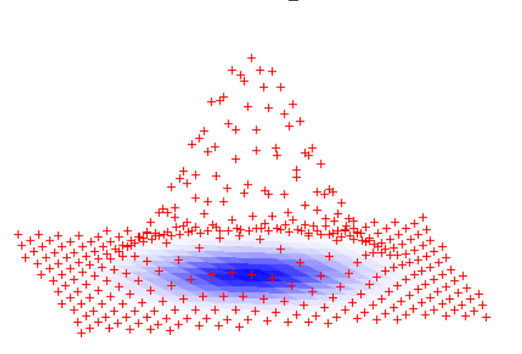
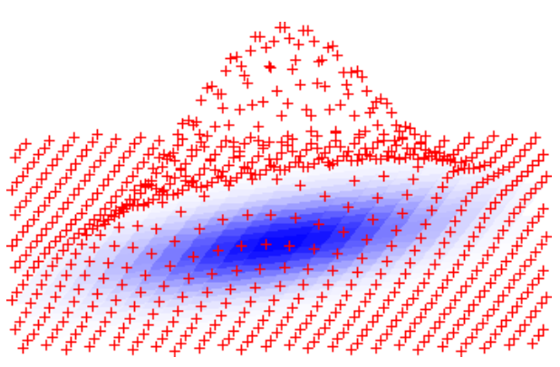
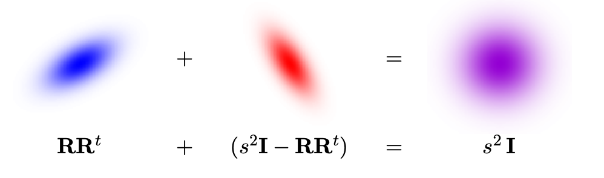

# 格密码学进阶02：Lattice Trapdoors Cont'd（格中陷门下篇）

### 前期回顾

上一期，我们了解了格密码学中的一个非常重要的primitive，即Trapdoor（陷门）。

如果快速回顾一下的话，我们学到最重要的莫非就是**基于SIS与LWE的两个单向函数**（OWF）的构造了。

基于SIS的OWF $f_\mathbf{A}$的构造如下：我们选择一个随机分布的矩阵$\mathbf{A} \in \mathbb{Z}_q^{n \times m}$。这个OWF的输入是一个短向量$\mathbf{x} \in \mathbb{Z}_{\{0, \pm1\}}^m$，输出则是：
$$
f_\mathbf{A}(\mathbf{x}) = \mathbf{Ax} \text{ mod }q
$$
基于LWE的OWF $g_\mathbf{A}$的构造是这样的：我们同样选择随机分布的$\mathbf{A} \in \mathbb{Z}_q^{n \times m}$。这个OWF的输入是一个任意的向量$\mathbf{s} \in \mathbb{Z}_q^m$，与一个在噪音分布空间内的噪音向量$\mathbf{e} \in \mathcal{X}_B$，输出为：
$$
g_\mathbf{A}(\mathbf{s, e}) = \mathbf{s}^t \mathbf{A} + \mathbf{e}^t \text{ mod }q
$$
如果我们比较这两个OWF的输入与输出空间之间的映射的话，我们会发现基于SIS的OWF是**满射**（surjective）的，而基于LWE的OWF是**单射**（injective）的。

我们还讲到了$f_\mathbf{A}, g_\mathbf{A}$这两个OWF，如果我们有了Trapdoor构造出了对应的反函数$f_\mathbf{A}^{-1}, g_\mathbf{A}^{-1}$，那么这两个反函数输出的特点也会和原本的OWF相对应。$f_\mathbf{A}^{-1}$会输出很多种符合要求的解的一个高斯分布，而$g_\mathbf{A}^{-1}$则只会输出一个唯一的解。

随后，我们对Lattice中的Trapdoor到底长什么样子做了一个简单的探索：看到了所谓的**Type 1 Trapdoor**其实就是OWF对应的Lattice $\Lambda$的一组好的基向量（good basis），符合了短并且近似垂直的特性。基于此类Trapdoor，我们还大概了解了一下如何解决格中的一些难题（比如CVP）。

上期的最后，我们抛砖引玉介绍了一下Type 2 Trapdoor的存在以及它的各种优点。这一期我们就来看看Type 2 Trapdoor到底是什么。

### 构造Trapdoor：第二类格陷门（Type 2 Lattice Trapdoor）

我们上期提到过，第一类格陷门是基于格本身的几何特点来构造的。虽然理解起来比较容易，但是实际上构造起来并不现实。

第二类格陷门是Micciancio与Peikert在MP12中提出的一种新的陷门构造。这一类的构造并不依靠几何结构，而是依靠对于矩阵$\mathbf{A}$的**随机分布**这一属性的更深理解。

我们都知道，如果想要获得一个**平均随机分布**（**Uniform Random**）的随机矩阵，我们只需要平均随机地取$m \times n$个随机数，然后放进矩阵$\mathbf{A}$里就完成了。

但是这并不是唯一的构造平均随机分布矩阵的方法。我们可以在随机选取的矩阵$\mathbf{A}$上再叠加一些别的东西，比如说任意的另一个矩阵，最后得到的叠加仍然是随机分布的！一个很简单的例子就是**One-Time Pad**（OTP）流加密算法。在OTP中，我们随机生成一段密钥，并且通过XOR叠加到原本的原文上，最后得到的密文也是呈随机分布的。**这一随机分布的特性导致了OTP系统的安全性**。

同理，我们第二类格陷门的思路一样——我们在矩阵$\mathbf{A}$中引入一些特殊的结构，使得它具有一些方便我们构造Trapdoor的能力，然后通过随机分布的这一特性把这一特殊结构给掩盖起来，这样看到$\mathbf{A}$的人，并不知道这个矩阵是真随机生成的，还是通过我们的Type 2 Trapdoor的方法生成的了。

我们先不用担心这里的Trapdoor到底长什么样子，因为我们的最终目标是构造描述过的两个OWF $f_\mathbf{A}, g_\mathbf{A}$的反函数$f_\mathbf{A}^{-1}, g_\mathbf{A}^{-1}$。拥有了Type 2这一特性之后，MP12指出，我们可以通过非常简单的三个步骤来构造出我们想要的反函数。

#### 构造$f_\mathbf{A}^{-1}, g_\mathbf{A}^{-1}$的三步操作

接下来，我们来看看MP12是如何尝试构造反函数$f_\mathbf{A}^{-1}, g_\mathbf{A}^{-1}$的。其中一共分为三步：

1. 选择一个构造非常简单的**Gadget Matrix**（**工具矩阵**）$\mathbf{G}$，并且基于此矩阵构造出同样的函数$f_\mathbf{G}, g_\mathbf{G}$。在此过程中，因为$\mathbf{G}$的特殊构造，我们可以非常轻松的得到并且计算$f_\mathbf{G}^{-1}, g_\mathbf{G}^{-1}$。
2. 通过上述描述的随机分布的特性，我们把$\mathbf{G}$“嵌入“到随机矩阵$\mathbf{A}$中，并且得到对应的Trapdoor矩阵$\mathbf{R}$。表面上看$\mathbf{A}$是呈平均随机分布的，但是只要我们知道$\mathbf{R}$的值，我们就可以通过非常简单的矩阵相乘与线性变换，从$\mathbf{A}$还原到$\mathbf{G}$。
3. 最后，我们根据第二部构造的这一特点构造出我们想要得到的反函数$f_\mathbf{A}^{-1}, g_\mathbf{A}^{-1}$。

下面，我们就来逐步详细的走一遍，复现这一过程。

### 第一步：工具矩阵下的“单向函数”

我们知道，原本的$f_\mathbf{A}, g_\mathbf{A}$都是单向函数，是因为函数中包括的矩阵$\mathbf{A}$是呈平均随机分布的。我们的第一步就是弱化这个矩阵——能否我们**选择一个特殊结构的矩阵**，可以打破这个矩阵构造成的$f$与$g$函数的单向性。

这里说的特殊矩阵，其实就是我们称呼的**Gadget Matrix**（**工具矩阵**）$\mathbf{G}$了。

工具矩阵并不是什么复杂的东西，其实就是一个**提前选好公开，并且结构非常简单的矩阵**。为了更方便理解，我们不妨先来看看这个矩阵的第一行$\mathbf{g}$——我们也可以称之为Gadget Vector（工具向量）。

我们首先定义**工具向量**$\mathbf{g}$为：
$$
\mathbf{g} = \begin{bmatrix}
1&2&4&\cdots&2^{k-1}
\end{bmatrix}
\in \mathbb{Z}_q^{1 \times k}
$$
为了方便计算和理解，我们这里定义模组为$q = 2^k$。这个向量其实就是依次排列的2的幂，结构非常简单。

基于这个工具向量，我们可以定义一个迷你版本的$f_\mathbf{g}, g_\mathbf{g}$：
$$
f_\mathbf{g}(\mathbf{x}) = \mathbf{gx} \text{ mod }q\\
g_\mathbf{g}(s, \mathbf{e}) = s \cdot \mathbf{g} + \mathbf{e} \text{ mod }q
$$
这里的$s$就是一个$\mathbb{Z}_q$中的数值，我们可以理解为是原本的$g_\mathbf{A}$中的输入向量$\mathbf{s}$中的一个元素。

这个迷你版的单向函数其实和完整版的结构一样，只是我们取了问题矩阵中的一行，**缩小了输出的维度**而已。由于工具矩阵$\mathbf{g}$的特殊构造，我们会发现，我们这里构造的这两个“迷你单向函数”一点也不单向。不仅如此，我们可以很容易的从输出的结果还原出原本的输入。

#### 计算$g_\mathbf{g}$的反函数$g_\mathbf{g}^{-1}$

我们首先来看一看基于LWE的$g_\mathbf{g}$。如果我们把$\mathbf{g}$向量的具体构造带入进表达式中，那么这个求解$g_\mathbf{g}$的反函数$g_\mathbf{g}^{-1}$可以被表达为：
$$
\text{Given }g_\mathbf{g}(s, \mathbf{e}) = s \cdot \mathbf{g} + \mathbf{e} = \begin{bmatrix}
s + e_0 & 2s + e_1 & \cdots & 2^{k-1}s + e_{k-1}
\end{bmatrix},\\ \text{Find }s.
$$

换句话说，我们这里的目标就是基于$s + e_0, 2s + e_1, \dots, 2^{k-1} + e_{k-1}$这么一系列$k$个取值还原出原本的$s$来。

由于我们之前定义了$q = 2^k$，所以$\mathbb{Z}_q$中的所有数字都可以被$k$ bits来表达。我们先来看最后的一项$2^{k-1}s + e_{k-1}$。因为$s$是一个$k$ bits的数字，所以乘上了$2^{k-1}$就可以理解为把整个数字往左left shift了$k-1$位，即$s \ll k-1$。这样就等于是我们把原本的$s$的最低位$s_0$一下子往左挪到了最高位上，然后剩下的其他位上都是0！

随后，虽然我们还是会加上一个噪音$e_0$，但是我们知道噪音的取值空间$\mathcal{X}_B$远远小于$q$，所以加上这一个噪音就并不会改变我们最高位上的值。这样一来，我们就可以靠观测$2^{k-1}s + e_{k-1}$的最高位上的数值，就能知道$s$的最低位$s_0$啦。

现在我们依靠这个方法成功的提取出了$s_0$，接下来我们就看下一项$2^{k-2}s + e_{k-2}$。我们发现，其实这就等于是把$s$的值往左挪了$k-2$位，即$s \ll k-2$。这样的话，原本$s$的倒数第二位$s_1$会被挪到最高位上，然后$s_0$会跟着被挪到第二位上。
$$
2^{k-2}s + e_{k-2} = 2^{k-1}s_1 + 2^{k-2}s_0 + e_{k-2}
$$
因为我们已经推测出$s_0$的值了，这个时候我们只需要把$s_0$从我们的表达式中减去，即减去$2^{k-2} s_0$，我们就可以得到和上面一样的表达式，然后通过观察最高位的值推出$s_1$了。

继续使用这个算法依次的处理所有的$k$项之后，我们也就成功的还原出了$s$这个$k$-bit数字的每一位，从而还原出$s$了。这也就是反函数$g_\mathbf{g}^{-1}$的全貌了：输入一个$k$项的乘积结果，用上述的算法还原出$k$格bits，然后重组成$s$输出。

这里我们观察一下噪音的上限：只要噪音的取值上限$B$不超过$2^{k-1}$，即不会干扰最高位上面的值，那么就不会影响我们的反函数算法了。因为我们定义了$q = 2^k$，所以转换到这里的话，噪音的的取值范围则不能大于$q/2$。这一上限和LWE问题中对于噪音的分布上限的要求是一样的。在LWE中，$\mathbb{Z}_q = [-q/2, q/2)$，$\mathcal{X}_B = [-q/4, q/4)$。

#### 计算$f_\mathbf{g}$的反函数$f_\mathbf{g}^{-1}$

解决了LWE的迷你单向函数，接下来我们来看看基于SIS的迷你单向函数$f_\mathbf{g}$。我们知道$f$函数是一个满射、有碰撞存在的函数，所以对应的我们的反函数$f_\mathbf{g}^{-1}$应该可以输出一个高斯分布的解$\mathbf{x}$并且使得：
$$
\langle \mathbf{g, x} \rangle = u \text{ mod }q
$$
这里的$u$是一个$\mathbb{Z}_q$中的数字。现在我们来尝试找到符合这一要求的$\mathbf{x}$。

一看到这个问题，我们马上可以想到一个思路：因为$\mathbf{g}$正好是由2的幂组成，所以很理所当然的我们就可以直接把$u$这个数字分解成$k$个bits，然后每一个bit正好对应$\mathbf{x}$向量的一项，就搞定了。

但是我们需要注意到的是，虽然这个方法找到的$\mathbf{x}$符合上述的等式，但是这个算法是**deterministic**（确定）的！这也就代表无论运行这个算法多少次，我们最后都只会得到一模一样的$\mathbf{x}$。然而这样的输出并不符合我们之前所期待的高斯分布的要求。

那么到底要如何生成我们所希望的高斯分布呢？我们这里介绍一种最简单方法：**穷举法**（brute force）。

因为向量$\mathbf{g}$是一个已知的结构，并且输入的$\mathbf{x}$的分布区域很局限，即$\mathbf{x} \in \mathbb{Z}_{\{0,\pm1\}}^m$ ，那我们完全就可以在看到$u$之前穷举出所有可能的$\mathbf{x}$的值和对应的$\langle \mathbf{g, x } \rangle$，然后再根据输出值把所有可能的输入都存起来。这样的话，当我们看到$u$之后，只需要去找到可以生成$u$的一系列输入$\mathbf{x, x', x'', \dots}$，然后依次输出就可以了。

因为我们需要一个高斯分布的结果，所以我们穷举的步骤如下：

1. 根据高斯分布，从$\mathbb{Z}_{\{0, \pm1\}}^m$中抽取一个$\mathbf{x}$。
2. 计算$u = \langle \mathbf{g, x} \rangle \in \mathbb{Z}_q$，并且保存结果。
3. 重复第一步，直到$\mathbb{Z}_q$空间的每一个数字都被覆盖。

一共需要重复多少次才可以结束穷举的过程呢？我们观察发现，给定任意随机的$\mathbf{x}$，那么得到对应的$u$的结果在$\mathbb{Z}_q$中大概也是均匀随机分布的。那么我们就可以把问题转化成：我们在$\mathbb{Z}_q$空间中要取多少个随机数，才可以遍历整个$\mathbb{Z}_q$空间？

这其实就是一个经典的**赠券收集问题**（**Coupon Collecting Problem**），当我们生成$q \log{q}$个随机的$\mathbf{x}$之后，我们就可以大概率的相信整个输出空间$\mathbb{Z}_q$已经被遍历啦。当我们完成这一步，构建出这个数据库之后，我们就可以非常轻松的反转$f_\mathbf{g}$了。

穷举法虽然很容易理解，但是不幸的是**复杂度太高**了。一旦$q$变得很大，那么这个算法马上就变得效率很低。MP12的原文中也提到了这一点，并且提出了一个更加高效的方法。具体的实现方法我们就不多说了，不过大概的思路就是从最低位开始“二进制”分解$u$，不过我们选择每个bit的时候，我们不仅选择0或者1，而是我们在$2\mathbb{Z} + b$的coset（伴集）中随机选择。

#### 从工具向量延伸到工具矩阵

现在我们已经掌握了如何计算迷你版本的SIS与LWE$f_\mathbf{g}, g_\mathbf{g}$的反函数$f_\mathbf{g}^{-1}, g_\mathbf{g}^{-1}$。下一步，我们需要扩展这个定义到真正的SIS和LWE OWF。

我们知道$\mathbf{g}$是由2的幂组成的，其实真正的工具矩阵$\mathbf{G}$构造大致相同，只是维度扩展成了$n$行：
$$
\mathbf{G} = \mathbf{I}_n \otimes \mathbf{g} = \begin{bmatrix}
\cdots\mathbf{g}\cdots&&&\\
&\cdots\mathbf{g}\cdots&&\\
&&\ddots&\\
&&&\cdots\mathbf{g}\cdots
\end{bmatrix} \in \mathbb{Z}_q^{n \times nk}
$$
这样一来，我们真正的单向函数$f_\mathbf{G}, g_\mathbf{G}$就是：
$$
f_\mathbf{G}(\mathbf{x}) = \mathbf{Gx} \text{ mod q}\\
g_\mathbf{G}(\mathbf{s, e}) = \mathbf{s}^t \mathbf{G} + \mathbf{e}^t \text{ mod }q
$$
因为$\mathbf{G}$的构造和$\mathbf{g}$大致相同，所以反函数的计算就很简单了：我们可以把$f_\mathbf{G}^{-1}, g_\mathbf{G}^{-1}$分解成$n$个平行的$f_\mathbf{g}^{-1}, g_\mathbf{g}^{-1}$，然后**依次求解之后，再按照应该的维度组合起来**，就搞定啦。

### 第二步：从$\mathbf{G}$出发，生成$\mathbf{A}$

知道了如何计算基于$\mathbf{G}$的SIS和LWE的反函数$f_\mathbf{G}^{-1}, g_\mathbf{G}^{-1}$之后，我们距离构造真正的反函数$f_\mathbf{A}^{-1}, g_\mathbf{A}^{-1}$已经不远了！其实现在的路线已经很清晰了，我们只要想办法可以从基于$\mathbf{A}$的SIS/LWE规约到基于$\mathbf{G}$的问题，那就可以使用我们上一步得到的反函数来计算结果了。

现在我们来看看如何把$\mathbf{G}$和$\mathbf{A}$联系起来。

之前有所提到过，构造SIS与LWE问题的矩阵$\mathbf{A}$其实就有一个要求，即这个矩阵需要看上去是平均随机分布的。我们可以尝试构造出如下的$\mathbf{A}$的结构：
$$
\mathbf{B} \in_{Uniform} \mathbb{Z}_q^{n \times m'}, \mathbf{R} \in_{Gaussian} \mathbb{Z}_q^{m' \times n \log{q}}\\
\mathbf{A} = [\mathbf{B} \vert \mathbf{G}] \cdot \begin{bmatrix}
\mathbf{I}&\mathbf{R}\\
\mathbf{0}&\mathbf{I}
\end{bmatrix}
= [\mathbf{B \vert G - BR}]
$$
其中，$\mathbf{B}$是一个平均分布的$n \times m'$维度的随机矩阵，$\mathbf{R}$是一个高斯分布的$m' \times n \log{q}$维度的随机矩阵。

这样构造的$\mathbf{A}$是不是平均随机分布的呢？我们不妨先来了解一个定理，即**Leftover Hash Lemma**。

LHL指出，如果我们选择的$\mathbf{B, R}$矩阵的维度中，只要$m' \approx n \log{q}$，那么这两个矩阵的乘积$\mathbf{BR}$的随机分布近似于平均随机分布$\mathbf{U}$：
$$
(\mathbf{B, BR}) \approx (\mathbf{B, U})
$$
这样一来，我们在看回我们这里定义的$\mathbf{A} = [\mathbf{B \vert G - BR}]$。因为$\mathbf{BR}$是平均随机分布的，所以$\mathbf{G - BR}$也是平均随机分布的（因为$\mathbf{G}$矩阵是一个已知不变的常数矩阵）。再加上左半边平均随机选择的$\mathbf{B}$，我们就可以充分证明矩阵$\mathbf{A}$是一个平均随机分布的矩阵了！

现在，我们拥有了一个看似是平均随机分布的$\mathbf{A}$，如果我们公布$\mathbf{A}$出去，没有人会知道这个矩阵究竟是随机生成的，还是通过我们这里的方法用$\mathbf{B, R, G}$生成的。更重要的是，一旦知道$\mathbf{R}$的值的话，我们就可以非常轻松的从$\mathbf{A}$还原到$\mathbf{G}$：
$$
\mathbf{A} \cdot 
\begin{bmatrix}
\mathbf{R}\\
\mathbf{I}
\end{bmatrix}
 = \mathbf{G}
$$
这里的随机高斯分布矩阵$\mathbf{R}$，就是我们这个构造的**Trapdoor**了！如果不知道$\mathbf{R}$，那么$\mathbf{A}$就是一个纯随机生成的矩阵。但是一旦知道了$\mathbf{R}$的话，我们就可以很快速的把$\mathbf{A}$还原成原本的$\mathbf{G}$。

### 第三步：从$f_\mathbf{A}^{-1}, g_\mathbf{A}^{-1}$规约到$f_\mathbf{G}^{-1}, g_\mathbf{G}^{-1}$

**我们的Trapdoor构造大业终于要完工了**。第二步完成之后，我们的矩阵$\mathbf{A}$就变成了一个拥有Trapdoor的特殊矩阵。

我们把拥有Trapdoor的$\mathbf{A}$放入原本的SIS和LWE的单向函数中。如果不知道Trapdoor的话，那么这两个OWF应该和原来一样，无法计算反函数。现在，由于我们构造了这个矩阵，所以我们也就知道Trapdoor $\mathbf{R}$。接下来要做的，就是基于Trapdoor的特性，尝试构造原本不可能完成的反函数$f_\mathbf{A}^{-1}, g_\mathbf{A}^{-1}$。

#### 构造$g_\mathbf{A}$的反函数$g_\mathbf{A}^{-1}$

和之前一样，我们都知道基于LWE的单向函数$g$比较好对付，因为这个函数的单射特性导致了反函数只会有唯一的解。所以我们先来看看，**怎么通过Trapdoor来求解LWE**。

我们再重新看一下计算LWE的反函数的问题描述：
$$
\text{Given }\mathbf{b}^t = \mathbf{s}^t \mathbf{A} + \mathbf{e}^t \text{ mod }q,\\
\text{Find unique }(\mathbf{s, e})
$$
因为我们知道了矩阵$\mathbf{A}$的特殊结构与Trapdoor $\mathbf{R}$，我们可以直接把LWE的结果乘上陷门矩阵：
$$
\mathbf{b}^t \cdot \begin{bmatrix}\mathbf{R}\\\mathbf{I}\end{bmatrix} = \mathbf{s}^t \mathbf{G} + \mathbf{e}^t \cdot \begin{bmatrix}\mathbf{R}\\\mathbf{I}\end{bmatrix}
$$
我们观察得到的结果可以发现，这和我们之前的$g_\mathbf{G}$的结果非常相似。唯一不同的在于最后的噪音项，之前是$\mathbf{e}^t$，而现在是$\mathbf{e}^t \cdot \begin{bmatrix}\mathbf{R}\\\mathbf{I}\end{bmatrix}$。

然而，我们其实并不在乎噪音的具体数值，只要噪音向量$\mathbf{e}^t \cdot \begin{bmatrix}\mathbf{R}\\\mathbf{I}\end{bmatrix}$的每一项的大小不超过$[-q/4, q/4)$的范围，那就可以还原出$\mathbf{s}$的值了。我们可以直接使用$g_\mathbf{G}^ {-1}$来计算$\mathbf{s}$：
$$
\mathbf{s} = g_\mathbf{A}^{-1}(\mathbf{b}^t) = g_\mathbf{G}^{-1}(\mathbf{b}^t \cdot \begin{bmatrix}\mathbf{R}\\\mathbf{I}\end{bmatrix})
$$
是不是非常简单？这也就是LWE构造的格密码学算法的特点，计算过程非常的简单并且优雅。

#### 规约$f_\mathbf{A}$的反函数$f_\mathbf{A}^{-1}$

解决了LWE之后，我们现在来看SIS的反函数。

我们在上一期的文章中讲到，因为有碰撞的存在，所以SIS OWF的反函数$f_\mathbf{A}^{-1}$不会输出一个唯一的结果，而是一组结果的高斯分布。我们再回顾一下SIS反函数的定义：
$$
\text{Given } \mathbf{u} = f_\mathbf{A}(\mathbf{x}) = \mathbf{Ax} \text{ mod }q,\\
\text{Sample } \mathbf{x'} \leftarrow f_\mathbf{A}^{-1}(\mathbf{u})
$$

MP12中给出的这张离散高斯分布的图代表了这个反函数输出不同的值的可能性。越靠近中心，那么对应的概率越高。

现在，我们已知了结果向量$\mathbf{u}$，我们可以首先通过**工具矩阵下的SIS反函数**$f_\mathbf{G}^{-1}$随机的抽取一个符合要求的preimage $\mathbf{z}$：
$$
\mathbf{z} \leftarrow f_\mathbf{G}^{-1}(\mathbf{u})
$$
然后，我们只需要计算这个preimage $\mathbf{z}$和Trapdoor矩阵的乘积，就能得到我们想要的结果$\mathbf{x}$了：
$$
\mathbf{x} = f_\mathbf{A}^{-1}(\mathbf{u}) = \begin{bmatrix}\mathbf{R}\\\mathbf{I}\end{bmatrix} \cdot \mathbf{z}
$$
我们可以快速的验证一下这个解$\mathbf{x}$的正确性：
$$
f_\mathbf{A}(\mathbf{x}) = \mathbf{Ax} = \mathbf{A} \cdot \begin{bmatrix}\mathbf{R}\\\mathbf{I}\end{bmatrix} \cdot \mathbf{z} = \mathbf{Gz} = \mathbf{u} \text{ mod }q
$$
验证通过！这下我们构造的反函数就能够成功的生成的$\mathbf{x}$了。是不是大功告成了？不幸的是，我们这儿的反函数$f_\mathbf{A}^{-1}$有一个巨大的问题。

问题出在，我们这个反函数输出的值的**随机分布又出了问题**。但是不是我们之前已经确保$f_\mathbf{G}^{-1}$的输出是随机高斯分布了吗？但是我们发现，一旦我们把$\mathbf{z}$乘上我们的Trapdoor $\mathbf{R}$之后，整个随机分布又发生了改变。

根据MP12中所述的，如果我们观察这个反函数输出的$\mathbf{x} = \begin{bmatrix}\mathbf{R}\\\mathbf{I}\end{bmatrix} \cdot \mathbf{z}$的**Covariance**（协方差）的话，我们会发现这个协方差会暴露我们的Trapdoor $\mathbf{R}$的信息：
$$
\Sigma = \mathbb{E}_\mathbf{x}[\mathbf{x \cdot x}^t] = \mathbb{E}_\mathbf{z}[\mathbf{R \cdot z z}^t \mathbf{\cdot R}^t] \approx \sigma^2 \cdot \mathbf{RR}^t
$$
这里的$\sigma$代表了原本$\mathbf{z}$的高斯分布的一个半径系数。这样的非标准高斯分布的协方差会导致的问题就是，如果我们利用这个Trapdoor生成了太多的反函数的解$\mathbf{x}$之后，别人就可以直接通过观测$\mathbf{x}$的分布猜出我们的Trapdoor来。这对于这个体系的安全性是致命的。

如果我们希望反函数的输出为高斯分布的话，那么我们需要输出的$\mathbf{x}$的协方差为高斯分布的协方差，即$\sigma^2 \mathbf{I}$。然而我们现在的$\sigma^2 \cdot \mathbf{RR}^t$和想要的还差一段距离。

那怎么办？Peikert在2010年提出了**pertubation method**，即我们可以加入额外的随机数来补上缺少的这部分协方差。

即然我们有了一个协方差为$\mathbf{RR}^t$的高斯分布，我们只需要补上一个$(\sigma^2 \mathbf{I} - \mathbf{RR}^t)$的高斯分布，两者加起来的话，仍然是一个高斯分布。这是因为高斯分布之间相互的卷积还会是高斯分布（Convolution of Gaussians）。

这样一来，MP12提出了如下的修改方法，可以使得反函数$f_\mathbf{A}^{-1}$输出均匀高斯分布的结果：

1. 首先，我们随机从$(\sigma^2 \mathbf{I} - \mathbf{RR}^t)$的分布中抽取一个向量$\mathbf{p}$。
2. 随后，我们就跟之前一样，使用$f_\mathbf{G}^{-1}$来找到一个$\mathbf{z}$使得$\mathbf{Gz = u - Ap}$。
3. 最后，我们输出$\mathbf{x = p + \begin{bmatrix}\mathbf{R}\\\mathbf{I}\end{bmatrix} \cdot z}$。

我们快速的来验证一下这个方案的正确性。
$$
\mathbf{Ax} = \mathbf{Ap} + \mathbf{A} \begin{bmatrix}\mathbf{R}\\\mathbf{I}\end{bmatrix} \cdot z = \mathbf{Ap + Gz} = \mathbf{u}
$$
这样一来，我们就彻底搞定了SIS单向函数的反函数$f_\mathbf{A}^{-1}$了。

### 篇尾小结

经过这三步构造之后，我们就成功的复现了MP12中的Lattice Trapdoor了！最后，我们再总结一下我们到底做了什么。

我们了解了一个**万能的工具矩阵**$\mathbf{G}$。只要我们能够把问题规约到基于$\mathbf{G}$的SIS或者LWE上来，那么问题一下子就变得好解了。

上期的时候介绍Type 1 Trapdoor的时候，我们提到了Type 2其实蕴涵了Type 1在里面。这其实就是因为如果我们的SIS与LWE问题都基于$\mathbf{G}$的话，我们就可以很快的找到一组$\mathbf{G}$对应的Lattice $\Lambda(\mathbf{G})$的短基向量：
$$
\mathbf{G} \cdot \begin{bmatrix}
2&0&0&\cdots&0\\
-1&2&0&\cdots&0\\
0&-1&2&\cdots&0\\
0&0&-1&\cdots&0\\
\vdots&\vdots&\vdots&\ddots&\vdots\\
0&0&0&\cdots&2\\
0&0&0&\cdots&-1
\end{bmatrix} = 0 \text{ mod }q
$$
这个短基向量矩阵其实就是$\mathbf{G}$的Type 1 Trapdoor了。

这也就是说，其实Type 2 Trapdoor的精髓在于，我们掌握了一个随机的Trapdoor $\mathbf{R}$，让我们可以把一个随机的SIS/LWE问题**转化**到基于$\mathbf{G}$的SIS/LWE问题上。然后由于我们已经知道了$\mathbf{G}$的Type 1 Trapdoor，我们就可以求解SIS/LWE问题啦。

总的来说，要构造带有Trapdoor的SIS/LWE单向函数的话，我们只需要选取平均分布的$\mathbf{B}$和高斯分布的$\mathbf{R}$，随后构造$\mathbf{A} = [\mathbf{B \vert G - BR}]$，作为SIS/LWE的单向函数的问题矩阵。只要掌握了Trapdoor $\mathbf{R}$，任何人都可以有效的计算这两个单向函数的反函数$f_\mathbf{A}^{-1}, g_\mathbf{A}^{-1}$。这就是Lattice Trapdoor的全貌了。

了解完Lattice Trapdoor这一强大的工具之后，我们下一期开始就可以来学习基于Trapdoor的一些进阶的Lattice体系：**Identity-based Encryption**（身份加密，IBE）。

### References

本文内容主要参考于IIT Madras的教授[Shweta Agrawal](https://www.cse.iitm.ac.in/~shwetaag/)的讲座。

