# 浅谈零知识证明：背景与起源

#### **作者：东泽**

上个学期在斯坦福跟着Dan Boneh学习了区块链和数字货币相关的技术。和以往的课程不同的是，今年的课程新添加了一个章节，叫做零知识证明。萌萌的Dan和他的大神phd Ben Fisch给我们轮流上课，花了两周时间讲完了零知识的起源、概念和zkSNARK的实现。

这两天考完期末考试，复习的过程中在脑海中再三回味整堂课，觉得最精彩的部分还是零知识证明。想着最近趁着假期总结一下，分享给大家。

## 前言

写完第一稿之后，分享给朋友Proofread的时候，发现很多朋友反馈到说，背景知识不太够。所以我在开始之前额外添加了这一章节，标注了一下为了能读懂这篇文章所需的背景阅读：

1. [Merkle Tree/Merkle Proof](https://blog.csdn.net/wo541075754/article/details/54632929): https://blog.csdn.net/wo541075754/article/details/54632929
2. [比特币的交易](https://blog.csdn.net/liduanwh/article/details/81141972): https://blog.csdn.net/liduanwh/article/details/81141972
3. [UTXO模型](https://www.jianshu.com/p/02fd289e8853): https://www.jianshu.com/p/02fd289e8853
4. [一些基本的加密解密概念](https://www.jianshu.com/p/f7c729a41c9f): https://www.jianshu.com/p/f7c729a41c9f

读完了前言之后，我们就可以开始**正文**了。

要说零知识证明真正火热的出现在大家的视野里，其实还要从比特币开始说起。

## 比特币的不足

如果熟悉比特币的话，大家应该会知道，在比特币网络上，每一笔交易都是公开的。

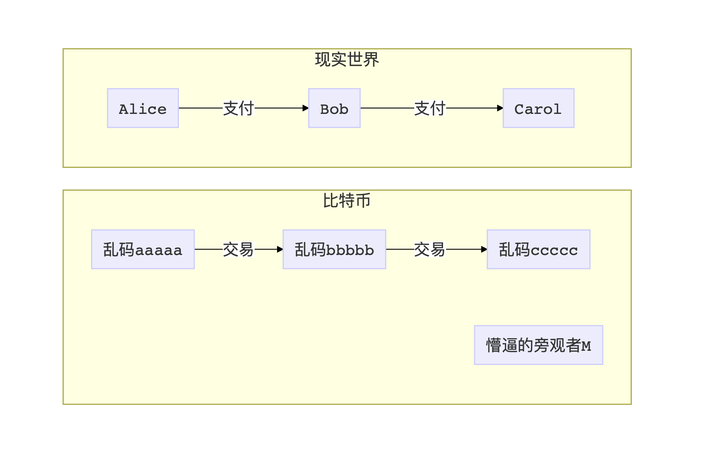

如果A要付给B一笔钱，那么A就会拿着大喇叭向全网公布，她要创建一笔新的交易（Tx），并且这个交易的受益人是B的公钥（P2PK），或者是公钥的哈希值（P2PKH）。B只要看到了这笔交易，就可以用自己的私钥签署一份数字签名，证明自己真的是这个公钥的主人，从而花掉这笔钱。

当A提交了付钱给B的这笔交易后，作为一个网络上的旁观者M，她只能看到一串乱码地址aaaaa要付x个币给一串乱码地址bbbbb。随后当B再打钱给C的时候，他也只能看到bbbbb打了一笔钱给ccccc。我们可以看到比特币里的交易是有很强的连接性的。虽然不知道谁打钱给了谁，但是我们可以顺藤摸瓜找到很多条交易链条。

如果每个用户都只是乖巧的来回打钱，比特币其实还是比较安全的。

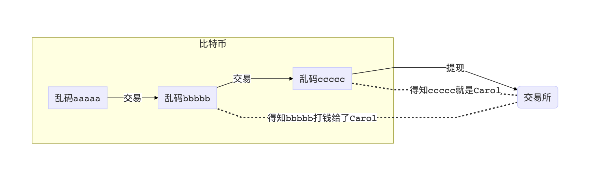

一旦有用户看破了，不想玩了，想去交易所套现了，那么这一整条链的交易信息都会被暴露。交易所往往都有KYC（Know Your Customer）政策，每个数字货币和法币进行兑换的用户要进行实名制认证。一旦C从ccccc这个地址提款跑路了，那么交易所就掌握了bbbbb曾经打钱给C的事实。如果C涉嫌洗钱，这个时候只需要静静等待B套现出来，然后一把抓住。

美国现在已经有很多公司在做比特币上的交易链条分析，比如Chainalysis。

想必说到这里，大家都能感受到比特币的不足了：随机生成的收款公钥只是一个假象（网名），一旦在哪里实名制认证了，把网名和实名联系起来了，那么之前在网上所有的所作所为也就一览无余，毫无隐私可言。这就好比有人用网名在贴吧上发帖子喷人，然后被人用密保找到了手机号，再用手机号找到了注册的实名，从而被人肉是一个道理。

## 匿名（Anonymous） 与假名（Pseudonymous）

我们对于隐私的理解，其实分两种。

第一种是匿名（Anonymous），意思是用户不用透露任何和自己相关的信息，好比是学校的表白墙，你永远无法知道到底是谁写了上去，反正字就是写在了上面。

第二种是假名（Pseudonymous），意思是用户通过自己创造的假名来发表信息，好比是贴吧，如果你不了解这个用户，你无法建立网名到实名的联系，你也就不知道发帖的人是谁。

这么分析一看，比特币其实是一种假名机制：每个用户都会随机生成自己的公钥（假名），并且通过公钥地址来收款。这就好比是A/B/C/D四个人分别化名为小明/小红/二狗/小刚在网上匿名交易，只要D一旦在任何一个环节暴露出了自己的身份（比如在交易所提现），那么小明/小红/二狗和D之间的关系就会马上暴露出来。

我们对于如何增强比特币的保密性，可以从这两种方法来讨论。

## 增加隐秘性的方法

### CoinJoin

既然A给B付钱会被人看到，C给D付钱也会被人看到，有人就想到了说那索性把ABCD这四个人全部扔到一笔交易里面去。因为比特币的交易可以多个输入输出，所以一个旁观者会看到一个交易里，aaaaa和ccccc都往里面打了x个币，然后bbbbb和ddddd收款。这样一来，就算交易所得知了这几个地址分别对应ABCD四人，也很难分辨到底谁收了谁的钱。

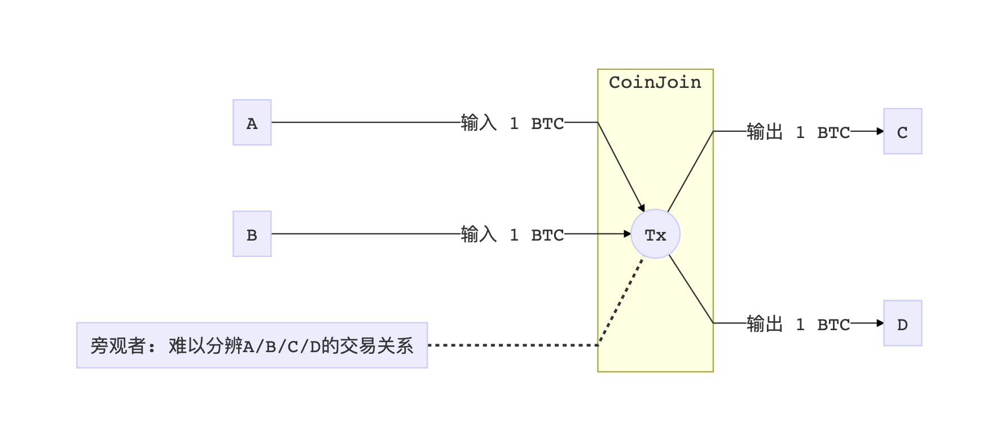

如果两组交易还是太好辨认怎么办？两个不够混四个，四个不够混八个，以此类推。把各种人的交易结合在一起，混淆视听，让人无法追踪。这就是CoinJoin。

CoinJoin的弊端是什么？其实混合多笔交易并不能完美的杜绝被人顺藤摸瓜，只能说在概率上减低了被一路摸上来的几率。而且还有一个很重要的一点，如果要混合AB与CD的交易，那么他们的交易量一定要相同。如果A付给B一万个币，C付给D一个币，我们只需要看输入和输出，就可以马上把一笔CoinJoin交易拆散成两个独立的交易。所以混搭相似交易额度的交易，也是CoinJoin在实现的时候一个不容忽视的难点。

如果用上文的分类来看的话，CoinJoin只是比特币现有系统的一个骚操作，它的本质仍然是假名机制。

### Confidential Transaction（私密交易/CT）

既然隐藏我是谁那么麻烦，那么人们就开始动脑思考：如果不隐藏参与交易的公钥，我们还可以隐藏交易的额度。A给B打钱的时候，就算B被暴露了，全网也不会得知A究竟给了B多少钱。

如果这步操作能实现，那么我们甚至就可以用比特币发工资了，大家只能看到你每个月工资到账，但是并不知道你赚了多少钱。

想要具体实现的方法，我们先要了解一种特殊的加密算法：同态加密。

一句话概括的话，同态加密就是一种特殊的加密算法，可以**让密文保持原有的数学特性**。

我们可以假设有一个加密方法E，如果E是加法同态的话，那么E(a) + E(b) = E(a+b)。反之如果乘法同态的话，那么E(a) x E(b) = E(a x b)。

介于这篇文章是讲zkp的科普文，我们就不详细了解具体实现的方法了。我们只需要了解，椭圆加密方程和RSA里的大数模组都有某种同态的特性。

#### Pederson Commitment （Pederson承诺）

继续回到隐藏交易量的话题。如果A有100个币的余额，付10个币给B，那么这笔交易大概长这样：

结合上文提到的加法同态，如果我们有一个加法同态的加密方法E，我们就可以把这笔交易转化成：

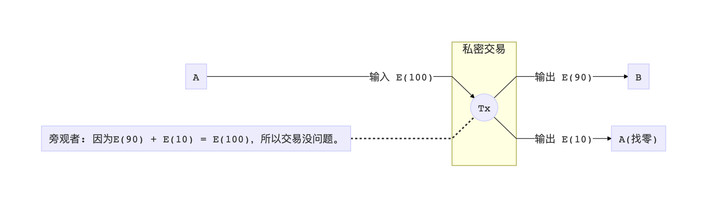

只要第一个数等于后两个数之和，一个旁观者到头来也不会看到交易量，但是又不得不承认A真的分了一部分钱给B，然后还有一部分钱又退回给了A。这个方法叫做Pederson Commitment（Pederson承诺），隐藏了数据本身，但是证明了数据的关系。

#### 负数漏洞

读到这里，有些朋友就会发现一个天大的漏洞：虽然Pederson承诺证明了数字之间的关系，但是并没有限制任何数字的取值区间！那也就说，A就可以使坏，提交一笔交易，说自己要付-100个币给B，然后“找”给自己200个币，这样一来一去，等式还是成立的。A就可以借此无限印钞，从而摧毁整个系统。

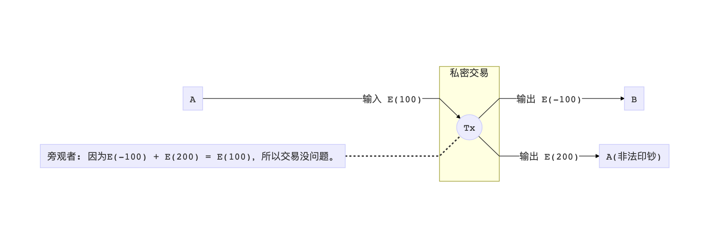

怎么去避免负数的存在？在Pederson承诺之余，我们还需要另外一组证明来证明所有交易里的数字都是正数。换句话来说，所有交易里的数字，都被限制在0到2^256（正整数最大值）的区间（Range Proof）。

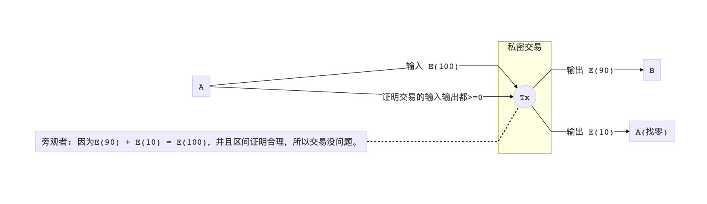

听起来似乎不难，最简单的方法无疑就是这几个数字全部公开出去。但是这就违背了隐藏交易量的前提。所以我们必须得找到另一种证明方法，即不能暴露原始数字，又要证明他们的特性（取值在0～2^256）。**听起来是不是在点题了？**先不要急，我们再看另一个问题。

#### 所有权漏洞

在我们继续深入研究之前，我想快速的指出一下，其实这个协议现在还有个天大的漏洞：所有权不明。

对比特币了解的朋友们可能会知道，在创建一个比特币交易的时候，是需要提供输入交易的UTXO Txid的，这样可以快速的验证，准备付款给B的A是不是真的有这笔钱。

但是现在，至始至终我们都没有提及任何关于指向前一笔交易的内容。也就是说，因为全网不知道A花了多少钱，所以A纯粹就可以把input的数字改的异想天开，改成几千几万，然后再全部打给自己，给自己偷偷铸币。

如何解决这个问题？有两种方案。

**第一种方案**是继续引入比特币的交易机制，把上一笔私密交易的输出当作交易的输入。这种思路有点像问题的转换，我这笔交易用上笔交易的结果，那么只要上笔交易没问题，我这笔交易也没有问题。

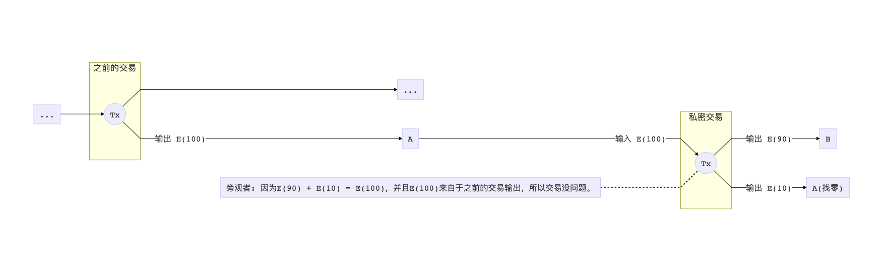

这是一个鸡和蛋的问题，如何创造出第一笔没有问题的私密交易呢？

我们可以通过一种特殊交易，把普通的币转换成私密的输出。这种交易的输入是一个存在的交易id（比特币UTXO），然后输出就变成了隐私的输出。这样我们就变出了最早的蛋来。（ZCash的shielded transaction就是这个原理）

**第二种方案**是证明A的输入真正属于A。像类似于Ethereum一类的系统里，都有一个世界态（World State）的概念。世界态就是当前整个链上所有用户和智能合约的余额和状态。一般一个完整的节点都会保留整个世界态（大小很大），而轻节点则只需要保存世界态的Merkle Commit。

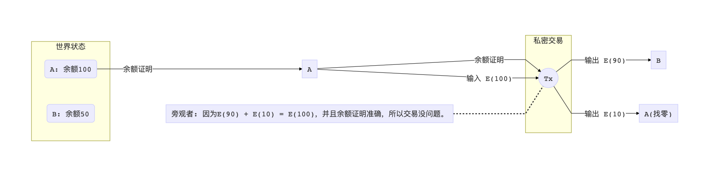

在提交了Pederson承诺和区间证明之外，我们额外再提供一个证明，证明交易输入的数字和原来的世界态里A的余额是相符的。我们可以用Merkle Proof来实现这个证明。

但是如果我们直接提交了Merkle Proof，所有旁观者都能看到A的交易输入了，那又违反了私密交易的前提。所以**再次点题**：我们还是需要借用上文提到的神秘的算法——既可以隐藏住谜底本身（A的余额），但又可以证明这个数字真的属于世界态当中。

### ZCash：全部匿名

当CT的概念被提出来之后，很多人不满于现状，不禁感慨：如果连自己的名字都能隐藏起来就好了。

于是ZeroCoin/ZeroCash的概念就被提出来了：基于CT，但是额外新增了新的机制，可以把交易的用户都匿名起来。这下在一边吃瓜的旁观者C真的就一脸懵逼了，看到网络中一串乱码飘过，但是完全不知道是个啥，但是又不得不相信是真的。

ZCash是基于ZeroCoin/ZeroCash协议实现的一个数字货币，可以达到全匿名交易。过多的介绍我在这就不叙述了，不过依旧就是依靠着老几样密码学的工具：Pederson承诺，区间证明，Merkle证明，还有我们一直在提的黑魔法：不会暴露答案本身的证明。

**千呼万唤始出来，我们终于要讲到重头戏了：这种不会暴露答案本身的证明方式就叫做零知识证明。**

## 零知识证明（zkSNARK）

相信看完上文，大家已经对我们想要解决的问题大概有所理解了。

我们想要证明数字之间的关系，比如0 <= a <= 2^256，或者SHA256(x) = y。但是我们又不想暴露出这几个数字来，比如说前文的a和x。如何构建一套系统来实现这点呢？

在讲这个话题之前，我想把思路变一变，把这个话题拆分成两个部分：**零知识（zk）**和**证明（SNARK）**。

和往常一样，我们先讲定义和应用，后面再说如何实现。

### 证明（SNARK）

我们先从证明入手。

SNARK的全称是Succinct Non-interactive ARgument of Knowledge。这个名词由三个维度组成：

1. **简短**（Succinct）：证明本身要足够简短，最好验证证明是O(logN)甚至是O(1)的复杂度。
2. **无交互性**（Non-interactive）：整体流程没有任何交互，也就是说证明方可以扔出一大串乱码往你桌上一拍然后就走人，你之后再去验证这串乱码就可以验证他的证明。
3. **知识的表达**（Argument of Knowledge）：这玩意比较晦涩难懂。不过大概的意思就是说你要证明的东西得是能表达知识的（Proof of Knowledge）。关于PoK的证明又涉及到一个更加抽象的抽取器（Extractor）的概念，具体的内容可以参照郭宇老师的文章。不过**一句话总结就是，你证明的东西是有价值的，通过计算得到的，而不是乱七八糟别的东西。**

看了定义之后，我们会发现，光是能实现SNARK就已经非常强了，尤其是在简短这一点上。

我们马上可以想到一个应用：如果某个第三方机构存了大量（PB级别）的数据在自己的数据库里。假如政府机构想要去审计他们的数据库，确保每个数据点都没有问题，正常情况下可能得一行一行的看，把每个PB的数据都看完，看到天荒地老。这个时候突然SNARK横空出世，通过O(1)或者O(logN)的大小和时间就充分的证明了这个庞大的数据库里每个数据都没有任何问题，想想都有点激动。一般人觉得这是完全不可能的：怎么可以凭借几个数字就验证了几千万个数字的准确性呢？

留下悬念，后面再讲。

### 零知识（zk）

我们再回归到零知识（zero knowledge）上来。

其实零知识只是在这个SNARK证明的基础上又额外多了一个要求：整个证明本身不能暴露任何关于要证明的谜底有关的数据。零知识这个概念的官方定义又是非常晦涩难懂的，引入了一个模拟器（Simulator）的概念。详细的介绍还是可以去参考郭宇老师的文章，我这儿就一笔带过了。**一句话总结就是：一个再聪明的黑客，怎么瞅着零知识的证明，都没法提取出任何和答案本身有关的信息来。**

回到这个政府审计数据库的概念上，我们可以假设这个数据库是公司的纳税情况。政府一定要确定纳税的数据一定要准确无误，但是对于企业来说，他们并不想让审查员看到他们每天的业务流水，因为也许涉及商业机密。这个时候区区一个SNARK就不够了，我们需要zkSNARK才能够实现：

**既可以证明我如实的交了税，又不给你看到我每一笔交易的详细信息。**

### 零知识证明的应用

有了zkSNARK之后，我们可以做什么呢？

第一件事，就是可以把上文讲的**私密交易**（Confidential Transaction）给实现了。ZCash的私密交易机制就是基于zkSNARK之上实现的。这样一下，数字货币交易就变得安全了很多。

第二件事，我们可以用这个技术来**更好的解决区块链效率的问题**。现在目前区块链Scaling的方法无疑是几种：牺牲共识强度增加出块速度，启用侧链，或者类似于Lightning一样的线下点对点通道。

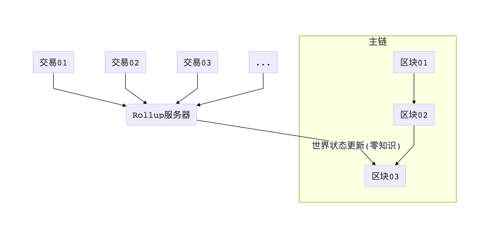

其实其中还有一个想法叫做Rollup。Rollup的概念大概就是，主链的负荷太大了， 于是我们就多开几个小服务器，也可以接收交易，做一做交易的认证，然后再批量性的把一段时间内累积下来的交易全部更新到主链上去。但是如果这个更新过程仍然需要向主链发送大批量的交易信息，这个Rollup的意义就不存在了，并不会减少任何主链的负荷。这个时候SNARK就派上用场了：通过SNARK（可以zk，也可以不要），Rollup服务器就可以用非常简短的证明提交给主链，证明一大批的交易都没有问题，主链只需要根据最后的结果增加减少一些UTXO就完事了。通过ZK Rollup，我们可以大大的减少主链的负荷，把更多的验证外包到别处去。

第三件事，我们可以真正实现**去第三方的交易**。

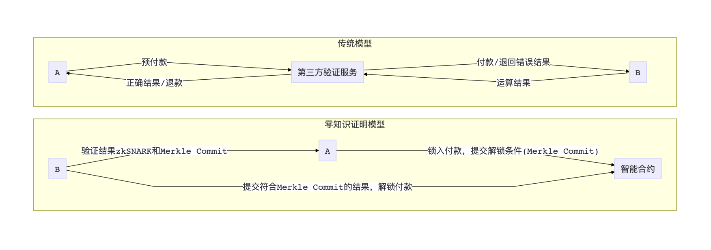

假设A在做机器学习方面的研究，但是并没有很好的电脑，于是她打算把训练模型的任务外包给B。过了三天之后，B告诉A他跑完了，需要让A先付钱再给她提供训练完的模型。A担心B并没有诚实的训练模型，而是随便生成了点随机数打了个包，所以想让B先把模型给A验证通过了再付钱。B担心A拿到模型之后偷偷抄走了模型，然后不给钱直接把他拉黑。

面对这类的问题，传统的解决方法是委托第三方，或者设计智能合约在链上来完成数据和货币的验证交换。现在有了zkSNARK，B可以直接向A提交一个模型训练的zkSNARK，证明他真的老老实实的跑了三天，并没有在作弊。A快速验证通过了之后，就可以放心的把钱打过去了。

第四件事，我们可以彻底做到**数据所有权的转移**。

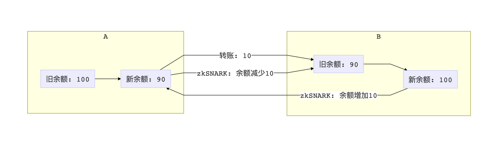

假设银行的账户余额数据库是一个sql table，那么一亿客户就会有一亿行记录。每年银行需要花不少成本来维护这么大的数据系统。**如果每个人都可以把属于自己的那一行记录搬运到本地，自己维护自己的账户数据，那么银行一分钱都不用花。**之所以银行不去这么做，是因为用户极有可能为了利益篡改自己的数据，把100块变成100万。

zkSNARK恰恰可以保证数据本身不会有问题。我们可以构想出一个分布式银行，每个人的存款余额都存在自己的电脑里面。当A想转账给B的时候，她需要向全网提交一个证明她账上余额正确扣款的zkSNARK，这样就确保了A诚实的把转账金额从自己的余额里扣除了。B进帐的时候也会对应提交一个余额增加的zkSNARK。

我们可以把这个概念应用到所有的领域里，社交网络，银行，健康，金融审计，企业纳税，等等。通过zkSNARK，**服务提供商不需要为大量数据的存储而买单，使用者也不需要担心自己的隐私被人偷了去。**

## 未完待续

篇幅原因，这次就写到这儿。想必看到这里，大家对为什么需要零知识证明，和零知识证明到底有多强大，有了一个更加深入的了解。

下一篇开始，我会写的更加深入一点，主要讨论一下zkSNARK具体的构造。

PS：本文中零知识证明和zkSNARK交替使用。但其实zkSNARK只是零知识证明协议中比较经典的一个，还有许许多多别的协议在后文也会介绍。

## 更多阅读

如果想要了解更多本文中讲到的内容，我收集了一个Reading List，放在下面。有兴趣的朋友可以读读。

1. [郭宇老师的零知识证明（共四篇）](https://www.jianshu.com/p/38ab873ae8ce): https://www.jianshu.com/p/38ab873ae8ce
2. [斯坦福的课件与课后阅读](http://cs251.stanford.edu/syllabus.html): http://cs251.stanford.edu/syllabus.html
3. [ZCash的构造](https://www.jianshu.com/p/4db439c63a96): https://www.jianshu.com/p/4db439c63a96
4. [CoinJoin](https://en.bitcoin.it/wiki/CoinJoin): https://en.bitcoin.it/wiki/CoinJoin
5. [Confidential Transaction](https://www.jianshu.com/p/22664259dee3): https://www.jianshu.com/p/22664259dee3
