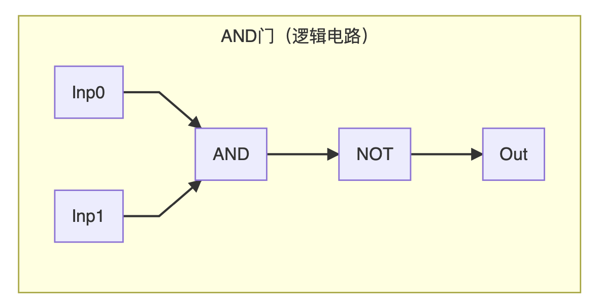
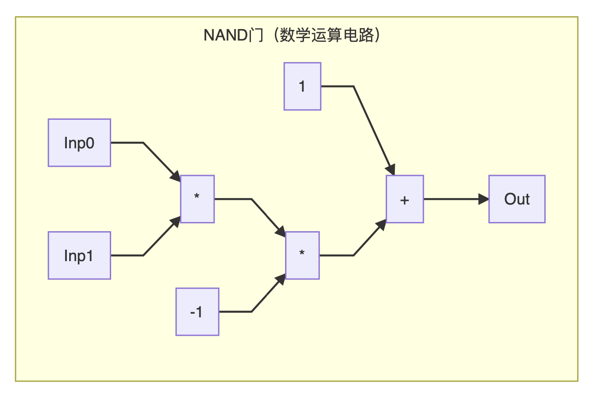
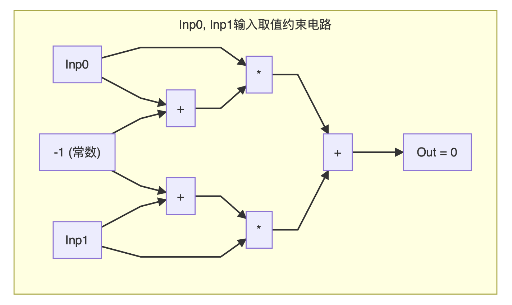
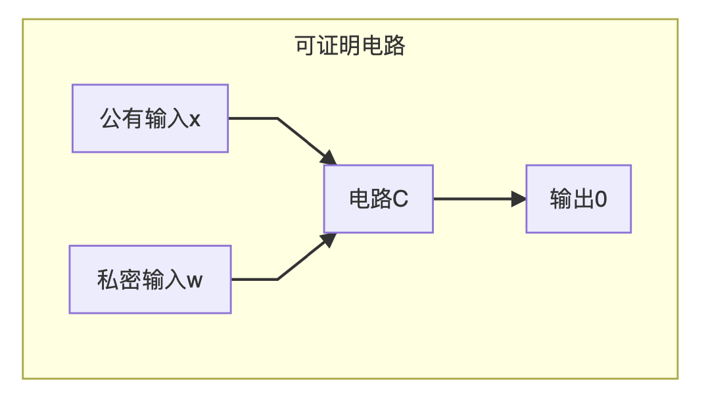
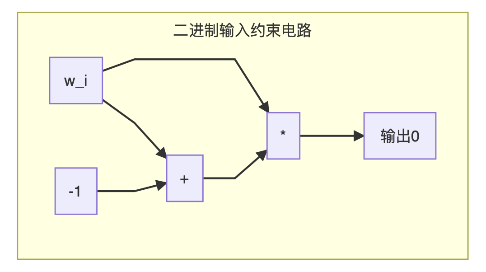
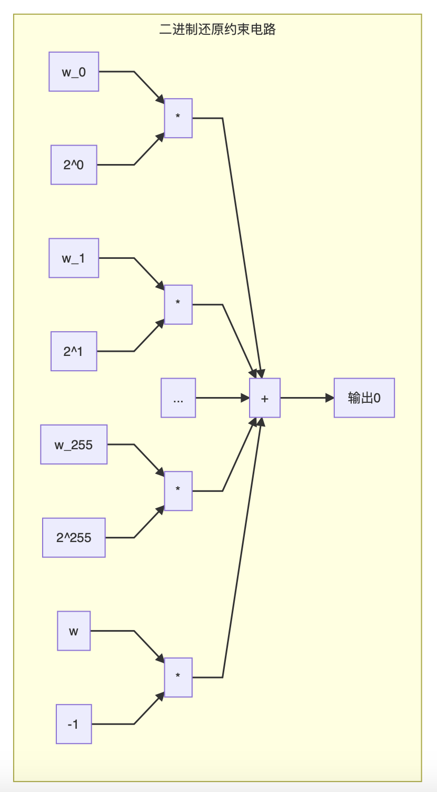
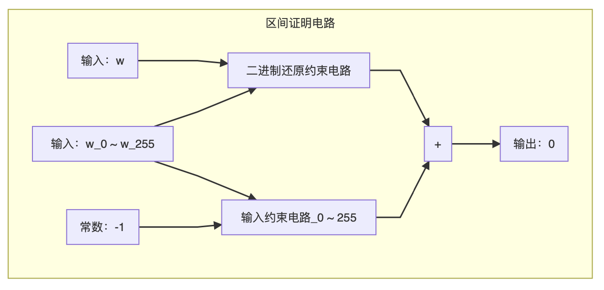
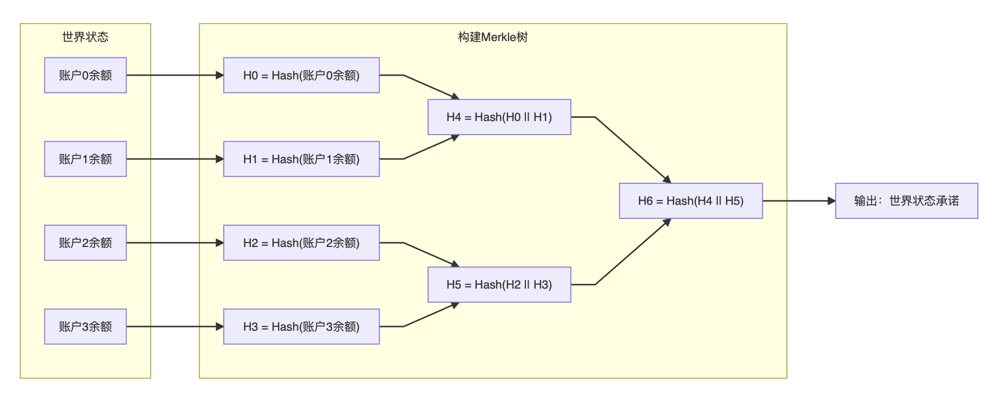
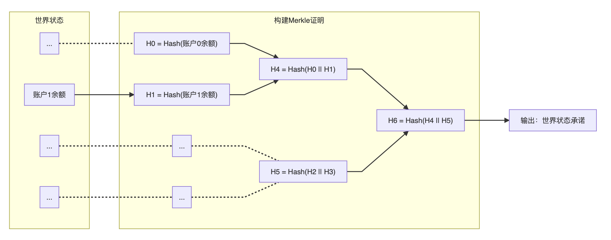
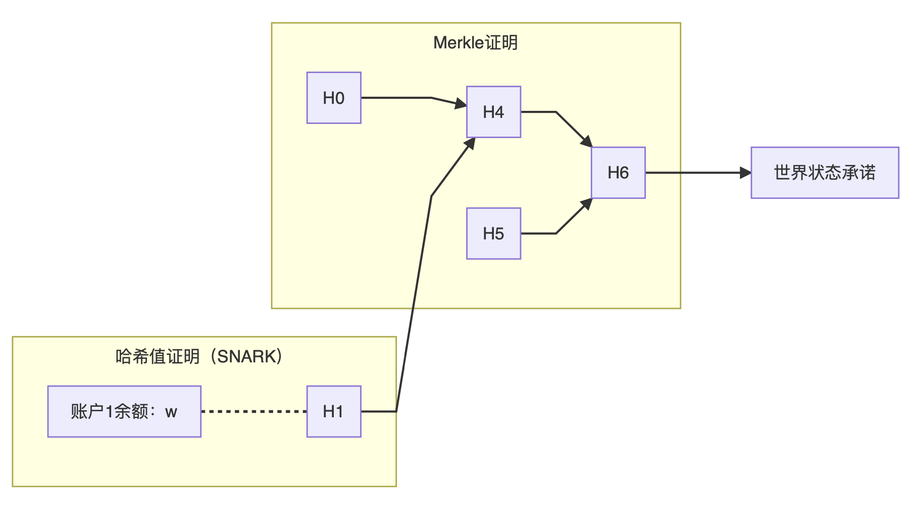

# 浅谈零知识证明之二：简短无交互证明（SNARK）

上一期文章发表之后，非常惊讶有那么多小伙伴读完了表示喜欢。那么我们接着这期继续吧！这次，我们专注的聊一聊SNARK。

---

相信看完前一篇文章的朋友们会有一点很不解的地方：为什么我们可以如此简短的创建一个证明，并且证明很长的信息呢？在上课前我也有这同样的疑惑，甚至觉得这个是一个“黑科技”，不过相信大家看完这篇文章，就会知道如何去驾驭这个“黑科技”了。

在详细讨论之前，我们得稍微严肃一点，系统性的学习一下SNARK的基本构造。

## SNARK的四步构造

因为SNARK的“黑科技”特性，想要构建一套简短证明系统，其实流程是略微有些复杂的。总结一下一共可以分为四步，我们来一步一步详细描述。

### 第一步：确定有限域 $\mathbb{F}$

在构造之前，我们先需要确定一个可以包含所有我们想要计算的数字的大小的一个有限域（Finite Field）$\mathbb{F}$。用通俗易懂的话来说，我们需要**选一个很大很大的数字p，确保这个数字比我们要解决的问题里的所有数字都大**。

如果以前了解过类似于RSA密码学的朋友们可能对这个概念不陌生。有限域就是给我们所有数字加了一个天花板，确定了整个数学系统的计算空间，类似于在电脑里如果我们想创建一个存数字的变量，我们需要思考到底是需要一个`uint32_t`（32位），还是一个`uint64_t`（64位）一样。所有超过有限域的值，都会直接溢出之后再倒回去从0开始。

在数学界，符合这个特性的计算空间其实有很多种，最常见的一种就是RSA算法里面用到的正整数求模一个大质数（integer mod p）。上文说到的找到一个数字p，其实就是一个很大的质数，然后我们可以用它来生成一个计算空间。

在确定计算空间之后，我们就可以真正开始SNARK的搭建了。

### 第二步：构建数学运算电路（Arithmetic Circuit）

当我们找到一个数字空间之后，我们下一步要做的事情，就是要把我们想要证明解决的问题**用数学运算电路表示出来**。

什么是数学运算电路呢？我们先来看一看传统的逻辑电路。

上图表述的是一个与非门（NAND）的电路。先不用过多了解电路的用处，我们可以发现的是，两组输入信号分别通过了NOT和AND这两个基础逻辑门。**像AND和OR这样的基础逻辑门是逻辑电路的基础模块，通过拼加和堆叠我们可以实现任何复杂逻辑。**

数学运算电路也是同理，只不过基础模块从逻辑门变成了数学运算。因为加法和乘法是最基础的数学运算，通过加法和乘法我们也可以近乎实现所有其他的运算方法，所以我们可以**选用“加法门”和“乘法门”作为我们数学运算电路的基础模块**。通过叠加运算门，我们可以搭建一个复杂多项式的“电路”。

---

为了能更好的理解运算门，我们来试试看**把上面的NAND门从逻辑电路转换成数学运算电路**。（假设Inp0和Inp1和原来逻辑电路一样，还是输入1/0的逻辑信号。 ）

我们先来看AND门：AND其实很简单，因为只有当Inp0和Inp1都是1的时候，AND的结果才会是1。我们很快发现，一个乘法门可以完美的代替AND门：只有当两个输入是1的时候，相乘得到的结果才会是1。

解决了AND之后，我们来转换NOT：NOT其实也非常简单，因为输入信号只会是0或者1，只要用1减去输入的信号，得到的结果就是相反的了。注意有一个问题是，因为我们只有加法和乘法，所以如果需要实现减法的话，我们需要先把输入信号乘上一个常数-1。

经过如此转换，我们就成功的把一个逻辑电路转换为数字逻辑电路了。同时因为我们已经知道如何组建AND和NOT了，理论上我们就可以把这两个部分模块化，拼接任意的复杂逻辑出来。

---

看到这里，你可能会觉得运算电路非常简单，和逻辑电路转化也非常直白。但是其实这是因为我们一直在假设运算电路的输入和逻辑电路一样，都是0或者1。在真实场景下，一个运算门的输入值可能上限非常大（取决于我们有限域选择的大小）。所以我们必须要想办法**约束我们运算电路的输入**，使其不仅能够在功能性上和逻辑电路相同，并且在输入取值上只可以取$[0,1]$这两个数字。

但是怎么用运算门来表示这么一个关系呢？因为数学运算电路其实就是一个复杂的多项式（比如上图的NAND电路就变成了Out = 1 - Inp0 * Inp1），我们可以把这个问题转化一下：**能否创造出一个多项式，只有当一个输入满足$[0,1]$的取值范围的时候，才会输入0？**最后我们发现，有这么一个多项式可以满足这个要求：
$$
n \in [0, 1] \iff n \cdot (n-1) = 0
$$
上面这串表达式的意思是，只有当数字n取值于$[0,1]$这个范围的时候，后面的多项式$n \cdot (n-1)$才会输出0。也就是说，我们就可以把上文提到的Inp0和Inp1接到这个多项式转换成的运算电路内，**只要这个运算电路的输出结果是0，那么我们就可以确信上文的NAND运算电路的输出也是对的。**

有人可能会问，上文限制取值的多项式只能限制一个输入，但是我们有两个输入，如何同时限制他们的取值范围呢？其实答案很简单， 只需要把同样的多项式复制一份，两者加起来就好了。

有了这两个电路之后，我们只要确定约束电路的输出是0，那么NAND门电路就会正常运转了。

有一点需要注意的是，因为我们的逻辑门是从运算门搭建起来的，我们会发现其实**逻辑运算非常的慢**：任何逻辑运算至少得做一次乘法，然而熟悉计算机硬件的朋友们会知道，乘法其实是相对来说比较昂贵的运算。这样一来有一点颠倒黑白的感觉，在计算机里逻辑运算是最便宜也是最简单的计算，然而在数学运算电路里，逻辑运算反而是一个比较繁琐的过程了。

### 第三步：转换为可证明数学运算电路

当我们有了数字运算电路这个概念之后，我们就可以把不同的电路模块拼接起来，生成一个可以用作证明的运算电路出来。

首先，我们先定义一下**可以用作证明的数字运算电路C(x, w)**，具体构造如下：

简单的来说，这个电路C有两组输入。

第一组输入标记为x，我们称之为**公有输入（public input）**，也就是说所有人都会知道x的值。这个x一般来说表达了想要证明的问题的特性和一些固定的环境变量。

第二组输入标记为w，我们称之为**私密输入（secret input）**，或者又称之为witness。这一组数据就是真正提交证明的一方的谜底，只有证明的一方才会知道，其他人是不可以得之的。

当我们有C这一个电路之后，我们的目标就是**证明C(x, w) = 0**。换句话来说，在A和B已知数学运算电路C输出为0，并且公有输入为x的情况下，A需要证明她知道能够构成这个输出的私密输入值w。

---

如果我们把这个C(x, w)的概念代入上文提到的NAND门的例子里，我们会发现，光是NAND门不足以成为一个用做证明的电路。我们可以重新定义一下我们想证明的问题：**如果我们已知一个NAND门的输出为0，并且其中的一个输入Inp0为1，A想证明她知道另一个输入Inp1的值。**这个证明的过程中，不仅要保证NAND门的输出是对的，而且要保证所有的输入值都取值在我们事先约定好的区间内。

我们结合上面讨论的方案，把NAND的电路输出和我们的取值约束电路接在一起拼接成运算电路C，x为Inp0，w为Inp1，输出我们约束为0，从而构成一个完整的NAND门私密输入证明体系。

---

当我们得到最后的证明电路C之后，我们可以计算出这个运算电路的复杂度。

如果我们想知道一个数字运算电路C有多难算的时候，我们可以用里面有多少个运算门来描述它的复杂度。一般来说我们会用 $|C|$ 来表示。像是上面提到的NAND证明电路，$|C|$大概是在10左右。

在现实使用场景中，如果我们要把像SHA256这样的复杂函数用数字运算电路来表示，$|C|$ 可能会达到25000这么大。这也就是为什么真正落地的证明还是非常慢的原因。

### 第四步：非交互简短证明体系（SNARK）

当我们通过第三步得到了最终的证明电路C，还有对应的x和w之后，我们的准备工作已经做的差不多了。剩下来的事情，我们就可以交给SNARK算法来生成和验证我们的证明了。

首先，我们看看整个非交互式证明体系的**官方定义**。

一个SNARK系统，往往由三个核心算法组成：Setup，Prove和Verify。

1. **生成算法Setup**：$Setup(C) \rightarrow (S_p, S_v)$

   Setup算法会把我们实现确定好的电路C拿进来进行一系列的预处理（preprocessing），然后生成两组参数。$S_p$是给证明方的参数，$S_v$是给验证方的。这些参数的用处就是方便双方来生成和验证简短证明。一般来说，生成算法的复杂度和电路C的复杂度是等比例的，$O(|C|)$。

2. **证明算法Prove**：$Prove(S_p, x, w) \rightarrow \pi$

   证明算法相比不用多讲了，证明方会用Prove这个算法来生成一个证明$\pi$，然后把这个证明发送给验证方。Prove算法再生成证明的时候会用到几乎所有的数据：预处理数据$S_p$，公有输入x，还有私密输入w。最后生成的证明$\pi$的空间复杂度非常简短：$|\pi| = O(log|C|)$。

3. **验证算法Verify**：$Verify(S_v, x, \pi) \rightarrow Yes/No$

   验证算法也非常的直白，验证方会用Verify这个算法验证我们收到的证明$\pi$。这个算法会返回一个1/0的数值，代表验证是否通过。验证的过程中除了需要对方提供的证明$\pi$，我们还需要预处理数据$S_v$，还有公有输入x。验证的复杂度也非常小，一般来说是 $O(|x| + log|C|)$。

有了这三个算法之后，我们可以用很简单的图来描述一下整个证明体系。

**证明方提交的这个证明$\pi$可以充分说服验证方，让其相信证明方真的有这么一个秘密的w可以满足C(x, w) = 0。**

## 实例：私密交易的输入输出取值区间（Range Proof）

读过上一篇文章的朋友们应该还会记得，如果我们要进行私密交易（Confidential Transaction）的话，我们需要在交易最后附带三组证明：

1. 第一组是**Pederson承诺**，证明了输入和输出之间的数学关系。
2. 第二组是**区间证明**，需要证明输入和输出的值全部取值于正整数的范围。
3. 第三组是**所有权证明**，证明交易的发起人真的有这么多token作为输入。

Pederson承诺的实现我们已经在上一篇文章中讨论过了。现在了解完简短证明的四步构造，我们可以来看看如何具体实现**区间证明**。

---

首先，我们需要找到一个**合适的数学运算电路**来描述我们想要证明的内容。（我们默认使用正整数的有限域，选取一个非常大的质数p进行求模。）

假如我们有一个数字w，我们想要证明这个数字w不是一个负数，那么我们可以先办法证明它一定会取值于正整数区间。因为考虑到计算机系统里的正整数一般不会超过256位，所以我们可以把问题弱化一下：**证明一个数字w取值于0-2^256之间。**（根据此条件，有限域选择的质数p需要大于2^256。）
$$
w \in \{0,...,2^{256}\}
$$
现在确定了要解决的问题之后，我们可以开始思考如何用加法和乘法来表达这个取值关系。还记得在前面的章节，当我们在讲一个值n会取值在0和1之间的时候，我们用$n \cdot (n - 1) = 0$来约束这个取值范围。**同理可得，如果我们想约束$n$必须要取值于0和5之间的话，我们就可以用更长的一串乘法来约束它**：
$$
n \cdot (n - 1) \cdot (n - 2) \cdot (n - 3) \cdot (n - 4) \cdot (n - 5) = 0
$$
看到这里，大家可能心里已经知道如何约束这个w的值了：我们只要**用同样的办法扩大这个等式**，从$(w - 1)$一直连续乘到$(w - 2^{256})$，不就可以了？

听起来很简单，但是细心的朋友会发现，这样最后的电路里面将会有**2^256个乘法门**。光是这么多乘法，还没有算加法，这个电路的复杂度已经是天文数字了。就算是跑Setup可能就不知道跑到猴年马月，所以我们说这种约束的方法是**不实际的**。

那还有什么方法来约束这个数字w的空间呢？我们可以**巧妙借助二进制数的结构**。既然我们想要规定w是个整数，并且大于0但小于2^256，那么我们就可以在二进制里，**把w拆分成256位，然后分别约束每一位**。这样的话，我们最后得到的电路大小只会和这个数字有多少位成正比，而不会和这个数字的最大上限有关系。复杂度一下子就下来了一大个等级。

具体是怎么实现的呢？我们首先把w拆分成256位：
$$
w \rightarrow [w_0, w_1, ... , w_{255}]
$$
因为每一位都是二进制的，所以我们需要约束每一位的取值空间为0和1：
$$
\forall w_i: w_i \in \{0, 1\} \\
w_i \cdot (w_i - 1) = 0
$$

这个约束需要256份，每一份对应每一位。当我们把这些约束准备好之后，我们最后确定所有的位组在一起可以还原成原来的w：
$$
2^0 w_0 + 2^1 w_1 + ... + 2^{255} w_{255} - w = 0
$$

我们把上文提及的256+1=257组约束电路全部拼接在一起，合并成一个输出。最后生成的电路就是我们可以用来构建证明系统的电路C了。如果C的输出为0，那么代表了输入的数字一定要满足：

1. 这个数字是一个正整数，可以被255位二进制数表达。
2. 这255位二进制数的确是二进制数。（只能取值0或者1）
3. 这255位二进制数全部拼在一起可以重新还原输入进来的数字。

通过巧妙借助二进制的特性，**我们就有一组大小适中的数学运算电路，可以调用Setup来准备生成后续的SNARK了。**

## 实例：私密交易输入的所有权

解决了区间证明，我们来完成私密交易的最后一组证明：**所有权证明**，证明私密交易的输入值合理。

看过前一篇文章的朋友应该会知道，我们讲了两种私密交易所有权证明的体系：

第一种方案是一笔交易可以直接引用上一笔交易的输出，但是这会带来鸡和蛋的问题：难度在如何创造出第一笔私密交易来。第二种方案是在每一笔交易的下面附加另一个新的证明，证明交易发起的用户的账户余额真的有那么多钱。

我想着重讲一下**第二种证明方案，也就是证明交易发起者在世界状态中的账户余额。**

---

在很多区块链的场景中，整个世界的状态就是一个巨大的账本。账本的每一行都记录了某一个用户的账户余额。

为了更方便的表示整个世界状态，我们往往会使用Merkle树把巨大的世界账本变成一串短小精悍的Merkle哈希值。只要任何一个账户的任何余额发生改动，这个Merkle哈希值就会发生改动。

Merkle树其实就是一个二叉树，每一个节点都会把下面的两个子节点的值拼接在一起，并且算出对应的哈希值作为自己的值。为了方便构建Merkle树，我们会把最原始的余额数值先做一次哈希计算，然后把它们的哈希值存到Merkle树的最底层来。

当我们如此构建一个Merkle树之后，我们就可以把输出的Merkle哈希值当作一个**承诺**：**只要承诺不发生改变，那么当前的世界状态就肯定不会发生改变**。在区块链中，如果我们想要记录一长串数据的状态，一般为了节省空间，会在链上记录所有数据的Merkle承诺，而不是把数据本身存在链上。

当我们有了一个世界状态的承诺之后，后续的问题就是：**假如A就是上图中的账户1，现在有5块钱。A如何向B证明，在整个世界状态中，她的余额真的为5块呢？**

一个很简单的方法就是：A可以向B提交所有账户的余额，然后B自己再进行一次Merkle承诺的运算。只要B算出来的承诺和当前的世界状态承诺相等，并且A提交的她自己的账户余额的确是5块钱的话，B就可以相信A真的有5块钱。

听起来好像是很不错的方法，但是这个方法存在的问题一目了然。加入这个世界有几亿的用户，如果A需要向B提交几亿行存款余额，先别说B怎么去有效的计算这个承诺，光是网络流量就要用爆了。并且如此证明方法将会**暴露所有用户的余额信息**，大家肯定也是不太愿意的。

---

那怎么有效的证明账户1的余额属于当前世界状态呢？这个时候我们就可以利用Merkle树的特点来构造**Merkle证明**。

如果仔细观察上图经过一些修剪的Merkle树的话，我们会发现，只要证明账户1的余额可以在Merkle树中和相邻的节点一路组成最后的世界状态承诺，我们也就能证明账户1的余额属于当前世界状态了。

那具体怎么做呢？我们先从账户1的余额出发，**一路沿着Merkle树往上走。**

有了账户1的余额，那么我们就可以计算出H1。当有了H1之后，我们发现，我们并不需要知道账户0的余额，只要一个H0的值，就可以组合生成H4了。同理，我们可以通过和H5的值结合，最终生成顶点的Merkle承诺——H6。到头来我们只需要提交三样东西就可以完成这个Merkle证明了：**账户1的余额、H0、H5。**剩下哈希值全部可以在验证的过程中被计算出来。这就是**Merkle证明**。

我们通过Merkle证明可以大大的压缩证明的体积，并且也可以尽可能的保证世界状态中的其他用户的余额不在证明的过程中被暴露出来。Merkle证明在密码学上非常有用，只需要$O(logN)$的大小就可以证明某个东西在长度为N的列表之内。往往我们都会用Merkle证明来证明一组数据属于一个很大文件，一个用户属于一个很大的组织，等等。

---

了解完Merkle证明的原理之后，我们来看看如何证明在私密交易中，A可以证明她的余额。

Merkle证明的精髓就是我们可以**从要证明的值开始，一路往上算哈希值，并且和相邻的节点的哈希值不断的合并**。但是我们发现一个非常致命的问题：虽然我们可以隐去世界状态里别人的余额，但是我们还是**必须要暴露自己的余额**（不然没有办法算出第一个哈希值H1）。这一点和我们私密交易的本质是违背的！

这个时候，就需要借助SNARK的力量了。**我们可以把这个问题拆分成两步。**

### 第一步：证明余额哈希值

第一步，我们通过SNARK来证明，账户1的余额，通过哈希函数之后，可以得到哈希值H1。

因为我们想隐藏账户1的余额，我们用w来表示这个数字。在套用SNARK之前，我们还需要变换一下问题的描述方法，使其更方便用数学运算电路表达：

假设A自己拥有一个秘密w = 账户1的余额。A和B都事先知道了账户1的余额的哈希值H1（我们可以用x来表示）。我们可以构造数学运算电路C：**Hash(w) - x = 0**。如果C(x, w) = 0，那么代表Hash(w) = x。

为了简化表述，我们在图上用一个抽象的模块表示哈希函数。在实际运用当中，我们一般会使用SHA256哈希函数。当我们得到最终的电路C之后，我们使用Setup算法生成参数，再用Prove算法生成简短证明。

通过这一步，**我们会得到一个公开的x和一个证明$\pi$，并且这个x的值就是账户1的余额的哈希值**。虽然我们看不到账户1真正的余额，但是因为强大的SNARK证明，我们不得不相信x = Hash(w)。

### 第二步：从H1开始完成Merkle证明

前一步让我们得到了H1，并且也提供了证明代表H1真的是从原本的世界状态中生成的。我们现在要做的事情，就是从H1开始，分别与相邻的H0和H5结合，生成一个新的世界状态承诺。如果我们比较这个生成的承诺和区块链上保存的老的承诺是相同的，那么我们就可以相信账户1的余额真的在这个世界状态之中。

总结起来看，我们把所有权证明分成了两步，**第一步证明秘密的w可以被哈希函数转换为x，再证明公开的x属于整个世界状态的Merkle树。**提交证明的A知识证明她知道一个秘密账户1，并且这个账户在当前的世界状态中。验证证明的B或者其他人，仍然无从知晓到底A知道的是哪个账户，但是又不得不相信是真的。

## 私密交易总结

看到这里，想必大家已经对私密交易是如何实现的已经有了一个大概的了解。现在我来总结一下如果A要向B支付一笔私密交易，她一共要做哪些事。

1. 首先，A需要向全网**提交一笔私密交易**，这一笔交易里面有交易的发起人和收款人，但是并没有任何数量，原本的输入输出的数量被几串乱码代替了。
2. 在这笔交易的下面，A需要附加一项**Pederson承诺**，证明输入和输出的数字相加起来是相等的。
3. 然后A需要再附加一个通过**SNARK生成的区间证明**（Range Proof），证明输入和输出的数字都是大于0的正整数。
4. 最后，A需要附加一个**所有权证明**，证明她真的拥有一个账户w，里面存了钱。这个所有权证明分为两个部分，一个是通过**SNARK生成的哈希值证明**，另一个就是一个**Merkle证明**，证明了前面的哈希值真的属于这个世界状态。

通过这四步，A就可以把所有要生成的东西打个包，然后发到网上。矿工们看到这个包，以此把所有的证明都用Verify来验证一下。如果没问题的话，那么交易就完成啦。是不是很简单？

## 未完待续

因为篇幅的原因，这次就讲到这里啦。想必大家看到这里，对于零知识证明的「证明」部分已经有所了解了，大概知道了数学运算电路是个啥，然后我们如何把现实生活中的问题转化为电路。

相信很多人会好奇，那么究竟Setup，Prove和Verify这三个算法是如何工作的呢？下一期，我们继续deep dive一下，深入了解一下SNARK证明系统背后的原理。

## 更多阅读

和往常一样，在文末给出一部分reading list，有兴趣的朋友可以深入了解一下：

1. [数学运算电路](https://www.jianshu.com/p/246a69921e98): https://www.jianshu.com/p/246a69921e98
2. [Merkle证明](http://ethbook.abyteahead.com/ch4/merkle.html): http://ethbook.abyteahead.com/ch4/merkle.html
3. [V神的数学电路教程](https://medium.com/@VitalikButerin/quadratic-arithmetic-programs-from-zero-to-hero-f6d558cea649): https://medium.com/@VitalikButerin/quadratic-arithmetic-programs-from-zero-to-hero-f6d558cea649
4. [Zcash7篇的中文翻译](https://www.jianshu.com/p/b6a14c472cc1?from=timeline): https://www.jianshu.com/p/b6a14c472cc1?from=timeline